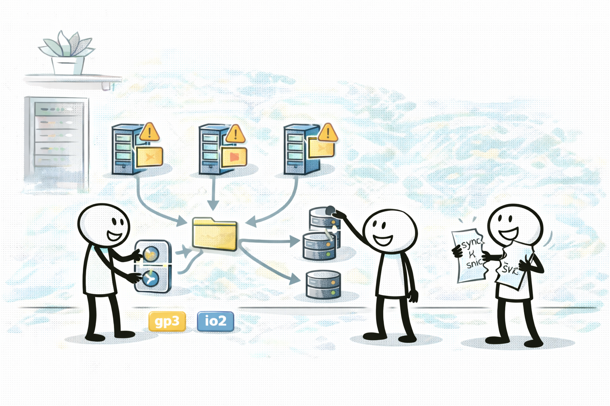

# EFS: 여러 인스턴스가 공유하는 파일시스템

## 소개 (이게 뭔가요?)

- EFS는 NFS 기반의 관리형 “공유 파일시스템”이고, 시험에서는 “공유 요구가 보이면 EFS”를 놓치지 않는지가 중요하다.

## 고객 사례 (스토리, 600~1000자)

웹 서버를 Auto Scaling으로 늘리기 시작하자 새로운 문제가 터진다. 업로드 파일(이미지/첨부)이 각 인스턴스의 로컬 디스크에 흩어지면서, 어떤 사용자는 파일이 보이고 어떤 사용자는 안 보인다. 팀은 일단 한 대를 “파일 서버”처럼 만들어 NFS를 직접 구성하거나, rsync로 주기적으로 동기화한다. 하지만 인스턴스가 늘어날수록 동기화는 지옥이 되고, 장애가 나면 “어느 파일이 최신인지”부터 헷갈린다.

이때 요구를 다시 읽으면 답이 단순해진다. “여러 인스턴스가 같은 파일을 읽고/쓴다”, “공유 POSIX 파일시스템이 필요하다” 같은 문장 신호는 EFS를 가리킨다. EBS는 인스턴스에 붙는 블록 스토리지라 공유 모델이 다르고, “공유”를 억지로 풀려고 하면 운영 부담이 폭증한다. EFS를 붙이면 인스턴스가 늘어도 같은 파일을 한 곳에서 보게 만들 수 있고, 애플리케이션은 파일시스템처럼 마운트해서 쓴다.

물론 EFS도 모든 상황에서 ‘무조건 빠른’ 건 아니다. 워크로드에 따라 성능/처리량 모드 같은 선택지가 나오고, “단일 인스턴스의 로컬 초고성능”이 목표라면 EBS(io2)나 instance store가 더 맞을 수 있다. 그래서 시험은 “공유”라는 신호를 먼저 잡고, 그다음에 성능 요구를 확인하라고 유도한다.

정리하면 EFS는 성능 튜닝의 문제가 아니라 “공유라는 요구를 올바른 레이어에서 푸는 것”이다. 지금 시나리오에는 “공유 파일” 신호가 있나요?

## Impact 범위 (어디에 영향을 주나?)

- Operations: 수동 동기화/단일 파일 서버 같은 운영 함정을 제거한다.
- Reliability: 공유 파일을 한 곳에서 보게 만들어 일관성을 높인다.
- Performance: 워크로드에 따라 성능/처리량 모드 선택이 영향을 줄 수 있다(개념).

## Exam Guide (Badges)

Exam guide mapping (details)

- Domain: Domain 3: Design High-Performing Architectures
- Objectives: “공유 파일시스템” 요구를 올바른 서비스로 매칭할 수 있는지

## Why This Matters (시험/실무에서 걸리는 지점)

- “여러 인스턴스가 같은 파일”은 EFS 대표 신호인데, EBS로 착각하는 함정이 자주 나온다.

## Core Concepts

- When to use
  - 여러 인스턴스가 같은 파일을 읽고/쓰는 요구(공유)
  - POSIX 파일시스템 요구
- When not to use
  - 단일 인스턴스의 로컬 초고성능 디스크처럼 쓰려는 요구(요구에 따라 instance store/EBS가 더 적절)

## Exam Traps (확장)

- 더 많은 연계/고급 함정: `../../exam-trap-bank.md`
- “공유 파일시스템”인데 EBS를 고르는 선택지
- 공유 요구를 “한 대를 파일 서버로”로 풀려는 선택지(운영 리스크)

## Exam Trap Drill (O/X, 1~3분)

- “Auto Scaling으로 늘어나는 여러 웹 서버가 같은 업로드 파일을 봐야 한다” → EFS가 먼저 떠오르나요?

## TL;DR (한 줄 정리)

- “여러 인스턴스가 같은 파일을 공유”하면 **EFS**, “인스턴스에 붙는 블록 I/O 튜닝”이면 **EBS(gp3/io2)**가 신호다.

## Back

- `./README.md`
