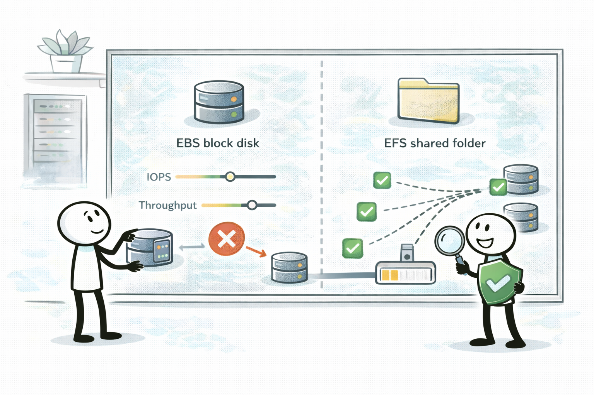
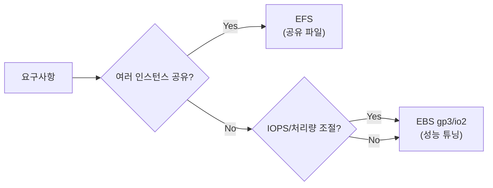

# Day 03 - Storage performance (스토리지 성능: EBS vs EFS)

## Quick Links

- [오늘의 이야기](#오늘의-이야기)
- [Timeline](#timeline-오늘-학습-타임라인)
- [Flow](#flow-서비스-연결-흐름)
- [Reading](#reading-서비스별-theory)
- [Quiz](#quiz)
- [References](../../references/README.md)

## 오늘의 이야기

파일이 느리다는 얘기가 나오면, 의외로 문제는 “파일”이 아니라 “어떤 스토리지 모델을 골랐냐”에서 시작됩니다. 오늘은 EBS와 EFS를 성능 관점에서 확실히 갈라봅니다. 단일 인스턴스에 붙는 블록 스토리지가 필요하고 IOPS/처리량을 ‘숫자로 맞추고’ 싶다면 EBS가 자연스럽습니다. 특히 gp3/io2처럼 스펙을 조절하거나 예측 가능한 성능을 요구하는 문장이 나오면 EBS 쪽으로 생각이 움직여야 해요. 반대로 여러 인스턴스가 동시에 같은 파일 시스템을 공유해야 하고, “공유 폴더” 같은 실무 요구가 나오면 EFS가 더 자연스럽죠.

여기서 함정은 “둘 다 스토리지니까 그냥 큰 걸로”라는 태도입니다. 블록(EBS)과 파일(EFS)은 붙는 방식이 다르고, 확장/성능/운영 방식이 다릅니다. 오늘은 그래서 팀에서 흔히 보는 상황으로 생각해봅니다. 로그 처리 서버는 디스크 성능이 중요해서 EBS를 만지고, 웹 서버 여러 대가 같은 정적 파일을 공유해야 하면 EFS가 등장하고요. 시험에서도 똑같습니다. “공유가 필요하다”는 단어 하나가 EFS로 점프할지, “IOPS/지연” 같은 숫자 신호가 EBS로 끌고 갈지를 결정하거든요.

그리고 EBS는 같은 EBS라도 “어떤 볼륨 타입으로 얼마나 맞출 건지”가 또 시험 포인트가 됩니다. gp3처럼 IOPS/처리량을 따로 조정하는 옵션이 있고, io2처럼 더 높은 성능/특성을 요구하는 경우도 있죠. 반대로 EFS는 “여러 인스턴스 공유”가 핵심인 만큼, 성능은 단일 디스크 튜닝처럼 접근하기 어렵고 운영 방식이 달라집니다. 오늘은 이 차이를 ‘말로’ 설명해보는 데 시간을 씁니다. “EFS는 공유 파일, EBS는 단일 인스턴스에 붙는 블록”이라는 한 줄이, 스토리지 성능 문제를 정리해주는 기준이 되니까요.

실무에서는 여기서 “공유 폴더를 만들었더니 특정 AZ에서만 느리다” 같은 질문이 붙기도 합니다. 그런 경우엔 EFS가 여러 AZ에 mount target을 두고 접근하는 구조라는 것까지 같이 떠올려야 해요(자세한 구현보다 개념 신호). 시험에서도 “여러 인스턴스가 같은 파일을 봐야 한다”는 문장이 나오면 EFS가 강한 후보가 되고, “숫자로 성능을 맞춰야 한다”는 문장이 나오면 EBS가 강해지는 식으로, 오늘은 그 신호를 더 또렷하게 잡아봅니다.

## Timeline (오늘 학습 타임라인)

## Flow (서비스 연결 흐름)

## Reading (서비스별 theory)

- [EBS: gp3/io2로 IOPS/처리량을 맞춘다](01-ebs.md)
- [EFS: 여러 인스턴스가 공유하는 파일시스템](02-efs.md)

## Quiz

- [Day 03 Quiz](03-quiz.md)

## Back

- `../README.md`
