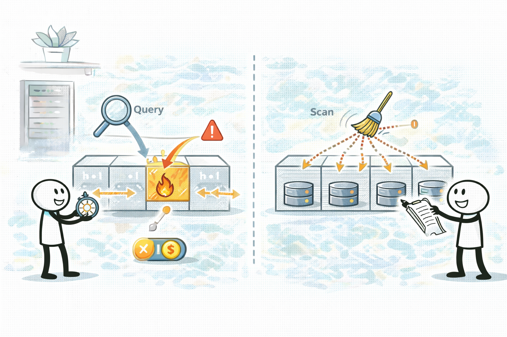
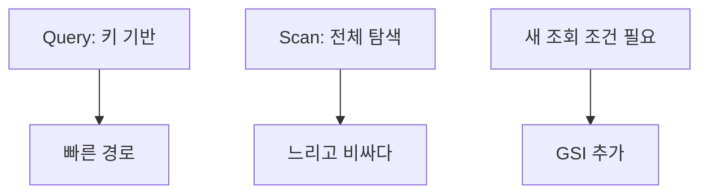

# DynamoDB: 키/Query/GSI가 성능을 결정한다

## 소개 (이게 뭔가요?)

- DynamoDB는 관리형 NoSQL이고, 시험에서는 “원하는 조회를 SQL처럼 다 된다”고 착각하는 순간 함정에 빠진다.

## 고객 사례 (스토리, 600~1000자)

주문 서비스가 성장하면서 “조회” 요구가 폭발한다. 고객별 주문 목록, 상태별 주문 목록, 최근 주문, 특정 기간의 주문 등등. 팀은 DynamoDB를 선택해 확장성 문제를 해결했다고 생각하지만, 얼마 지나지 않아 지연과 throttling이 늘어난다. 원인은 대부분 “키를 아무렇게나 잡고, 필요한 조건을 그때그때 Scan으로 뒤진다”는 데 있었다. 작은 데이터에선 티가 안 나다가, 데이터가 커지면 비용/지연이 폭증한다.

여기서 DynamoDB의 규칙이 중요해진다. Query는 “키 기반”이라 빠른 경로지만, Scan은 “전체 탐색”이라 느리고 비싸다. 따라서 요구 문장에 맞는 파티션 키/정렬 키(액세스 패턴)를 먼저 잡아야 한다. 그리고 “다른 조회 조건”이 필요해지면, SQL의 인덱스처럼 GSI(Global Secondary Index)로 새로운 액세스 패턴을 추가한다. DAX는 반복 읽기 핫패스를 줄이는 캐시이지만, 키 설계가 틀린 문제를 해결해주진 않는다.

시험은 여기서 한 가지를 더 섞는다. “특정 고객만 느리다”, “특정 키에서만 throttling이 난다” 같은 문장이다. 이건 보통 핫 파티션 신호다. 즉 “DynamoDB가 느리다”가 아니라 “키 분산이 깨졌다”가 핵심이다. 그래서 답도 “더 큰 용량”이 아니라 “키 설계/분산/액세스 패턴” 쪽으로 간다.

결국 DynamoDB 성능은 인스턴스를 키우는 문제가 아니라 “키/Query/GSI로 조회 경로를 설계하는 문제”다. 지금 시나리오의 조회는 Query로 풀 수 있나요, 아니면 새로운 패턴(GSI)이 필요할까요?

## Impact 범위 (어디에 영향을 주나?)

- Performance: Query 경로를 만들면 지연/처리량이 안정된다.
- Cost: Scan은 데이터가 커질수록 비용/지연이 폭증한다.
- Operations: 핫 파티션/스로틀링은 운영 이슈로 이어진다.

## Exam Guide (Badges)

Exam guide mapping (details)

- Domain: Domain 3: Design High-Performing Architectures
- Objectives: Query vs Scan, 키 설계, GSI 추가, 핫 파티션 신호를 구분할 수 있는지

## Why This Matters (시험/실무에서 걸리는 지점)

- “Scan으로 원하는 조건을 찾는다”는 선택지는 거의 함정이다.

## Core Concepts

- 파티션 키가 균등 분산되면 확장이 잘 된다.
- 핫 파티션 신호
  - 특정 키에 트래픽 집중
  - throttling/지연(“특정 사용자/특정 키” 힌트)
- GSI(Global Secondary Index)
  - “다른 액세스 패턴”을 추가(예: status로 조회)

## Deep Dive

### “액세스 패턴”이 1등 요구사항이다

DynamoDB는 인스턴스를 키워서 해결하는 DB가 아니라, **조회 경로(키/인덱스)를 설계**해서 성능을 만드는 DB다.

- Query는 “키 기반 빠른 경로”
- Scan은 “전체 탐색(데이터가 커질수록 지연/비용 폭증)”
- GSI는 “새로운 조회 조건(새 액세스 패턴) 추가”

따라서 **Query가 가능한 상황에서 Scan을 고르는 보기**는 거의 오답 후보가 된다.

### 언제 GSI로, 언제 캐시(DAX)로 가나

| 문제 신호 | 자연스러운 1순위 | 이유 |
|---|---|---|
| “새 조회 조건이 필요” | **GSI** | 조회 경로 자체가 없음 |
| “같은 데이터 반복 읽기, 약간의 지연 허용” | DAX/캐시 | DB 호출 수를 줄임 |
| “특정 키만 느림/스로틀링” | 키 분산/핫 파티션 해결 | 캐시만으로 근본 해결이 안 될 수 있음 |

즉, 캐시는 “읽기 핫패스 최적화”에는 강하지만, **키 설계/인덱스 부재** 문제를 대체하지 못한다.

### 시험에 자주 나오는 디테일

- “특정 사용자/특정 키만 느림”은 종종 **핫 파티션** 신호다. 이때 정답은 단순 용량 증설이 아니라 “키 분산/액세스 패턴” 쪽으로 기운다.
- “다른 조건으로도 조회해야 한다”는 문장이 보이면, SQL처럼 Scan으로 버티기보다 **인덱스(GSI)**를 추가하라는 문제인 경우가 많다.

### 핵심 정리 (Deep Dive)

- DynamoDB 성능 문제는 대부분 “Query 경로가 있나?”부터 확인하면 빠르게 풀린다.
- “새 조회 조건” → **GSI**, “전체 탐색” → **Scan 함정**, “반복 읽기” → **DAX/캐시** 축으로 분리한다.

## Quick Comparison Table

| Topic | Best | Notes |
|---|---|---|
| 키 기반 조회 | Query | 빠른 경로 |
| 조건이 키에 없음 | GSI | 새 액세스 패턴 |
| 전체 탐색 | Scan | 비용/지연 함정 |

## Exam Traps (확장)

- 더 많은 연계/고급 함정: `../../exam-trap-bank.md`
- Query가 가능한데 Scan을 고르는 선택지
- 핫 파티션 신호가 있는데 키 설계 변경 없이 “무조건 캐시(DAX)”로만 푸는 선택지

## Exam Trap Drill (O/X, 1~3분)

- “status로도 조회해야 한다” → Scan이 아니라 무엇을 추가할까요?

## TL;DR (한 줄 정리)

- DynamoDB 성능은 **키/Query/GSI**가 핵심이고, **Scan은 대부분 함정**이다.

## References

- References index: `../../references/README.md`
- Exam guide (SAA-C03): `../../references/exam-guide.md`
- Glossary: `../../references/glossary.md`
- AWS services list: `../../references/aws-services.md`
- Exam keypoints: `../../exam-keypoints.md`
- Exam trap bank: `../../exam-trap-bank.md`

## Back

- `./README.md`
