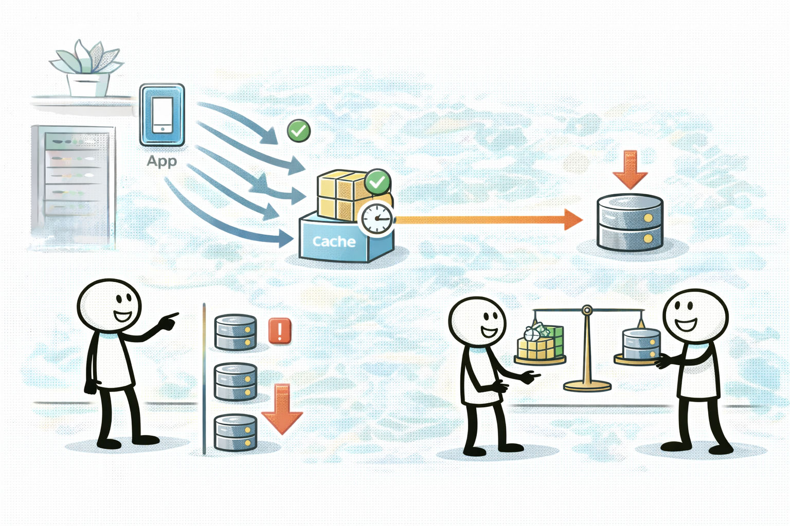
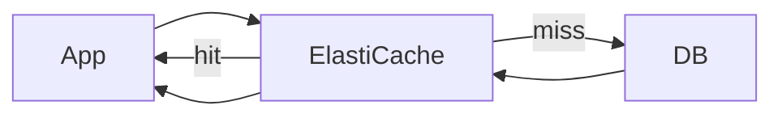

# ElastiCache: 반복 읽기 핫패스를 캐시로 뺀다

## 소개 (이게 뭔가요?)

- ElastiCache는 Redis/Memcached 기반 관리형 캐시이고, 시험에서는 “반복 읽기/핫 키/지연” 문장에서 레버리지로 자주 나온다.

## 고객 사례 (스토리, 600~1000자)

인기 기능이 생기면서 특정 API가 폭발한다. “홈 화면에 보여줄 추천 목록”처럼 대부분의 사용자가 비슷한 데이터를 반복해서 읽는다. DB는 CPU도 괜찮고 스토리지도 버티는데, 읽기 요청이 너무 많아 연결 수가 늘고 지연이 튄다. 팀은 읽기 리플리카를 늘리지만, 스파이크가 올 때마다 따라잡기 어렵고 비용도 계속 올라간다.

이때 캐시의 효과가 크게 나온다. 반복 읽기라면 DB 호출 수 자체를 줄이는 게 가장 빠르다. ElastiCache를 앞에 두고 “읽기 핫패스”를 캐시로 빼면, 지연이 줄고 DB 부하가 같이 내려간다. 다만 캐시는 만능이 아니다. 캐시 무효화(언제 지울지), 일관성(항상 최신이어야 하는지), 히트율(캐시가 실제로 맞을지) 같은 트레이드오프가 있다. 요구가 “항상 최신”이면 캐시를 조심해야 하고, “몇 분 정도 지연 허용”이면 캐시가 정답으로 급상승한다.

또 하나의 함정은 “캐시를 어디에 쓰는가”다. 세션/토큰처럼 짧게 살아도 되는 데이터, 추천/카탈로그처럼 반복 읽기가 많은 데이터는 캐시와 궁합이 좋다. 반대로 결제/잔액처럼 강한 일관성이 필요한 데이터는 캐시 전략을 더 조심해야 한다. 시험은 이런 키워드로 캐시의 적합도를 판단하게 만든다.

시험에서 ElastiCache가 나오면, 대개 문장 속에 “반복 조회/읽기 지연/핫 키” 같은 신호가 있다. 지금 요구는 ‘최신성’이 강한가요, ‘반복 읽기 감소’가 강한가요?

## Impact 범위 (어디에 영향을 주나?)

- Performance: 반복 읽기 핫패스에서 지연을 크게 줄일 수 있다.
- Cost: DB 스케일업/리플리카보다 비용 효율이 나올 수 있다.
- Operations: 캐시 무효화/일관성 정책이 운영 포인트다.

## Exam Guide (Badges)

Exam guide mapping (details)

- Domain: Domain 3: Design High-Performing Architectures
- Objectives: 반복 읽기/핫패스에서 캐시가 적절한지(일관성 요구 포함) 판단할 수 있는지

## Why This Matters (시험/실무에서 걸리는 지점)

- “읽기 지연/반복 조회” 문장에서 캐시를 떠올리면 정답 후보가 선명해진다.

## VAKOG Anchors

- V(Visual): 아래 캐시 hit/miss 흐름을 떠올린다.
- A(Auditory): “반복 읽기=캐시, 최신성 강함=조심”을 말로 고정한다.
- O(Olfactory, smell test): “항상 최신”인데 캐시를 무조건 고르는 답은 냄새가 난다.
- G(Gustatory, taste test): 문장 1개로 캐시가 맞는지 판정한다.

## Core Concepts

## Quick Comparison Table

| Topic | ElastiCache | DAX |
|---|---|---|
| 대상 | 여러 DB/핫패스 캐싱 | DynamoDB 전용 캐시 |
| 대표 신호 | 반복 읽기/핫 키 | DynamoDB 읽기 핫패스 |
| 함정 | 무효화/일관성 | 키 설계 문제는 못 고침 |

## Exam Traps (5-8)

- 최신성 요구가 강한데 캐시를 “무조건” 고르는 선택지
- 캐시 히트율/무효화 얘기 없이 캐시만 추가하는 선택지

## Taste Test (1~3분)

- “동일 데이터 반복 조회가 많고, 몇 분 정도 지연은 허용된다” → 무엇이 먼저 떠오르나요?

## TL;DR (한 줄 정리)

- 반복 읽기 핫패스면 **ElastiCache**가 강력하지만, **무효화/일관성 요구**가 정답을 가른다.

## Back

- `./00-theory-index.md`
