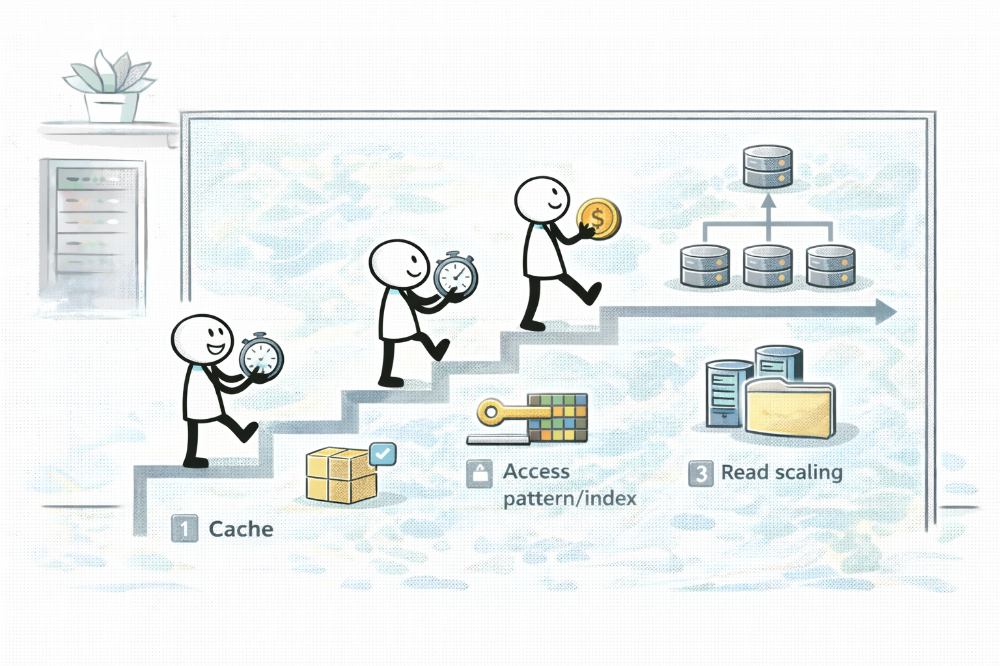

# Day 04 - DB performance + caching (DB 성능 + 캐시: DynamoDB/Aurora/ElastiCache)



## Quick Links

- [오늘의 이야기](#오늘의-이야기)
- [Timeline](#timeline-오늘-학습-타임라인)
- [Flow](#flow-서비스-연결-흐름)
- [Reading](#reading-서비스별-theory)
- [Quiz](#quiz)
- [References](../../references/README.md)

## 오늘의 이야기

DB 성능 이슈는 늘 비슷한 그림으로 시작합니다. “읽기가 느려요”, “쿼리가 밀려요”, “피크에만 터져요.” 그런데 해결책은 하나가 아니죠. 오늘은 DynamoDB, Aurora, ElastiCache를 같은 회의실 안에 앉혀놓고 역할을 나눕니다. DynamoDB는 키 설계와 Query 패턴이 성능을 결정합니다. “스캔이 많다”거나 “파티션 키가 잘못됐다”는 신호가 보이면, 스케일업이 아니라 모델링을 다시 봐야 해요. Aurora는 읽기 확장/DB 성능 패턴 쪽에서 자주 나오고, 읽기 부하를 분산시키는 구조를 떠올리게 합니다.

그 사이에 ElastiCache가 들어오는 순간은 더 명확해요. 같은 데이터를 반복해서 읽는 “핫패스”가 있고, 그게 DB를 때려서 지연이 생기면 캐시로 빼는 게 가장 자연스럽습니다. 실무에서도 “DB를 더 키울까요?” 전에 “캐시로 뺄 수 있나?”를 먼저 묻죠. 시험에서도 똑같습니다. “반복 읽기”, “지연”, “오리진 부하” 같은 신호가 나오면 ElastiCache가 정답 후보가 됩니다. 오늘은 이 세 가지를 외워서 푸는 게 아니라, 문장 신호로 연결하는 감각을 만드는 날이에요. **모델링(키/쿼리) → 읽기 확장(Aurora) → 핫패스 캐시(ElastiCache)** 순서로 생각하면, 성능 문제는 훨씬 구조적으로 풀립니다.

추가로, 캐시는 “붙이면 좋아진다”가 아니라 “무엇을 캐시할 건가”가 중요합니다. 읽기가 핫한 데이터가 무엇인지, TTL을 얼마나 둘지, 캐시가 깨졌을 때(미스) DB로 어떤 부하가 가는지까지 생각해야 해요. DynamoDB도 마찬가지로, 인덱스(GSI)나 Query 패턴을 제대로 잡지 않으면 캐시로 임시 처방을 해도 근본 병목이 남습니다. Aurora는 읽기 확장이 필요할 때 후보가 되고, ElastiCache는 반복 읽기 핫패스를 떼어낼 때 후보가 되는 식으로, 오늘은 ‘문장 → 후보’ 매칭을 여러 번 반복해서 손에 붙이는 시간을 가집니다.

시험에서는 이게 보통 이렇게 나옵니다. “DB를 더 키워라” 같은 선택지와 “캐시로 빼라” 같은 선택지가 같이 나오고, 정답은 ‘반복 읽기/핫패스’ 신호를 잡는 쪽입니다. 오늘은 그 신호를 놓치지 않게, DynamoDB/Aurora/ElastiCache를 한 문장으로 비교해서 말하는 연습까지 하고 넘어갑니다.

## Timeline (오늘 학습 타임라인)

```mermaid
flowchart LR
  A[0-10m: 워밍업(모델링/확장/캐시)] --> B[10-140m: Reading]
  B --> C[140-160m: 미니 정리(신호 매칭)]
  C --> D[160-210m: Trap drill(캐시/DB 혼동)]
  D --> E[210-240m: Quiz]
```

## Flow (서비스 연결 흐름)

```mermaid
flowchart LR
  App[App] --> DB{DB 선택/패턴}
  DB --> DDB[DynamoDB<br/>(키/Query/GSI)]
  DB --> AUR[Aurora<br/>(읽기 확장 패턴)]
  App --> Hot[반복 읽기 핫패스] --> Cache[ElastiCache]
  Cache --> DB
```

## Reading (서비스별 theory)

- [DynamoDB: 키/Query/GSI가 성능을 결정한다](01-dynamodb.md)
- [ElastiCache: 반복 읽기 핫패스를 캐시로 뺀다](02-elasticache.md)
- [Aurora: 읽기 확장과 DB 성능 패턴](03-aurora.md)

## Quiz

- [Day 04 Quiz](03-quiz.md)

## Back

- `../README.md`
