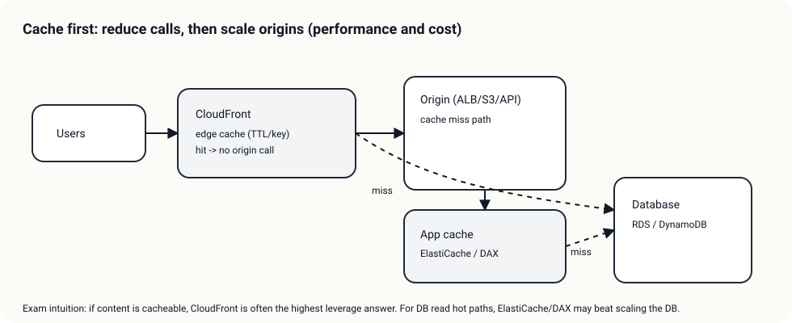
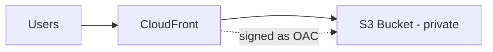

# Special Lecture + Week Summary (Domain 3)

## 소개 (이게 뭔가요?)

- Week 3(Domain 3)에서 자주 섞이는 “고성능 패턴”을 **진단 순서/선택 기준/함정**으로 한 번에 회수한다.
- CloudFront/GA, EBS/EFS, DynamoDB/Aurora, ElastiCache/DAX 같은 비교 포인트를 “문장 신호”로 연결한다.

## 고객 사례 (스토리)

서비스가 성장하자, 성능 이슈가 ‘한 번에 한 군데’만 터지지 않는다. 글로벌 사용자 비중이 늘면서 RTT 때문에 페이지가 늦게 뜨고, 동시에 인기 기능 때문에 반복 읽기가 폭증해 DB가 버티지 못한다. 팀은 급한 대로 인스턴스를 키우고, 리플리카를 늘리고, 캐시도 붙이려 한다. 그런데 담당자가 1명이라, 무엇부터 해야 하는지조차 정리가 안 된다. “일단 스펙 업”은 비용만 올리고, 문제는 계속 남는다.

이때 중요한 건 서비스가 아니라 순서다. 먼저 캐시(CloudFront/ElastiCache/DAX)로 불필요한 호출을 줄일 수 있는지 본다. 그다음 DB 액세스 패턴(키/인덱스/Query vs Scan)이 병목인지 확인한다. 스토리지 I/O(EBS 타입/IOPS/처리량)나 네트워크 경로(GA/엣지/리전)가 신호라면 그 축으로 이동한다. 마지막으로 컴퓨트(EC2/Lambda 동시성)는 ‘다른 축을 봤는데도’ 남는 병목일 때 들어간다.

여기서 시험 함정은 “이름만 비슷한 서비스”를 섞어 놓는 방식이다. CloudFront와 Global Accelerator를 같은 ‘가속’으로 착각하게 만들거나, DynamoDB에서 Query와 Scan을 섞어서 “대충 조회하면 되지”로 유도한다. 그래서 더더욱 ‘순서’가 필요하다.

즉 Domain 3는 “빠른 서비스 하나”를 고르는 시험이 아니라, **문장 신호를 병목 축으로 매칭**해서 진단하는 시험이다. 지금 케이스에서 1번으로 의심되는 축은 무엇인가요?

## Impact 범위 (어디에 영향을 주나?)

- Performance: 병목 축을 맞추면 체감 지연이 크게 개선된다.
- Cost: “스펙 업만 반복”은 비용을 급격히 키운다(캐시/패턴/튜닝이 더 효율적일 수 있다).
- Operations: 진단 순서가 있으면 대응이 단순해지고 재발 방지가 쉬워진다.

## Exam Guide (Badges)

Exam guide mapping (details)

- Domain: Domain 3: Design High-Performing Architectures
- Task focus:
  - 3.1 Storage
  - 3.2 Compute
  - 3.3 Database
  - 3.4 Network
  - 3.5 Data ingestion/transformation

## Week 3 Diagnosis Order (시험에서 통하는 순서)

1. 캐시(CloudFront/ElastiCache)로 불필요한 호출을 줄일 수 있는가
2. DB/키/인덱스/파티션이 병목인가
3. 스토리지 IOPS/throughput이 부족한가(EBS/EFS)
4. 컴퓨트가 부족한가(EC2/Lambda concurrency)
5. 네트워크 경로/엣지/리전 선택이 문제인가

## Core Concepts

- Domain 3는 “성능 최적화”를 단일 서비스 선택이 아니라 “병목 진단 순서”로 푸는 문제로 자주 나온다.

## Confusing Similar Cases

| Scenario | Best choice | Why | Common wrong choice | Why it's wrong |
|---|---|---|---|---|
| 글로벌 정적 콘텐츠 | CloudFront | 캐시/엣지 | 단일 리전 S3만 | RTT/지연 증가 |
| 고정 IP 가속(개념) | Global Accelerator | Anycast | CloudFront | L7 캐시 목적과 다름 |
| DynamoDB 지연 | 키 설계/GSI | 핫 파티션 회피 | 무조건 DAX | 근본 키 설계 문제는 남음 |
| DB 읽기 성능 | 캐시/인덱스 | 반복 조회 최적화 | 스케일업만 | 비용 증가/한계 |

## Exam-Heavy Pattern: CloudFront + Private S3 (OAC)

- S3는 퍼블릭이 아니고, CloudFront만 접근하도록 bucket policy를 제한한다.
- 캐시 키/TTL/무효화(invalidation)가 선택지로 등장한다.

## Exam must-know (요약)

- Key point: 캐시 가능하면 캐시(CloudFront/ElastiCache)가 1순위 후보, 키/인덱스/IOPS 신호가 있으면 그 축으로 들어간다.
- Why: 성능 문제의 원인은 CPU보다 네트워크 RTT/캐시 히트율/DB 액세스 패턴/스토리지 I/O에 있는 경우가 많다.
- Alternative: 요구가 “복원력” 중심이면(Domain 2) DR/ASG/큐로, “비용” 중심이면(Domain 4) 티어링/구매 옵션/전송 비용으로 전환한다.

## Reference Pack

- `aws-saa/special-lectures/domain03-high-performing-top-services.md`

## TL;DR (한 줄 정리)

- Domain 3는 “서비스 하나”가 아니라 **병목 축(캐시→DB 패턴→스토리지 I/O→컴퓨트→네트워크 경로)**으로 진단해서 선택하는 도메인이다.

## References

- Internal references:
  - [References index](../../references/README.md)
  - [Exam guide (SAA-C03)](../../references/exam-guide.md)
  - [Glossary](../../references/glossary.md)
  - [AWS services list](../../references/aws-services.md)
  - [Exam keypoints](../../exam-keypoints.md)
  - [Exam trap bank](../../exam-trap-bank.md)

- Official AWS documentation:
  - [AWS KMS Developer Guide](https://docs.aws.amazon.com/kms/latest/developerguide/overview.html)
  - [Amazon S3 User Guide](https://docs.aws.amazon.com/AmazonS3/latest/userguide/Welcome.html)
  - [Search: S3 SSE-KMS](https://docs.aws.amazon.com/search/doc-search.html?searchQuery=S3%20SSE-KMS)
  - [Amazon EC2 User Guide](https://docs.aws.amazon.com/AWSEC2/latest/UserGuide/concepts.html)
  - [Search: Amazon EBS](https://docs.aws.amazon.com/search/doc-search.html?searchQuery=Amazon%20EBS)
  - [Amazon EFS User Guide](https://docs.aws.amazon.com/efs/latest/ug/whatisefs.html)
  - [Amazon CloudFront Developer Guide](https://docs.aws.amazon.com/AmazonCloudFront/latest/DeveloperGuide/Introduction.html)
  - [AWS Global Accelerator Developer Guide](https://docs.aws.amazon.com/global-accelerator/latest/dg/what-is-global-accelerator.html)
  - [Amazon DynamoDB Developer Guide](https://docs.aws.amazon.com/amazondynamodb/latest/developerguide/Introduction.html)
  - [Amazon ElastiCache User Guide](https://docs.aws.amazon.com/AmazonElastiCache/latest/red-ug/WhatIs.html)
  - [Search: Amazon Aurora](https://docs.aws.amazon.com/search/doc-search.html?searchQuery=Amazon%20Aurora)
