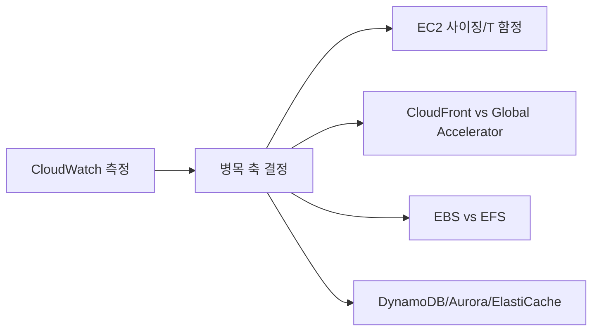

# Day 05 - Special Lecture + Week Summary (Domain 3)

## Quick Links

- [오늘의 이야기](#오늘의-이야기)
- [Timeline](#timeline-오늘-학습-타임라인)
- [Flow](#flow-서비스-연결-흐름)
- [Reading](#reading)
- [Quiz](#quiz)
- [References](../../references/README.md)

## 오늘의 이야기

이번 주(Domain 3)는 “빠르게 만들기”가 아니라 “병목을 정확히 찍고, 그 축에 맞는 도구를 고르는 법”이었습니다. 성능 이슈가 생기면 사람들은 보통 서버를 키우거나 DB를 바꾸려 하지만, 실제로는 측정이 먼저고, 선택은 문장 신호가 결정하죠. 오늘은 그래서 EC2 사이징과 CloudWatch 관측을 한 세트로 묶고, 글로벌 성능에서는 CloudFront(캐시)와 Global Accelerator(경로)를 갈라보고, 스토리지는 EBS(블록, 숫자로 튜닝)와 EFS(공유 파일)를 분리합니다. DB는 DynamoDB/Aurora/ElastiCache를 “모델링/읽기 확장/캐시”로 나누고요.

정리하는 날에는 서비스별 기능을 길게 복습하기보다, 케이스를 봤을 때 “이건 캐시 신호네”, “이건 T 인스턴스 함정이네”, “이건 공유 파일이라 EFS네” 같은 식으로 바로 소거되는 감각이 중요합니다. 오늘 pack은 그 감각을 회수하는 데 초점을 맞춥니다. 결국 성능 문제는 대부분 **측정(CloudWatch) → 병목 축 결정 → 적합한 서비스/옵션 선택**으로 귀결되니까요. 이 흐름을 말로 설명할 수 있으면, Domain 3는 정리가 끝납니다.

오늘은 케이스를 짧게 여러 개 돌려보면서 “왜 이 선택지가 정답인지”를 한 줄로 말하는 연습을 합니다. 예를 들어 “정적 콘텐츠 전 세계 지연”이면 CloudFront, “캐시가 안 되는 글로벌 가속”이면 Global Accelerator, “공유 파일”이면 EFS, “IOPS/처리량 튜닝”이면 EBS, “반복 읽기 핫패스”면 ElastiCache 같은 식이죠. 이처럼 문제를 읽자마자 후보가 좁혀지는 상태가 되면, Domain 3는 암기보다 훨씬 덜 힘들게 풀립니다.

마지막으로, 성능 문제는 “가장 비싼 서비스”가 아니라 “가장 맞는 레버”를 고르는 게임이라는 걸 다시 확인합니다. CloudWatch로 근거를 만들고, 컴퓨트/엣지/스토리지/DB 중 어디가 병목인지 찍고, 거기에 맞는 선택지를 고르는 것. 오늘은 그 흐름을 깔끔하게 회수하고 다음 주로 넘어갑니다.

## Timeline (오늘 학습 타임라인)

```mermaid
flowchart LR
  A[0-15m: 워밍업(병목 축/신호 10개)] --> B[15-195m: Special lecture pack]
  B --> C[195-225m: 케이스 워크스루]
  C --> D[225-240m: Quiz]
```

## Flow (서비스 연결 흐름)



## Reading

- Pack: `aws-saa/special-lectures/domain03-high-performing-top-services.md`

## Quiz

- [Day 05 Quiz](03-quiz.md)

## Back

- `../README.md`
