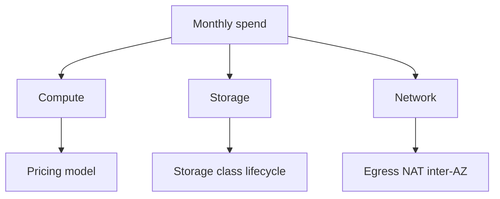

# Theory

## Exam Guide Mapping

- Domain: Domain 4: Design Cost-Optimized Architectures
- Task focus:
  - 4.1 Storage
  - 4.2 Compute
  - 4.3 Database
  - 4.4 Network

## Core Concepts

- 비용은 “사용량(시간/요청/GB) x 단가”다.
- 비용 최적화는 “요구사항을 유지하면서 비용 드라이버를 줄이는 설계”다.
- 가시성이 없으면 최적화가 없다
  - 태그/계정/서비스/리전 차원으로 “어디서 돈이 나가는지”부터 본다.

## Cost Drivers Cheat Sheet

- Compute: 인스턴스 시간, 컨테이너/서버리스 호출/동시성, 구매 옵션
- Storage: GB-month, 요청 수, 복구(Glacier) 비용, 복제/스냅샷
- Network: 인터넷 egress, NAT 경유, 교차 AZ/리전 전송

## Tagging & Cost Allocation (시험형 포인트)

- “팀별/프로젝트별 비용 분리” 요구가 나오면
  - 계정 분리(Organizations) 또는 태그 기반 차지백이 정답 후보가 된다.
- 태그는 “표준화”가 핵심
  - 예: `CostCenter`, `Service`, `Env`, `Owner`

## Cost Explorer vs Budgets (Choose-this-not-that)

| Goal | Best tool | Why | Trap |
|---|---|---|---|
| 비용 분석/추세/그룹핑 | Cost Explorer | 필터/그룹 분석 | Budgets만 만들고 분석이 없다고 착각 |
| 초과 알림/통제 | Budgets | 임계치 알림 | Cost Explorer가 알림을 준다고 착각 |

## Exam must-know (요약)

- Key point: “팀/프로젝트별 비용 분리” 문장이 있으면 태그 표준화/계정 분리 + Cost Explorer가 정답 후보로 올라간다.
- Why: 분해 가능한 차원(계정/태그/서비스/리전)이 있어야 차지백/쇼백이 가능하고, 분석 도구는 Cost Explorer가 대표다.
- Alternative: “초과 시 알림/통제” 요구가 있으면 Budgets(알림/임계치)가 후보가 된다.

## Exam Traps

- 태깅 없이 “팀별 비용”을 정확히 보겠다는 선택지
- NAT 비용/데이터 전송 비용이 숨어 있는데 컴퓨트만 줄이는 선택지
- “최적화 = 무조건 cheapest”로 가는 오답(요구사항 위반)
