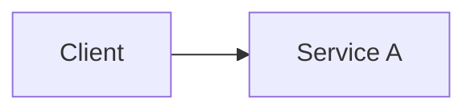

# Theory

## Exam Guide Mapping

- Domain: Domain 4: Design Cost-Optimized Architectures
- Objectives: TODO (?쒗뿕 媛€?대뱶 臾멸뎄瑜?洹몃?濡?遺숈씠吏€ 留먭퀬, ?섎? ?⑥쐞濡??붿빟)

## Core Concepts

- TODO

## Deep Dive

### Service A

- When to use / When not to use
- Key limits & tradeoffs
- Security & IAM
- Cost drivers
- Common architectures

### Service B

- TODO

## Quick Comparison Table

| Topic | Option 1 | Option 2 | Notes |
|---|---|---|---|
| TODO | TODO | TODO | TODO |

## Exam Traps (5-8)

- TODO

