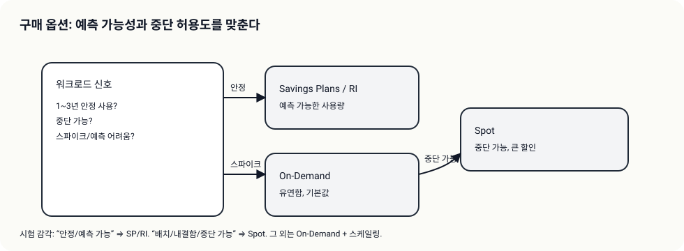
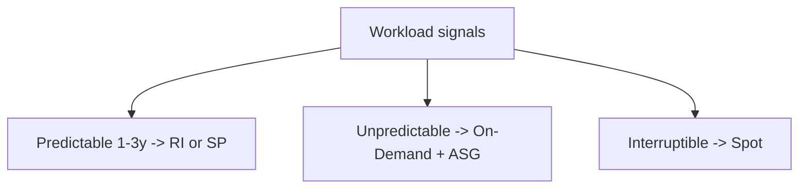

# Theory

## Exam Guide Mapping

- Domain: Domain 4: Design Cost-Optimized Architectures
- Task focus:
  - 4.2 Design cost-optimized compute solutions

## Core Concepts

- 비용 절감은 “요구사항 신호”로부터 시작한다
  - 예측 가능(steady state) -> 할인 모델(RI/Savings Plans)
  - 중단 허용 -> Spot
  - 변동/스파이크 -> On-Demand + Auto Scaling
- right-sizing은 감이 아니라 측정이다(CloudWatch, p95/p99, utilization)

## Deep Dive

### Purchase Options (시험형 선택 기준)

- On-Demand
  - 기본값, 유연, 할인 적음
- Reserved Instances / Savings Plans
  - 장기 예측 가능(1~3년) + 할인
  - 시험 힌트: “steady state”, “predictable usage”
- Spot
  - 중단 허용 워크로드에 큰 할인
  - 시험 힌트: “fault tolerant”, “batch”, “can be interrupted”

#### Exam must-know (포인트 + Why + 대안)

- Key point: “steady state/predictable 1-3년”이면 RI/SP, “interruptible/batch”면 Spot이 정답 후보로 올라간다.
- Why: 구매 옵션은 기술 문제가 아니라 요금 모델 선택 문제이며, 문장에 신호가 직접 등장한다.
- Alternative: 요구가 “가용성/중단 불가”면 Spot은 오답 후보가 되고, On-Demand + ASG/멀티 AZ로 돌아간다.

### Right Sizing = 측정 기반 의사결정

- 신호
  - CPU/메모리/네트워크/IO 지표(CloudWatch/내장 지표)
  - p95/p99 지연(앱 지표)
- 함정
  - “더 큰 인스턴스 1대”로만 해결(비용/가용성 악화)

### Auto Scaling을 비용 최적화로 쓰는 패턴

- 피크 시간만 확장, 비피크는 축소
- Scheduled scaling(스케줄 액션)으로 야간 0도 가능(워크로드 성격에 따라)

## Exam Traps

- 중단 허용인데 On-Demand만 고르는 오답(Spot 후보)
- 예측 가능인데 On-Demand만 고르는 오답(RI/SP 후보)
- right sizing을 “스펙 감”으로 결정하는 선택지(측정 기반이 정답)
