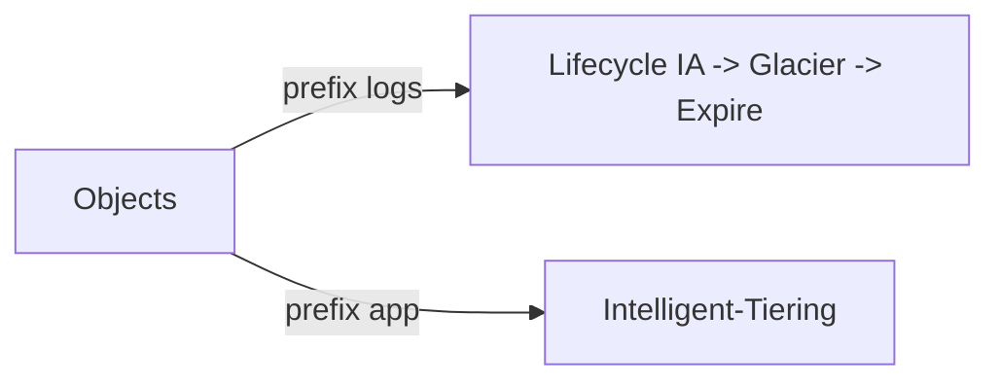

# Theory

## Exam Guide Mapping

- Domain: Domain 4: Design Cost-Optimized Architectures
- Task focus:
  - 4.1 Design cost-optimized storage solutions

## Core Concepts

- 스토리지 비용 최적화는 “액세스 패턴 + 복구 요구”를 같이 본다
  - 자주 접근: Standard
  - 가끔 접근: IA 계열
  - 거의 안 함: Glacier 계열(복구 시간/비용 트레이드오프)
- Lifecycle은 “자동 정책화”다(수동 이동은 운영비를 만든다)

## Deep Dive

### Storage class 선택 프레임

- 액세스 패턴
  - Hot(자주): Standard
  - Warm(가끔): Standard-IA 등
  - Cold(거의 없음): Glacier 계열(복구 시간/비용 트레이드오프)
- 복구 요구(복구 시간)
  - “즉시 필요” vs “몇 시간/몇 분 괜찮음”이 문제 문장에 힌트로 등장

### Lifecycle rule = 자동 정책화

- 전환(Transition): 시간이 지나면 더 저렴한 클래스로 이동
- 만료(Expiration): 보관 정책에 따라 삭제
- prefix 기반 분리: 데이터 성격이 다르면 정책이 달라야 한다

#### Exam must-know (포인트 + Why + 대안)

- Key point: “장기 보관/액세스 드묾” 신호가 있으면 lifecycle + Glacier 계열이 정답 후보가 된다.
- Why: 저장 클래스는 단순히 ‘싸다’가 아니라 복구 시간과 요청 비용 트레이드오프가 있어 요구사항을 만족해야 한다.
- Alternative: 액세스 패턴이 불명확하면 Intelligent-Tiering이 후보가 된다(“자동 최적화” 문장이 신호).

### Intelligent-Tiering (시험 힌트)

- 액세스 패턴이 예측하기 어려운 경우 후보
- “자동 최적화” 문장이 힌트가 된다

## Exam Traps

- “모든 데이터를 Glacier”로 옮기는 오답(복구 시간/비용을 무시)
- lifecycle을 “전체 데이터에 일괄 적용”하는 오답(중요 데이터까지 전환)
