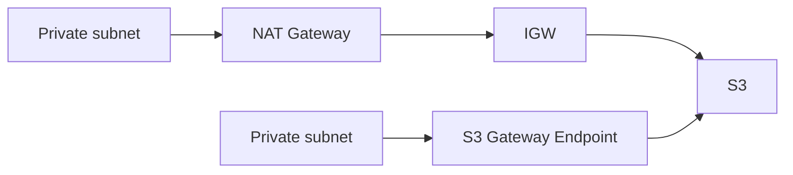

# Theory

## Exam Guide Mapping

- Domain: Domain 4: Design Cost-Optimized Architectures
- Task focus:
  - 4.4 Design cost-optimized network architectures

## Deep Dive

### Data Transfer Cost: “숨은 비용”

- 자주 나오는 함정 문장
  - “프라이빗 서브넷에서 외부/서비스로 자주 호출”
  - “대량 다운로드/스트리밍”
  - “멀티 AZ/리전 간 통신”
- 최적화 방향(시험형)
  - 사설 경로(endpoint)로 NAT/인터넷 경유 줄이기
  - 엣지 캐시(CloudFront)로 오리진 호출/전송량 줄이기

### NAT vs S3 Gateway Endpoint (비용 관점)

- NAT는 편하지만 비용 드라이버가 될 수 있다(요구 문장에 “자주/대량”이 있으면 힌트).
- S3 접근이 핵심이면 gateway endpoint가 정답 후보가 된다.

### CloudFront가 비용 최적화가 되는 신호

- 전 세계 사용자 + 정적/캐시 가능 콘텐츠
- 오리진 요청 수/전송량이 크다
- 캐시 히트로 오리진 비용을 줄일 수 있다

## Exam Traps

- NAT를 무조건 정답으로 고르는 오답(요구가 S3 접근/비용이면 endpoint 후보)
- 캐시 불가능(개인화/강한 일관성)인데 CloudFront를 고르는 오답
