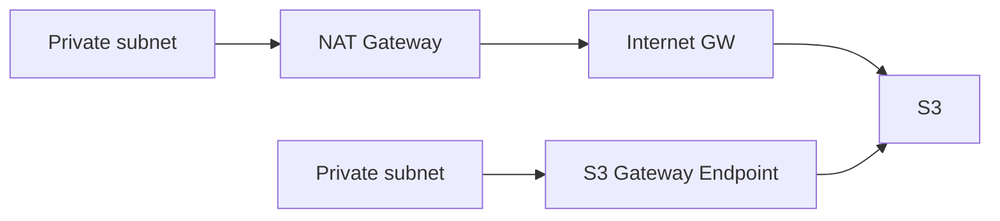

# Special Lecture + Week Summary (Domain 4)

## Exam Guide Mapping

- Domain: Domain 4: Design Cost-Optimized Architectures
- Task focus:
  - 4.1 Storage
  - 4.2 Compute
  - 4.3 Database
  - 4.4 Network

## Week 4 Cost Driver Rules

- “사용량(시간/요청/데이터 전송)”과 “단가(요금 모델)”의 곱이 비용이다.
- 비용 문제는 보통 “요구사항을 유지하면서 드라이버를 제거”하는 대안 비교로 출제된다.
- NAT 비용은 숨은 폭탄으로 자주 나온다(특히 프라이빗 서브넷 -> S3).

## Core Concepts

- Domain 4는 “가시화 -> 분류(Compute/Storage/Network) -> 대안 비교” 순서로 푸는 문제가 많다.

## Confusing Similar Cases

| Scenario | Best choice | Why | Common wrong choice | Why it's wrong |
|---|---|---|---|---|
| 1~3년 예측 가능 | Savings Plans/RI | 할인/예측 가능 | On-Demand | 할인 없음 |
| 중단 허용 배치 | Spot | 큰 할인 | On-Demand | 비용 비쌈 |
| S3 장기 보관 | lifecycle + Glacier 계열 | 자동 전환 | Standard 유지 | 장기 비용 과다 |
| 프라이빗 S3 접근 | S3 Gateway Endpoint | NAT 비용 제거 | NAT Gateway | 트래픽 따라 비용 증가 |

## Pattern: NAT vs Endpoint (Cost tradeoff)

## Exam must-know (요약)

- Key point: “예측 가능/중단 허용/장기 보관/프라이빗 S3 접근” 같은 신호는 Domain 4의 대표 키워드다.
- Why: 비용 문제는 기술적 가능성보다 “요금 모델/전송/티어링”의 선택 문제로 귀결되며, 문제 문장에 신호가 직접 들어간다.
- Alternative: 요구사항이 성능/가용성 중심이면 비용 최적화만으로 풀지 말고(Domain 2/3) 먼저 요구를 만족하는 설계를 만든 뒤 비용을 줄인다.

## Reference Pack

- `aws-saa/special-lectures/domain04-cost-optimized-top-services.md`
