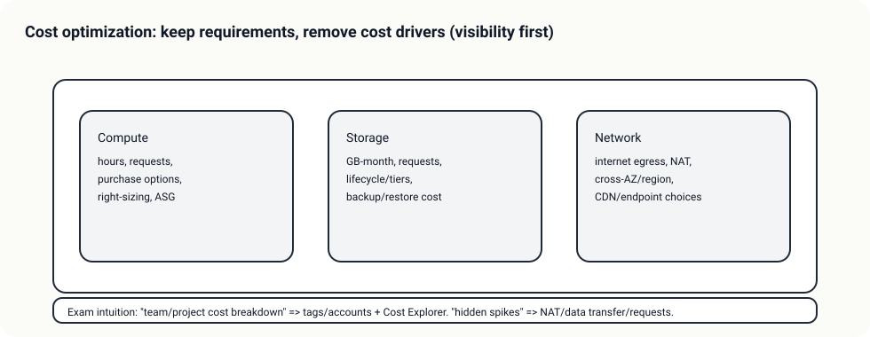

# Day 01 - Theory Index (Cost drivers + 가시성: 태그/Cost Explorer/Budgets)

> 이 문서는 Day 이론 “인덱스”다. 상세 이론은 Day 폴더 바로 아래 `01-*.md` 서비스별 문서로 분리한다.

## 소개 (이 Day는 무엇을 묶나?)

- Domain 4는 “돈을 아끼자”가 아니라, **요구사항을 유지하면서 비용 드라이버를 줄이는 설계**를 묻는다.
- Day 01은 그 출발점으로, “어디서 돈이 나가는지”를 **가시화(태그/분해) → 분석(Cost Explorer) → 알림/통제(Budgets)** 흐름으로 잡는다.

## 고객 사례 (스토리, 600~1000자)

서비스가 잘 되기 시작했는데, 한 달 뒤 청구서가 더 빨리 성장했다. “어디서 많이 나가나요?”라는 질문에 팀은 대답을 못 한다. 계정은 하나고, 리소스 이름은 제각각이며, 누가 만든 건지도 모르겠다. 운영 담당은 1명이라, 매번 비용을 줄이기 위해 ‘그럴듯한’ 인스턴스를 몇 개 끄는 식으로 대응한다. 하지만 며칠 뒤 또 비슷한 비용 급증이 반복된다.

여기서 전환점은 최적화가 아니라 가시성이다. 비용은 “사용량(시간/요청/GB) × 단가”로 쪼개고, 컴퓨트/스토리지/전송 3축 중 어디가 드라이버인지 먼저 잡는다. 그리고 “팀/프로젝트별로 비용을 나눠 보고 싶다”는 요구가 나오면 태그가 없이는 정확도가 나오지 않는다. 태그를 표준화하고(예: CostCenter/Service/Env/Owner), Cost Explorer로 서비스/리전/태그 기준으로 비용을 분해해 보면, ‘추측’이 아니라 ‘근거’로 이야기할 수 있다.

마지막으로 급증 감지는 Budgets가 맡는다. 분석(원인 파악)은 Cost Explorer, 알림/임계치(초과 감지)는 Budgets로 역할이 갈린다. Day 01에서 이 구분을 잡아두면, 이후의 모든 비용 최적화(구매 옵션, S3 클래스, NAT 비용)도 “어디서 새는지”를 먼저 확인하는 습관으로 연결된다.

지금 당신 팀은 “어디서 돈이 새는지”를 서비스/리전/팀 단위로 바로 말할 수 있나요?

## Impact 범위 (어디에 영향을 주나?)

- Cost: 비용 드라이버를 특정해야 ‘정확하게’ 줄일 수 있다.
- Operations: 태그/대시보드/알림이 없으면 최적화가 운영 부채가 된다.
- Security: 권한/계정 구조(누가 무엇을 만들었나)가 비용 가시성과 맞물린다.

## Exam Guide (Badges)

Exam guide mapping (details)

- Domain: Domain 4: Design Cost-Optimized Architectures
- Task focus: 가시화/분해/알림을 통해 비용 드라이버를 식별하는 능력

## Core Concepts

- 비용 = 사용량(시간/요청/GB) × 단가
- 최적화 = “요구사항을 유지하면서” 드라이버를 줄이는 설계
- 가시화 없이는 최적화가 없다
  - 태그/계정/서비스/리전 차원으로 “어디서 돈이 나가는지”부터 본다

## Cost Drivers Cheat Sheet

- Compute: 인스턴스 시간, 구매 옵션(온디맨드/할인/스팟), 자동 확장
- Storage: GB-month, 요청 수, 복구(Glacier) 비용, 라이프사이클/티어링
- Network: 인터넷 egress, NAT 경유, 교차 AZ/리전 전송

## Service Theories (서비스별로 읽기)

- [Cost Explorer: 비용을 “분해해서” 본다](01-cost-explorer.md)
- [AWS Budgets: 초과를 “알림/통제”한다](02-budgets.md)
- [Cost allocation tags: 팀/프로젝트 비용을 나눠 본다](03-cost-allocation-tags.md)

## Decision Rules (정답을 가르는 규칙 3개)

1. “팀/프로젝트별 비용”이면 **태그 표준화(또는 계정 분리)**가 먼저다.
2. “원인 분석/추세/그룹핑”이면 **Cost Explorer**, “초과 알림/임계치”면 **Budgets**다.
3. 비용은 우선 **Compute/Storage/Network** 3축으로 분해하고, 드라이버를 하나씩 제거한다.

## Smell Test (레드 플래그 3~5)

- 태그 없이 “팀별 비용”을 정확히 본다고 하는 답
- NAT/데이터 전송 비용을 무시하고 컴퓨트만 줄이는 답
- “최적화=무조건 cheapest”로 가서 요구사항(성능/가용성/보안)을 깨는 답

## TL;DR (한 줄 정리)

- Domain 4의 출발은 **가시화(태그) → 분석(Cost Explorer) → 알림(Budgets)**이고, 그 다음에야 ‘줄일 곳’이 보인다.
