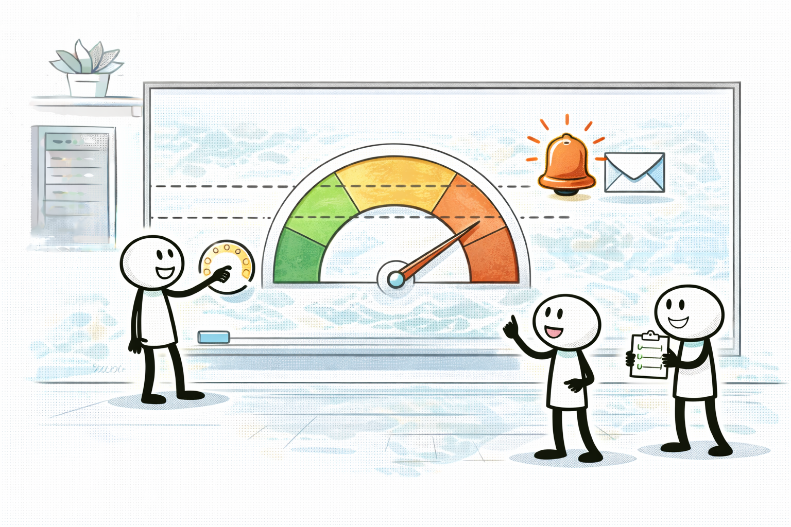

# AWS Budgets: 초과를 “알림/통제”한다

## 소개 (이 서비스/주제는 무엇인가?)

- AWS Budgets는 비용/사용량이 **임계치를 넘기기 전에 알림**을 주고, 상황에 따라 **통제 액션**까지 연결할 수 있는 도구다.

## 고객 사례 (스토리, 600~1000자)

팀은 비용을 줄이려고 노력했지만, 항상 “한 달이 끝나고 나서야” 문제가 보였다. 월말에 청구서를 보면 이미 늦다. 특히 프리티어를 넘기거나, NAT/데이터 전송 같은 숨은 드라이버가 터지면 체감은 더 크다. 운영 담당이 1명인 팀에겐 “나중에 분석”보다 “빨리 알아채는 것”이 더 중요할 때가 많다.

그래서 Budgets를 월 예산으로 하나 만들고, 80%/100% 같은 임계치에 이메일 알림을 걸었다. 권한이 되는 조직이라면 알림을 SNS로 연결해 슬랙/티켓으로도 보낼 수 있다. 이 한 가지로 대응 방식이 바뀐다. 비용이 급증하면 당일에 신호가 오고, Cost Explorer로 들어가 원인을 분해해 볼 수 있다. “월말에 후회”가 아니라 “이번 주에 바로 조치”로 바뀌는 느낌이다. 즉 Budgets는 ‘분석 도구’가 아니라 ‘센서’다. 시험에서도 “비용 초과를 빨리 감지하고 싶다”, “임계치 알림이 필요하다” 같은 문장은 Budgets로 연결된다.

반대로 “어느 서비스가 문제인가?”를 찾는 문제라면 Budgets가 아니라 Cost Explorer가 먼저다. 둘은 경쟁이 아니라 역할 분담이다.

지금 문장에는 “초과 알림/임계치”가 있나요, 아니면 “원인 분석”이 더 강한가요?

## Impact 범위 (어디에 영향을 주나?)

- Cost: 초과를 빠르게 감지해 손실을 줄인다.
- Operations: ‘사후 정산’이 아니라 ‘사전 대응’ 루틴을 만든다.

## Exam Guide (Badges)

Exam guide mapping (details)

- Domain: Domain 4: Design Cost-Optimized Architectures
- Objectives: 비용 초과를 알림/임계치로 통제하는 요구를 해석할 수 있는지

## Why This Matters (시험/실무에서 걸리는 지점)

- Domain 4는 “월말에야 알 수 있다”를 피하게 만든다. 알림 요구는 Budgets 신호다.

## Core Concepts

- Budgets가 잘하는 것
  - 비용/사용량 임계치 알림(예: 80%, 100%)
- Budgets가 아닌 것
  - 상세 원인 분석/그룹핑(이건 Cost Explorer)

## Taste Test (1~3분)

- “비용이 일정 수준을 넘기기 전에 이메일로 경고받고 싶다” → 무엇이 먼저 떠오르나요?

## Exam Traps (5-8)

- “알림/임계치” 요구인데 Cost Explorer만 고르는 선택지
- Budgets를 만들었는데도 “왜 원인을 모르지?”로 끝나는 선택지(역할 혼동)

## TL;DR (한 줄 정리)

- “초과 감지/임계치 알림”이면 **AWS Budgets**가 정답 후보다.

## Back

- `./00-theory-index.md`
