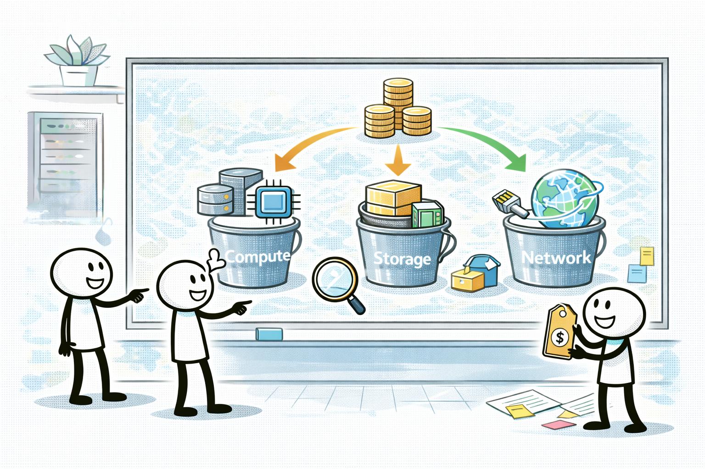
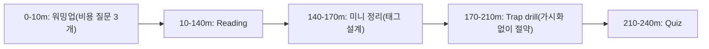
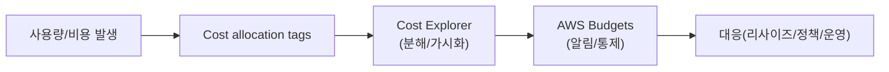

# Day 01 - Cost drivers + tagging + Budgets/Cost Explorer (Cost drivers + 가시성)

## Quick Links

- [오늘의 이야기](#오늘의-이야기)
- [Timeline](#timeline-오늘-학습-타임라인)
- [Flow](#flow-서비스-연결-흐름)
- [Reading](#reading-서비스별-theory)
- [Quiz](#quiz)
- [References](../../references/README.md)

## 오늘의 이야기

월말이 되면 운영팀이 늘 하는 말이 있습니다. “이번 달 비용이 왜 이렇게 튀었지?” 비용 최적화는 절약 팁을 외우는 게 아니라, 먼저 **무엇이 비용을 만들었는지(드라이버)**를 보이게 만드는 작업이에요. 오늘은 그 출발점으로 Cost Explorer를 봅니다. 비용을 서비스/계정/태그로 잘게 쪼개서 보면, “어느 팀이 썼는지”, “언제부터 늘었는지”, “어떤 사용량이 튀었는지”가 보이기 시작하거든요. 근데 여기서 끝내면 항상 늦습니다. 그래서 Budgets가 들어옵니다. 예산 초과를 “사후 보고”가 아니라 **사전 알림/통제**로 바꿔주는 역할이죠.

이 모든 걸 가능하게 하는 게 cost allocation tags입니다. 태그가 없으면 비용은 그냥 덩어리로 남고, 태그가 있으면 “프로젝트/팀” 단위로 책임과 개선 포인트가 생깁니다. 실무에서 비용 최적화 회의가 의미 있어지려면, 결국 “가시화(분해) → 기준(태그) → 알림/통제(버짓)”이 한 세트로 돌아가야 해요. 시험에서도 똑같습니다. “비용을 팀별로 보고 싶다”는 신호가 나오면 태그가 먼저고, “초과를 막고 싶다”는 신호가 나오면 Budgets가 튀어나오죠. 오늘은 이 흐름을 자연스럽게 말로 설명하는 날입니다.

실무에서 가장 흔한 실패는 “대충 Cost Explorer 한번 보고 끝”입니다. 그럼 다음 달에 또 같은 질문이 나와요. 그래서 태그 정책을 정하고(누가 어떤 태그를 필수로 달지), Cost Explorer에서 태그 기준으로 비용을 쪼개 보고, Budgets로 초과를 미리 알려서 행동으로 이어지게 만드는 게 중요합니다. 시험에서도 비슷한 식으로 묻습니다. “팀별 비용을 보여라”는 요구에는 cost allocation tags, “예산 초과 알림/통제”에는 Budgets, “어디서 튀었는지 분석”에는 Cost Explorer. 오늘 Day는 이 세 개가 같이 돌아가는 운영 그림을 만들어두는 날입니다.

결국 비용 최적화의 출발은 “가시화”이고, 그 가시화의 연료가 태그입니다. 오늘은 읽으면서도 계속 “이 요구면 어떤 화면/기능이 필요하지?”를 떠올리면, Cost Explorer/Budgets/태그가 훨씬 자연스럽게 묶일 거예요.

## Timeline (오늘 학습 타임라인)

## Flow (서비스 연결 흐름)

## Reading (서비스별 theory)

- [Cost Explorer: 비용을 “분해해서” 본다](01-cost-explorer.md)
- [AWS Budgets: 초과를 “알림/통제”한다](02-budgets.md)
- [Cost allocation tags: 팀/프로젝트 비용을 나눠 본다](03-cost-allocation-tags.md)

## Quiz

- [Day 01 Quiz](03-quiz.md)

## Back

- `../README.md`
