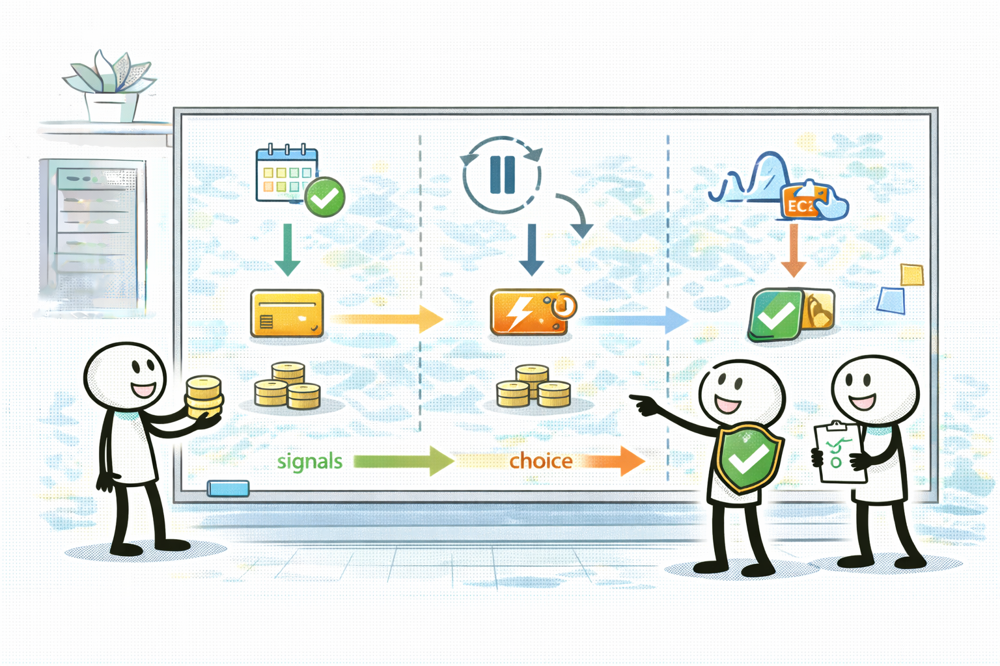
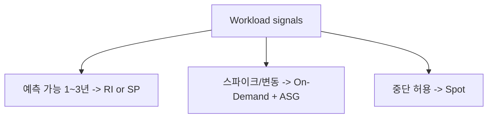

# EC2 구매 옵션(RI/SP/Spot): 문장 신호로 고른다

## 소개 (이 서비스/주제는 무엇인가?)

- EC2 비용 최적화의 핵심은 “어떤 인스턴스를 쓰나”보다 **어떤 구매/할인 모델을 고르나**인 경우가 많다.

## 고객 사례 (스토리, 600~1000자)

서비스가 안정되면서 트래픽이 크게 변하지 않는데, 매달 EC2 비용은 꾸준히 크다. 팀은 인스턴스를 조금 줄여보지만, 성능 여유가 줄어들 뿐 비용 절감 폭은 작다. 반대로 배치 작업은 매일 밤 몇 시간만 돌고, 중간에 끊겨도 재시도하면 되는 성격인데도 On-Demand로 돌리고 있다. “지금 돈을 가장 많이 먹는 방식이 무엇인가?”를 보려면 스펙이 아니라 요금 모델을 봐야 한다.

여기서 문장 신호가 정답을 가른다. “1~3년 사용량이 예측 가능(steady state)”이면 RI나 Savings Plans가 후보로 올라간다. “중단 허용, 배치, fault-tolerant” 같은 표현이 있으면 Spot이 강력하다. 반대로 “중단 불가/고가용성” 요구가 강하면 Spot은 오답 후보가 된다. 스파이크가 심하면 On-Demand를 기본으로 두고 Auto Scaling으로 피크만 대응하는 답이 자연스럽다.

그리고 같은 “할인”이라도 조건이 다르다. steady state는 장기 약정의 근거가 되고, 중단 허용은 스팟의 근거가 된다. 반대로 “항상 켜져 있어야 한다”는 요구가 있으면 할인보다 가용성/안정성이 우선이다. 이 기준이 고정되면, 옵션을 외우지 않아도 문장만 읽고 후보가 좁혀진다.

시험은 이 신호를 거의 문장에 직접 넣는다. 그래서 구매 옵션 문제는 ‘암기’가 아니라 ‘키워드 매칭’이다. 지금 시나리오는 예측 가능한가요, 중단을 허용하나요?

## Impact 범위 (어디에 영향을 주나?)

- Cost: 할인 모델/Spot은 절감 폭이 크다.
- Reliability: Spot은 중단을 허용할 때만 정답이 된다.

## Exam Guide (Badges)

Exam guide mapping (details)

- Domain: Domain 4: Design Cost-Optimized Architectures
- Objectives: 예측 가능/중단 허용 신호로 구매 옵션을 고를 수 있는지

## Core Concepts

## Deep Dive

### EC2 구매 옵션 전체 정리(누락 없이)

> 표준/대표 선택지는 **굵게** 표시했다.

| 옵션 | 언제 쓰나(문장 신호) | 제약/리스크 | 비용 효율 포인트 |
|---|---|---|---|
| **On-Demand** | 스파이크/변동, 예측 어려움 | 할인 적음 | 유연성 최우선(기본값) |
| **Savings Plans(Compute)** | steady state, 1~3년 예측 가능 | 약정(커밋) 필요 | “할인 폭 + 유연성” 균형 |
| Savings Plans(EC2 Instance) | 특정 인스턴스/리전에 더 고정 | 유연성 낮음 | 조건이 딱 맞으면 더 효율적 |
| Reserved Instances(Standard) | steady state, 고정 성향 강함 | 변경 유연성 낮음 | 장기 고정 워크로드에 유리 |
| Reserved Instances(Convertible) | 어느 정도 변경 가능 | 할인 폭/조건 트레이드오프 | “고정은 부담”일 때 대안 |
| **Spot** | 중단 허용 배치/내결함 | 인터럽트 가능 | 중단 허용이면 큰 절감 |

### Savings Plans vs RI: 언제 헷갈리고, 어떻게 소거하나

- 문장에 “1~3년 예측 가능”만 있으면 **SP/RI 둘 다 후보**다. 이때는 “얼마나 고정되어도 괜찮은가(유연성)”를 추가 신호로 본다.
- “인스턴스 타입/리전이 바뀔 수 있다” 같은 문장이 있으면, 너무 고정적인 선택지를 빠르게 소거하고 **(Compute) Savings Plans** 쪽이 자연스럽게 올라온다.

### Spot을 정답으로 만드는 추가 힌트(시험 단골)

Spot은 “싸다”만으로는 부족하고, 보통 아래 힌트가 같이 온다.

- “배치/큐 기반”, “재시도 가능”, “중단 허용(fault-tolerant)”
- “ASG/Mixed Instances” 같은 운영 구성 힌트

### 핵심 정리 (Deep Dive)

- **예측 가능(steady state)** → SP/RI 후보, **중단 허용** → Spot, **변동/스파이크** → On-Demand(+ASG)로 먼저 분류한다.
- 할인 모델은 “절감”이 아니라 “조건”이다. 신호가 없는데 할인만 노리면 함정이다.

### 비용 드라이버 체크(컴퓨트 관점)

- “할인”은 곧 “조건”이다: 예측 가능/중단 허용 신호가 없는데 할인만 노리면 함정이 된다.
- 큰 절감은 종종 “옵션”보다 “운영 패턴(ASG/스케줄 축소)”과 결합될 때 나온다.

## Exam Traps (확장)

- 더 많은 연계/고급 함정: `../../exam-trap-bank.md`
- “중단 허용 배치”인데 On-Demand만 고르는 선택지
- “steady state”인데 On-Demand만 고집하는 선택지
- “중단 불가”인데 Spot을 고르는 선택지

## Exam Trap Drill (O/X, 1~3분)

- “배치 작업, 중단 가능, 재시도 가능” → 어떤 옵션이 먼저 떠오르나요?

## TL;DR (한 줄 정리)

- “예측 가능”이면 **RI/SP**, “중단 허용”이면 **Spot**, “스파이크”면 **On-Demand+ASG**가 신호다.

## Back

- `./README.md`
