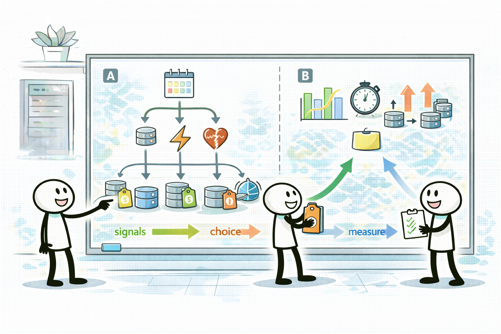

# Day 02 - EC2 pricing models + right sizing/ASG (컴퓨트 비용 최적화)



## Quick Links

- [오늘의 이야기](#오늘의-이야기)
- [Timeline](#timeline-오늘-학습-타임라인)
- [Flow](#flow-서비스-연결-흐름)
- [Reading](#reading-서비스별-theory)
- [Quiz](#quiz)
- [References](../../references/README.md)

## 오늘의 이야기

비용 최적화 회의에서 제일 위험한 말은 “그냥 RI 사면 되지 않아요?”입니다. 할인 모델은 강력하지만, 전제가 맞아야 해요. 오늘은 EC2 구매 옵션을 “문장 신호”로 고르는 연습을 합니다. 사용량이 예측 가능하고 1~3년 꾸준하면 RI/Savings Plans가 후보가 되고, 중단 허용 배치라면 Spot이 튀어나오죠. 반대로 변동이 크고 피크가 들쑥날쑥하면, 할인 모델 하나로 끝내기보다 On-Demand + Auto Scaling 같은 운영 패턴이 더 자연스럽습니다.

그리고 구매 옵션만으로는 부족합니다. “같은 인스턴스를 계속 키우는 것”은 비용도 성능도 애매해질 수 있죠. 그래서 right sizing이 필요합니다. 감으로 줄이는 게 아니라, 지표를 보고(예: 사용률/피크) “요구사항 대비 적정”을 찾는 작업이에요. 여기에 Auto Scaling(특히 scheduled scaling)을 붙이면, 야간/비피크를 줄여서 비용을 바로 내릴 수 있습니다. 오늘의 결론은 이렇게입니다. **요구 신호로 구매 옵션을 고르고, 측정으로 right sizing을 하고, Auto Scaling으로 비피크를 줄인다.** 이 흐름이 잡히면, 컴퓨트 비용 문제는 훨씬 건강하게 풀립니다.

실무에서는 이게 “한 번에 절약”이 아니라 “지속적으로 관리”로 이어집니다. 예측 가능하면 RI/SP로 할인 폭을 확보하고, 중단 허용이면 Spot으로 단가를 낮추되, 서비스가 흔들리지 않게 혼합/대체 전략을 생각합니다. 변동이 크면 On-Demand + Auto Scaling으로 탄력성을 확보하고, scheduled scaling으로 야간에 줄이는 식으로요. 오늘 Day는 구매 옵션(가격표)과 right sizing/ASG(운영 패턴)를 같이 묶어서, “할인만 사면 된다” 같은 단순 답안을 피하는 감각을 만드는 데 초점을 둡니다.

또, 시험에서는 “예측 가능”이라는 단어가 RI/SP로, “중단 허용”이라는 단어가 Spot으로, “야간에는 사용량이 없다” 같은 문장이 scheduled scaling으로 이어지는 식으로 힌트를 줍니다. 오늘은 그 힌트를 놓치지 않게, 요구 문장을 읽고 바로 구매 옵션/운영 패턴으로 번역하는 연습을 한 번 더 해봅니다.

## Timeline (오늘 학습 타임라인)

```mermaid
flowchart LR
  A[0-10m: 워밍업(예측/중단/스파이크)] --> B[10-120m: Reading]
  B --> C[120-160m: 미니 정리(옵션 선택표)]
  C --> D[160-210m: Trap drill(Spot/RI 오남용)]
  D --> E[210-240m: Quiz]
```

## Flow (서비스 연결 흐름)

```mermaid
flowchart LR
  Signal[요구 신호] --> Opt[EC2 구매 옵션<br/>(RI/SP/Spot/On-Demand)]
  Opt --> Size[right sizing]
  Size --> ASG[Auto Scaling<br/>(scheduled/mixed)]
  ASG --> Bill[비용 최적화]
```

## Reading (서비스별 theory)

- [EC2 구매 옵션(RI/SP/Spot): 문장 신호로 고른다](01-ec2-purchase-options.md)
- [Right sizing + Auto Scaling: 측정하고, 비피크를 줄인다](02-right-sizing-autoscaling.md)

## Quiz

- [Day 02 Quiz](03-quiz.md)

## Back

- `../README.md`
