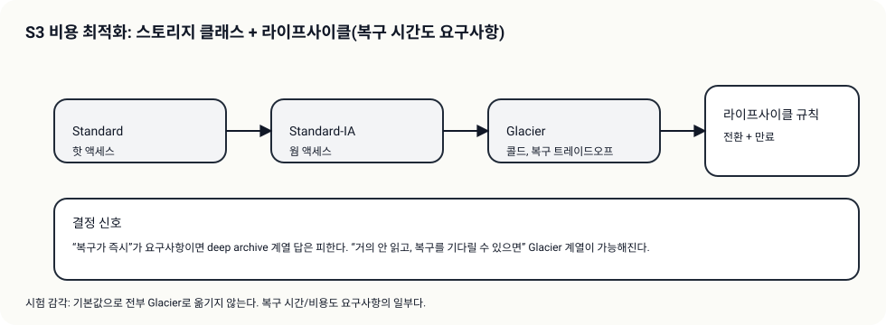

# Day 03 - Theory Index (S3 비용 최적화: 클래스/라이프사이클/Intelligent-Tiering)

> 이 문서는 Day 이론 “인덱스”다. 상세 이론은 Day 폴더 바로 아래 `01-*.md` 서비스별 문서로 분리한다.

## 소개 (이 Day는 무엇을 묶나?)

- Day 03은 스토리지 비용을 “GB-month를 줄이자”가 아니라, **액세스 패턴 + 복구 요구(시간/비용)**로 클래스를 고르는 흐름으로 정리한다.
- 그리고 그 선택을 자동화하는 방법이 라이프사이클(전환/만료)이다.

## 고객 사례 (스토리, 600~1000자)

서비스 로그가 쌓이면서 S3 비용이 꾸준히 늘어난다. 팀은 “일단 압축하자” 같은 대응을 하지만, 근본은 보관 정책과 액세스 패턴이다. 어떤 로그는 한 달만 필요하고, 어떤 로그는 1년 보관이 필요하다. 또 어떤 데이터는 거의 안 보지만, 사고가 나면 ‘빨리’ 꺼내야 한다. 그런데 버킷 하나에 전부 Standard로 넣어두면, 돈이 가장 비싼 방식으로 장기 보관을 하는 셈이다.

여기서 핵심은 두 축이다. 첫째, 액세스 패턴(자주/가끔/거의 안 함). 둘째, 복구 요구(즉시 vs 몇 분/몇 시간 괜찮음). “장기 보관 + 가끔 조회”라면 IA나 Glacier 계열이 후보가 되고, 복구 시간이 허용되는 만큼 더 저렴한 클래스로 갈 수 있다. 반대로 “항상 즉시 필요”하면 무조건 Glacier로 보내면 오답이다.

그리고 이 정책을 사람이 수동으로 옮기기 시작하면 운영비가 된다. 그래서 라이프사이클 규칙으로 전환/만료를 자동화하고, 데이터 성격이 다르면 prefix로 범위를 분리한다. 액세스 패턴이 예측하기 어려운 데이터라면 Intelligent-Tiering이 후보가 된다.

지금 문제 문장에는 “복구 시간” 힌트가 있나요, 아니면 “예측 어려움(자동 최적화)” 힌트가 더 강한가요?

## Impact 범위 (어디에 영향을 주나?)

- Cost: 장기 보관 데이터의 클래스/전환 정책이 큰 절감으로 이어진다.
- Operations: 수동 이동을 줄이고 정책으로 고정한다(운영비 감소).
- Performance: 복구 시간 요구를 위반하면 바로 오답이 된다.

## Exam Guide (Badges)

Exam guide mapping (details)

- Domain: Domain 4: Design Cost-Optimized Architectures
- Task focus:
  - 4.1 Design cost-optimized storage solutions

## Core Concepts

- 스토리지 비용 최적화는 “액세스 패턴 + 복구 요구”를 같이 본다
  - 자주 접근: Standard
  - 가끔 접근: IA 계열
  - 거의 안 함: Glacier 계열(복구 시간/비용 트레이드오프)
- Lifecycle은 “자동 정책화”다(수동 이동은 운영비를 만든다)

## Service Theories (서비스별로 읽기)

- [S3 스토리지 클래스: 액세스/복구 요구로 고른다](01-s3-storage-classes.md)
- [S3 라이프사이클: 전환/만료를 자동화한다](02-s3-lifecycle.md)
- [Intelligent-Tiering: 예측이 어려울 때 자동 최적화](03-intelligent-tiering.md)

## Decision Rules (정답을 가르는 규칙 3개)

1. “장기 보관/거의 안 봄”이면 **Glacier 계열 + 라이프사이클**이 후보가 된다(복구 시간 확인).
2. “복구가 즉시 필요”면 **무조건 Glacier**는 오답 후보가 된다.
3. “패턴 예측 어려움/자동 최적화”면 **Intelligent-Tiering**이 신호다.

## Smell Test (레드 플래그 3~5)

- “모든 데이터를 Glacier”로 옮기는 답(복구 시간/요청/복구 비용 무시)
- 라이프사이클을 “전체 데이터에 일괄 적용”하는 답(핫 데이터까지 전환)
- 복구 요구를 읽지 않고 ‘가장 싼 클래스’만 고르는 답

## TL;DR (한 줄 정리)

- S3 비용 최적화는 **액세스 패턴 + 복구 시간**을 먼저 확인하고, **라이프사이클/티어링**으로 정책화한다.
