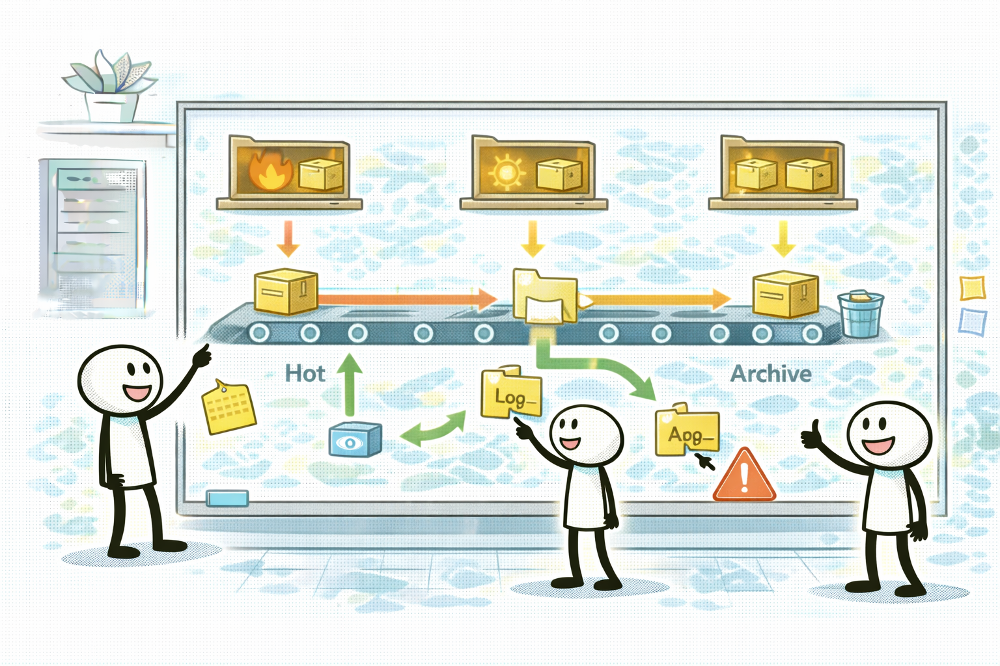
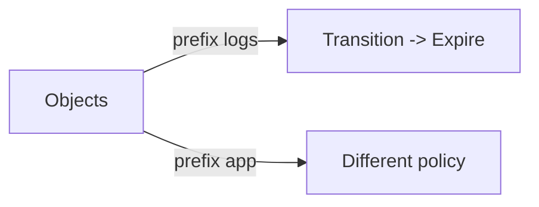

# S3 라이프사이클: 전환/만료를 자동화한다

## 소개 (이 서비스/주제는 무엇인가?)

- S3 라이프사이클은 오브젝트를 시간 기준으로 **전환(Transition)**하고 **만료(Expiration)**하는 “정책 자동화”다.

## 고객 사례 (스토리, 600~1000자)

팀은 비용을 줄이려고 데이터가 오래되면 사람이 직접 클래스를 바꾸거나 삭제하는 방식으로 운영했다. 그런데 담당자가 바뀌면 규칙이 깨지고, 어떤 데이터는 지워져 사고가 난다. 결국 “운영비”와 “리스크”가 동시에 커진다. 비용 최적화가 오히려 품질을 깎는 셈이다.

라이프사이클을 쓰면 ‘사람의 기억’이 아니라 ‘정책’으로 고정된다. 예를 들어 `logs/` prefix는 30일 후 IA, 90일 후 Glacier로 전환하고 365일 후 만료한다. 반면 `app/` prefix는 고객 다운로드가 있어 복구/신선도 요구가 다르니 다른 정책을 쓴다. 이 prefix 분리가 중요한 이유는, 데이터 성격이 다른데 정책을 한꺼번에 적용하면 핫 데이터까지 저렴한 클래스로 내려가 성능/운영 문제가 생길 수 있기 때문이다.

시험에서도 “장기 보관”, “규정 준수”, “자동 전환” 신호가 나오면 라이프사이클이 후보가 된다. 그리고 “prefix로 범위를 제한하라”는 힌트가 같이 붙는 경우가 많다.

또 자주 나오는 현실적인 요구는 “보관은 하되, 과거 데이터는 거의 안 본다”다. 이때 만료(Expiration)를 같이 걸어두지 않으면 데이터는 계속 쌓이고, 결국 비용이 다시 늘어난다. 반대로 중요한 데이터까지 만료해버리면 사고가 나니, “무엇을 언제까지 보관해야 하는지”를 먼저 정리하고 그에 맞게 전환/만료를 설계해야 한다.

지금 당신의 데이터는 한 가지 성격인가요, 아니면 로그/릴리즈/아카이브처럼 섞여 있나요?

## Impact 범위 (어디에 영향을 주나?)

- Cost: 전환/만료 자동화로 장기 비용을 안정적으로 줄인다.
- Operations: 수동 작업을 줄이고 사고(실수 삭제/잘못된 전환)를 줄인다.

## Exam Guide (Badges)

## Core Concepts

- Transition: 시간이 지나면 더 저렴한 클래스로 전환
- Expiration: 보관 정책에 따라 만료/삭제
- prefix 기반 범위 제한: 데이터 성격이 다르면 정책도 달라야 한다

## Exam Traps (확장)

- 더 많은 연계/고급 함정: `../../exam-trap-bank.md`
- 전체 버킷에 일괄 전환을 걸어 핫 데이터까지 내려버리는 선택지
- “자동화” 요구인데 수동 이동/수동 삭제로 푸는 선택지

## Exam Trap Drill (O/X, 1~3분)

- “로그는 1년 보관, 90일 지나면 거의 보지 않는다” → 무엇을 자동화할까요?

## TL;DR (한 줄 정리)

- 비용 최적화는 **수동이 아니라 라이프사이클(정책)**로 고정하는 게 핵심이다.

## References

- Internal references:
  - [References index](../../references/README.md)
  - [Exam guide (SAA-C03)](../../references/exam-guide.md)
  - [Glossary](../../references/glossary.md)
  - [AWS services list](../../references/aws-services.md)
  - [Exam keypoints](../../exam-keypoints.md)
  - [Exam trap bank](../../exam-trap-bank.md)

- Official AWS documentation:
  - [Amazon S3 User Guide](https://docs.aws.amazon.com/AmazonS3/latest/userguide/Welcome.html)
  - [Search: S3 lifecycle rules](https://docs.aws.amazon.com/search/doc-search.html?searchQuery=S3%20lifecycle%20rules)

## Back

- `./README.md`
