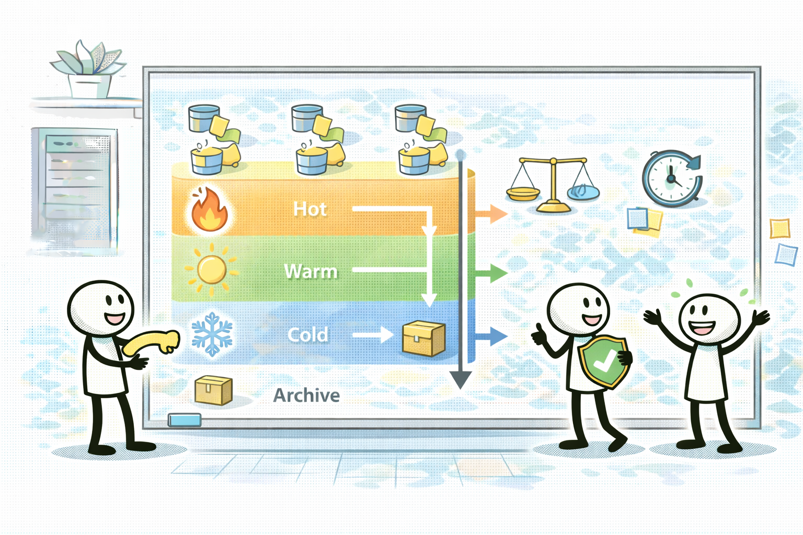
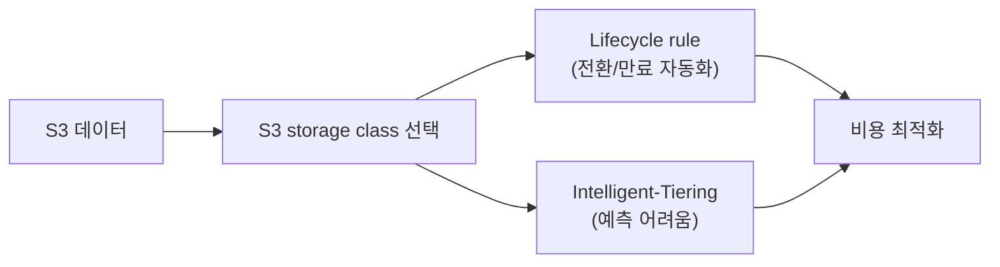

# Day 03 - S3 storage classes + lifecycle patterns (S3 비용 최적화: 클래스/라이프사이클)

## Quick Links

- [오늘의 이야기](#오늘의-이야기)
- [Timeline](#timeline-오늘-학습-타임라인)
- [Flow](#flow-서비스-연결-흐름)
- [Reading](#reading-서비스별-theory)
- [Quiz](#quiz)
- [References](../../references/README.md)

## 오늘의 이야기

S3 비용은 종종 “갑자기 많이 나왔다”로 체감되는데, 사실은 시간이 지나면서 조금씩 쌓이는 경우가 많습니다. 오늘은 그 비용을 ‘설계’로 낮추는 날이에요. 먼저 스토리지 클래스는 “싼 게 최고”가 아니라 **액세스 패턴/복구 요구/비용 드라이버**로 고릅니다. 자주 접근하면 Standard 쪽이 자연스럽고, 드물게 접근하면 IA 계열이 보이고, 아카이브(Glacier 계열)는 저장은 싸지만 복구 시간이/비용이 커질 수 있죠. 시험에서도 “즉시 복구” 같은 문장이 있으면 아카이브 선택지가 함정이 되기 쉽습니다.

그리고 운영에서 제일 큰 차이를 만드는 건 Lifecycle입니다. 사람이 수동으로 옮기는 게 아니라, 정책으로 “전환/만료”를 자동화해야 시간이 지나도 비용이 무너지지 않거든요. 액세스 패턴을 예측하기 어렵다면 Intelligent-Tiering 같은 선택지가 자연스럽고요. 오늘은 이 세 개를 연결합니다. **클래스는 현재/요구를 보고 고르고, Lifecycle은 미래를 자동화하고, Intelligent-Tiering은 예측이 어려울 때 안전장치로 둔다.** 이 한 줄이 잡히면, S3 비용 문제는 훨씬 편하게 풀립니다.

시험에서도 이 트레이드오프를 그대로 묻습니다. “저장 비용을 최소화”라는 문장이 있다고 해서 무조건 아카이브로 보내면, “복구 시간/즉시 접근” 요구에서 바로 오답이 되기 쉽죠. 반대로 “몇 달 뒤엔 거의 안 본다” 같은 문장이 있으면 Lifecycle로 자동 전환이 자연스럽고, “패턴이 들쑥날쑥해서 예측이 어렵다”면 Intelligent-Tiering이 매력적인 후보가 됩니다. 오늘 Day는 S3를 단순 저장소가 아니라, **정책으로 비용을 설계하는 플랫폼**으로 바라보는 감각을 만드는 시간입니다.

그리고 “비용이 싸다”는 말은 보통 저장 비용만을 의미하지 않는다는 것도 같이 챙깁니다. 아카이브 계열은 복구 요청/시간/비용이 따라오고, IA 계열도 최소 보관 기간 같은 제약이 걸릴 수 있어요. 오늘은 이런 제약을 ‘함정 포인트’로만 외우지 않고, 요구 문장과 연결해서 자연스럽게 판단하는 연습을 합니다.

## Timeline (오늘 학습 타임라인)

```mermaid
gantt
  title Learning Timeline
  dateFormat  HH:mm
  axisFormat  %H:%M
  section Day
  워밍업 - 액세스/복구/비용 :t1, 00:00, 10m
  Reading :t2, after t1, 130m
  미니 정리 - 전환/만료 패턴 :t3, after t2, 30m
  Trap drill - 아카이브 함정 :t4, after t3, 40m
  Quiz :t5, after t4, 30m
```

## Flow (서비스 연결 흐름)

## Reading (서비스별 theory)

- [S3 스토리지 클래스: 액세스/복구 요구로 고른다](01-s3-storage-classes.md)
- [S3 라이프사이클: 전환/만료를 자동화한다](02-s3-lifecycle.md)
- [Intelligent-Tiering: 예측이 어려울 때 자동 최적화](03-intelligent-tiering.md)

## Quiz

- [Day 03 Quiz](04-quiz.md)

## Back

- `../README.md`
