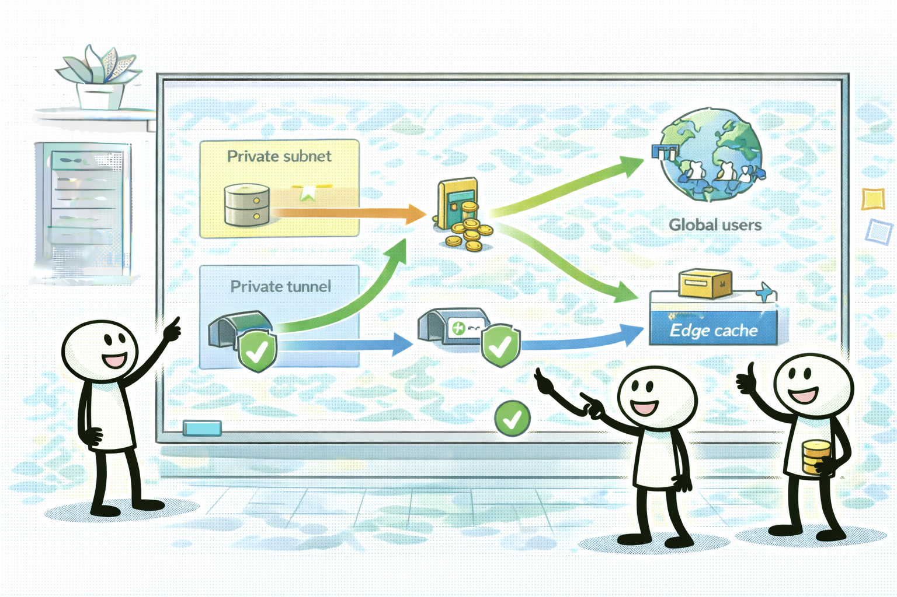
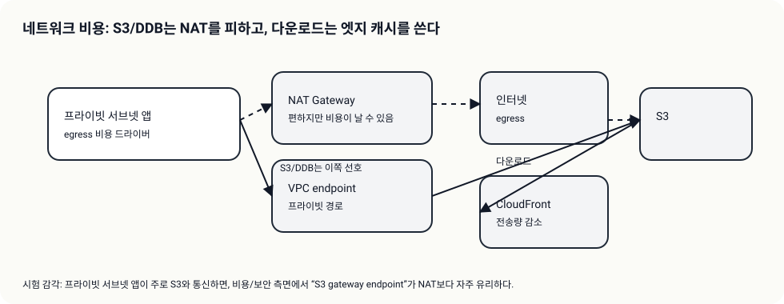

# Day 04 - Theory Index (네트워크 비용: NAT/엔드포인트 + CloudFront)

> 이 문서는 Day 이론 “인덱스”다. 상세 이론은 Day 폴더 바로 아래 `01-*.md` 서비스별 문서로 분리한다.

## 소개 (이 Day는 무엇을 묶나?)

- Day 04는 “숨은 비용”인 데이터 전송을 잡는다: 인터넷 egress, NAT 경유, 교차 AZ/리전 트래픽.
- 시험에서 대표적인 비용 절감 답은 2가지로 자주 정리된다:
  - 프라이빗 서브넷의 AWS 서비스 접근은 **VPC Endpoints**로 NAT를 피한다
  - 전 세계 다운로드/정적 콘텐츠는 **CloudFront 캐시**로 오리진 전송량/요청 수를 줄인다

## 고객 사례 (스토리, 600~1000자)

팀은 보안 때문에 워크로드를 프라이빗 서브넷에 넣었다. 그런데 한 달 뒤 비용이 이상하게 튄다. EC2 스펙도 그대로고, S3 저장 용량도 크게 늘지 않았는데, “네트워크” 항목이 커졌다. 원인을 몰라 인스턴스를 줄여보지만 효과가 없다. 알고 보니 프라이빗 서브넷에서 S3로 오브젝트를 자주 가져오면서 NAT Gateway를 매번 경유했고, 그 트래픽이 비용 드라이버가 됐다.

이때 해결은 “보안을 포기하고 퍼블릭으로”가 아니다. S3처럼 Gateway endpoint가 가능한 서비스라면 VPC endpoint로 사설 경로를 만들고 NAT 경유를 줄인다. 이렇게 하면 보안(인터넷 노출 감소)과 비용(경유 비용 감소)을 동시에 개선할 수 있다. 반대로 endpoint가 없는 서비스 접근은 interface endpoint(PrivateLink) 또는 NAT가 후보가 된다.

그리고 비용 최적화는 내부 트래픽만이 아니다. 전 세계 사용자가 정적 파일을 내려받는다면, CloudFront 캐시로 오리진 호출과 전송량을 줄여 비용과 성능을 같이 잡을 수 있다. 시험은 “프라이빗 서브넷 → S3”, “대량 다운로드”, “글로벌 사용자” 같은 신호로 이 선택을 유도한다.

지금 시나리오에는 “프라이빗에서 S3 자주 호출” 신호가 있나요, 아니면 “대량 다운로드/글로벌” 신호가 더 강한가요?

## Impact 범위 (어디에 영향을 주나?)

- Cost: NAT/전송은 작은 설계 실수로도 비용이 크게 튈 수 있다.
- Security: endpoints는 인터넷 경유를 줄여 보안에도 유리하다.
- Performance: CloudFront 캐시는 지연을 줄이고 오리진 부하를 줄인다.

## Exam Guide (Badges)

Exam guide mapping (details)

- Domain: Domain 4: Design Cost-Optimized Architectures
- Task focus:
  - 4.4 Design cost-optimized network architectures

## Core Concepts

- 네트워크 비용은 “숨은 드라이버”가 많다
  - NAT 경유, 인터넷 egress, 교차 AZ/리전 전송
- 시험형 최적화 방향
  - S3/DynamoDB 접근이면 endpoint로 NAT를 피한다
  - 다운로드/정적 콘텐츠면 CloudFront로 전송량/오리진 부하를 줄인다

## Service Theories (서비스별로 읽기)

- [VPC Endpoints vs NAT: 사설 경로로 비용 함정 회피](01-vpc-endpoints.md)
- [CloudFront: 캐시로 전송/오리진 비용을 줄인다](02-cloudfront-cost.md)

## Exam Traps

- NAT를 무조건 정답으로 고르는 선택지(요구가 S3 접근/비용이면 endpoint 후보)
- 캐시 불가능(개인화/항상 최신)인데 CloudFront를 고르는 선택지

## TL;DR (한 줄 정리)

- “프라이빗 서브넷 → S3 + 비용”이면 **S3 Gateway Endpoint**, “글로벌 다운로드/정적”이면 **CloudFront 캐시**가 대표 후보다.
