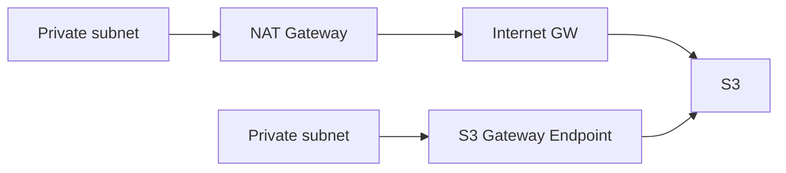

# VPC Endpoints vs NAT: 사설 경로로 비용 함정 회피

## 소개 (이 서비스/주제는 무엇인가?)

- 프라이빗 서브넷에서 AWS 서비스에 접근할 때, NAT는 편하지만 비용 드라이버가 될 수 있고, VPC Endpoints는 사설 경로로 비용/보안을 같이 개선할 수 있다.

## 고객 사례 (스토리, 600~1000자)

팀은 “프라이빗 서브넷이 더 안전하다”는 요구에 따라, 애플리케이션 서버를 모두 프라이빗에 넣었다. 문제는 그다음이다. 서버는 매일 S3에서 설정 파일과 릴리즈 아티팩트를 자주 가져온다. NAT Gateway를 통해 나가도 기능은 동작하지만, 트래픽이 쌓이면서 비용이 꾸준히 올라간다. 특히 “자주/대량” 호출이 있으면 NAT 경유가 숨은 폭탄이 된다.

이때 시험형 정답은 보통 “S3 Gateway endpoint로 NAT를 피한다”다. endpoint를 만들고 route table에 연결하면, S3로 가는 트래픽이 인터넷/NAT를 거치지 않고 사설 경로로 이동한다. 비용(경유 비용)과 보안(인터넷 경유 감소) 두 축을 동시에 개선할 수 있다. 반대로 endpoint가 없는 서비스 접근은 interface endpoint(PrivateLink) 또는 NAT가 후보가 되고, 요구사항에 따라 고른다.

여기서 자주 나오는 실수는 “프라이빗=무조건 NAT”로 외워버리는 것이다. 프라이빗이라는 요구는 ‘인터넷 노출을 줄이라’는 뜻이지 ‘반드시 NAT를 쓰라’는 뜻이 아니다. 그래서 S3/DynamoDB처럼 endpoint가 가능한 대상이면 endpoints가 비용/보안 관점에서 더 자연스럽다.

정리하면, NAT는 “일단 되게 하는 만능”이지만, 비용/보안 요구가 붙는 순간 endpoints가 후보로 올라온다. 지금 문장에는 “프라이빗 + S3 자주 호출 + 비용” 신호가 있나요?

## Impact 범위 (어디에 영향을 주나?)

- Cost: NAT 경유 트래픽을 줄여 비용 드라이버를 제거할 수 있다.
- Security: 인터넷 경유를 줄이는 설계가 가능하다.
- Operations: 라우팅/정책을 명확히 해야 한다(설정 검증 필요).

## Exam Guide (Badges)

## Core Concepts

## Exam must-know

- Key point: “프라이빗 서브넷에서 S3를 자주 호출 + 비용”이면 S3 gateway endpoint가 정답 후보로 올라간다.
- Why: 사설 경로로 NAT/인터넷 경유를 줄여 비용/보안을 동시에 개선한다.
- Alternative: endpoint가 없는 서비스 접근이면 interface endpoint(PrivateLink) 또는 NAT가 후보가 된다.

## Exam Traps (5-8)

- “프라이빗에서 S3 자주 호출”인데 NAT를 무조건 쓰는 선택지
- endpoint를 만들었는데 route table/정책 검증 없이 끝내는 선택지(동작/비용이 안 바뀜)

## Taste Test (1~3분)

- “프라이빗 서브넷의 워커가 S3를 자주 읽는다. NAT 비용이 크다” → 무엇이 먼저 떠오르나요?

## TL;DR (한 줄 정리)

- “프라이빗 → S3 자주 호출 + 비용”이면 **S3 Gateway Endpoint**가 대표 답이다.

## Back

- `./00-theory-index.md`
