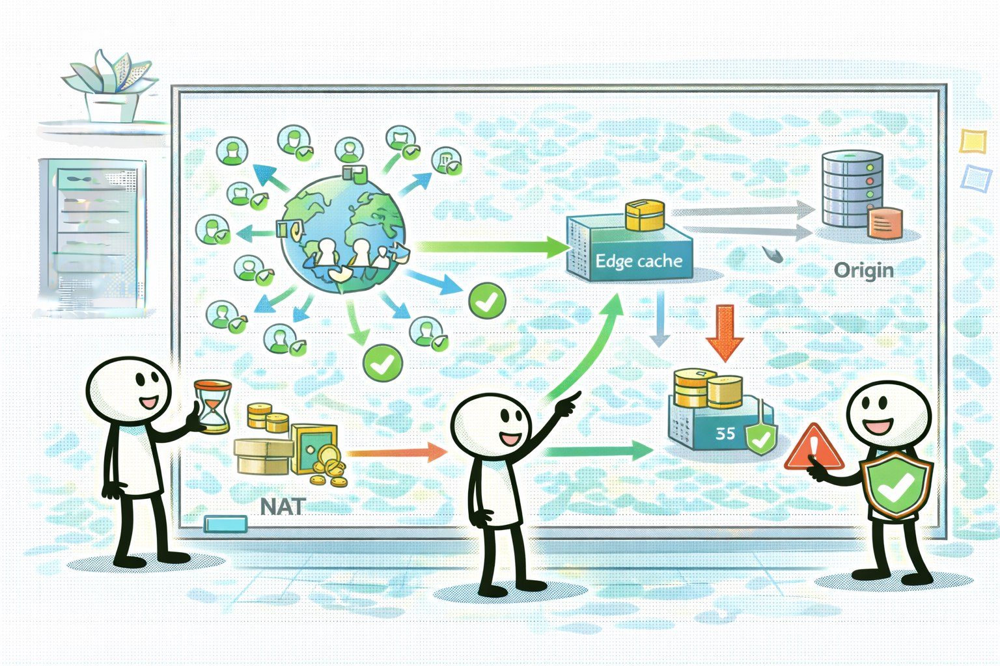

# CloudFront: 캐시로 전송/오리진 비용을 줄인다

## 소개 (이 서비스/주제는 무엇인가?)

- CloudFront는 CDN이고, Domain 4에서는 “성능”뿐 아니라 **전송량/오리진 호출 감소로 비용을 줄이는 레버**로도 등장한다.

## 고객 사례 (스토리, 600~1000자)

다운로드 기능이 인기라서 트래픽이 급증했다. 오리진(S3/ALB)은 버티지만, 전송량과 요청 수가 올라가면서 비용이 함께 올라간다. 팀은 “대역폭이 문제니까 서버를 늘리자”고 생각하지만, 정적 콘텐츠/다운로드는 서버를 늘리는 게 핵심이 아니다. 같은 파일을 전 세계에서 반복해서 받는 상황이라면, 오리진까지 매번 왕복하는 게 낭비다.

CloudFront를 붙이면 엣지에서 캐시 hit가 나면서 오리진 요청과 전송량이 줄어든다. 그 결과 비용과 성능이 같이 좋아질 수 있다. 다만 캐시가 ‘무조건’ 되는 건 아니다. 개인화가 강하거나, 항상 최신 응답이 필요하면 캐시 키/TTL/무효화 정책이 정답을 가른다. 시험에서도 “정적 콘텐츠/다운로드/글로벌” 같은 신호가 있으면 CloudFront가 후보로 올라오고, TTL/무효화 같은 조절점을 같이 묻는다.

또 비용 최적화 관점에서 중요한 건 “오리진이 어디냐”다. 오리진이 S3든 ALB든, 캐시 hit가 늘면 오리진 호출과 전송이 줄어든다. 반대로 캐시 키를 잘못 잡아 변종이 너무 많아지면(hit가 안 나면) 비용/성능 효과가 생각보다 작을 수 있다. 이 포인트가 시험 함정으로 종종 섞인다.

정리하면 Domain 4에서 CloudFront는 “빠르게”만이 아니라 “덜 보내서 싸게”라는 의미로도 나온다. 지금 요구는 캐시가 가능한가요?

## Impact 범위 (어디에 영향을 주나?)

- Cost: 오리진 호출/전송량 감소로 비용 절감 가능
- Performance: 글로벌 사용자 지연 개선
- Operations: TTL/무효화/캐시 키가 운영 포인트

## Exam Guide (Badges)

## Core Concepts

- 비용 최적화 신호
  - 전 세계 사용자 + 정적/캐시 가능 콘텐츠
  - 오리진 요청 수/전송량이 크다
  - 캐시 hit로 오리진 비용을 줄일 수 있다

## Exam Traps (5-8)

- 캐시 불가능(개인화/항상 최신)인데 CloudFront를 무조건 고르는 선택지
- TTL/무효화/캐시 키를 무시하고 “그냥 CDN”만 붙이는 선택지

## Taste Test (1~3분)

- “글로벌 사용자에게 정적 다운로드를 제공한다. 오리진 전송 비용이 크다” → 무엇이 먼저 떠오르나요?

## TL;DR (한 줄 정리)

- “글로벌 + 정적/캐시 가능 + 전송/요청 비용”이면 **CloudFront**가 후보로 올라간다.

## Back

- `./00-theory-index.md`
