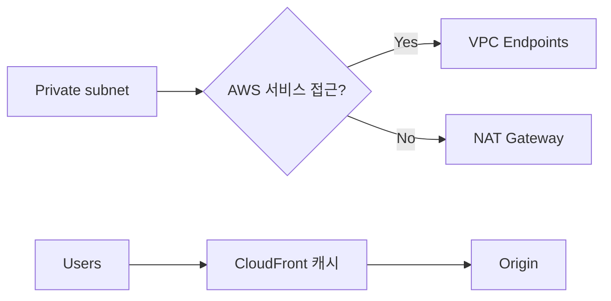

# Day 04 - Data transfer + NAT vs endpoints + CloudFront caching (네트워크/엣지 비용 최적화)


## Quick Links

- [오늘의 이야기](#오늘의-이야기)
- [Timeline](#timeline-오늘-학습-타임라인)
- [Flow](#flow-서비스-연결-흐름)
- [Reading](#reading-서비스별-theory)
- [Quiz](#quiz)
- [References](../../references/README.md)

## 오늘의 이야기

비용이 새는 곳은 생각보다 “컴퓨트”보다 “네트워크”인 경우가 많습니다. 특히 NAT Gateway를 달아놓고 프라이빗 서브넷에서 이것저것 나가다 보면, 어느 순간 데이터 처리 요금이 눈에 띄게 올라가요. 그래서 오늘은 NAT를 무조건 악으로 보지 않고, “대체 가능한 경우”를 정확히 잡습니다. 내부에서 S3 같은 AWS 서비스로 가는 트래픽이라면, 굳이 인터넷을 태울 이유가 없죠. 이럴 때 **VPC Endpoints**가 등장합니다. 엔드포인트로 사설 경로를 만들면, NAT 비용/운영을 줄이면서도 보안적으로 깔끔해집니다.

또 하나의 비용 레버는 엣지 캐시입니다. 오리진에서 매번 응답을 내리다 보면 전송 비용과 오리진 부하가 같이 올라가는데, **CloudFront**로 캐시하면 트래픽도 줄고 오리진도 가벼워집니다. 오늘은 이 두 가지를 연결합니다. “내부 → AWS 서비스 접근”은 endpoints로, “외부 사용자 → 반복 응답”은 CloudFront로. 시험에서도 실무에서도 “사설 경로로 비용/보안 개선”, “캐시로 전송/오리진 비용 개선” 같은 문장이 나오면 바로 떠올릴 수 있어야 합니다.

실무에서는 이게 “네트워크 비용이 왜 튀었지?”의 정답으로 자주 이어집니다. 프라이빗 서브넷에서 S3로 가는 트래픽이 NAT를 탔다면, 엔드포인트로 바꾸는 순간 비용과 보안이 같이 좋아지죠. 그리고 외부로 나가는 트래픽이 많다면, CloudFront 캐시로 오리진 호출을 줄여서 전송/오리진 비용까지 함께 줄일 수 있습니다. 오늘 Day는 NAT vs Endpoints, CloudFront 캐시라는 두 레버를 한 장의 그림으로 묶어서, 비용·보안이 섞인 문제에서도 빠르게 후보를 좁히는 감각을 만드는 데 초점을 둡니다.

시험에서도 NAT 비용은 “데이터 처리/전송” 문장으로 힌트를 주는 경우가 많고, “사설로 접근” 같은 요구가 붙으면 Endpoints가 강해집니다. CloudFront는 “캐시로 전송/오리진 비용을 줄여라”는 신호가 딱 보이는 서비스라서, 오늘은 두 레버를 같이 기억해두면 다음에 비용 문제를 훨씬 빨리 소거할 수 있어요.

## Timeline (오늘 학습 타임라인)

```mermaid
flowchart LR
  A[0-10m: 워밍업(NAT 비용 신호)] --> B[10-120m: Reading]
  B --> C[120-150m: 미니 정리(Endpoint vs NAT)]
  C --> D[150-210m: Trap drill(캐시/전송 비용)]
  D --> E[210-240m: Quiz]
```

## Flow (서비스 연결 흐름)



## Reading (서비스별 theory)

- [VPC Endpoints vs NAT: 사설 경로로 비용 함정 회피](01-vpc-endpoints.md)
- [CloudFront: 캐시로 전송/오리진 비용을 줄인다](02-cloudfront-cost.md)

## Quiz

- [Day 04 Quiz](03-quiz.md)

## Back

- `../README.md`
