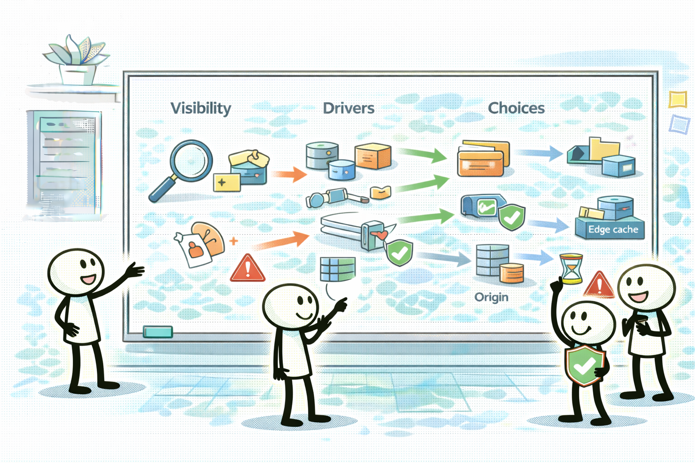
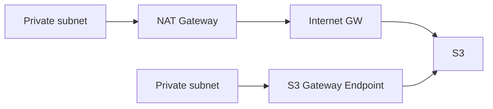

# Special Lecture + Week Summary (Domain 4)

## 소개 (이게 뭔가요?)

- Week 4(Domain 4)에서 자주 섞이는 “비용 최적화 선택지”를 **드라이버 규칙/비교/함정**으로 한 번에 회수한다.
- “가시화(태그/도구) → 드라이버 분류(Compute/Storage/Network) → 대안 비교(트레이드오프)” 흐름을 한 문장 규칙으로 고정한다.

## 고객 사례 (스토리)

서비스는 안정적이고 장애도 줄었다. 그런데 비용은 반대로 꾸준히 늘었다. 팀은 “서버를 조금 줄여보자” 같은 처방을 반복하지만, 큰 그림에서 드라이버가 무엇인지 합의가 안 된다. 어떤 사람은 S3가 문제라고 하고, 어떤 사람은 EC2라고 하고, 또 어떤 사람은 “네트워크는 원래 그런 것”이라며 지나친다. 운영 담당이 1명인 상황에선 이런 혼란이 곧 돈 낭비로 이어진다.

이때 Domain 4의 정답은 ‘가장 싼 서비스’가 아니다. 먼저 Cost Explorer/태그로 “어디서 돈이 나가는지”를 드라이버로 분해한다. 그다음 컴퓨트면 구매 옵션(RI/SP/Spot)과 스케줄 축소(비피크 0)를 비교하고, 스토리지는 클래스/라이프사이클/티어링을, 네트워크는 NAT/전송/엔드포인트/CloudFront를 비교한다. 특히 NAT 비용은 “프라이빗 서브넷 → S3” 같은 문장 한 줄로 크게 터질 수 있어서, 시험에서도 대표 함정으로 자주 나온다.

여기서 중요한 건 ‘완벽한 최적화’가 아니라 ‘틀리지 않는 순서’다. 드라이버를 맞추고, 요구사항을 유지하는 대안을 고르고, 마지막에 함정(예: NAT, 복구 시간, 중단 허용)을 체크한다. 이 흐름이 고정되면, 문제 문장이 길어도 흔들리지 않는다.

즉 Domain 4는 “기술”이 아니라 “선택 기준”을 묻는 도메인이다. 지금 케이스에서 가장 먼저 의심해야 할 드라이버는 무엇인가요?

## Impact 범위 (어디에 영향을 주나?)

- Cost: 드라이버를 맞추면 작은 변경으로 큰 절감이 가능하다.
- Operations: 가시화/규칙이 없으면 최적화가 반복 작업이 된다.
- Reliability/Performance: 비용 때문에 요구사항을 깨면 바로 오답(또는 실무 사고)이다.

## Exam Guide (Badges)

Exam guide mapping (details)

- Domain: Domain 4: Design Cost-Optimized Architectures
- Task focus:
  - 4.1 Storage
  - 4.2 Compute
  - 4.3 Database
  - 4.4 Network

## Week 4 Cost Driver Rules

- “사용량(시간/요청/데이터 전송)”과 “단가(요금 모델)”의 곱이 비용이다.
- 비용 문제는 보통 “요구사항을 유지하면서 드라이버를 제거”하는 대안 비교로 출제된다.
- NAT 비용은 숨은 폭탄으로 자주 나온다(특히 프라이빗 서브넷 -> S3).

## Core Concepts

- Domain 4는 “가시화 -> 분류(Compute/Storage/Network) -> 대안 비교” 순서로 푸는 문제가 많다.

## Confusing Similar Cases

| Scenario | Best choice | Why | Common wrong choice | Why it's wrong |
|---|---|---|---|---|
| 1~3년 예측 가능 | Savings Plans/RI | 할인/예측 가능 | On-Demand | 할인 없음 |
| 중단 허용 배치 | Spot | 큰 할인 | On-Demand | 비용 비쌈 |
| S3 장기 보관 | lifecycle + Glacier 계열 | 자동 전환 | Standard 유지 | 장기 비용 과다 |
| 프라이빗 S3 접근 | S3 Gateway Endpoint | NAT 비용 제거 | NAT Gateway | 트래픽 따라 비용 증가 |

## Pattern: NAT vs Endpoint (Cost tradeoff)

## Exam must-know (요약)

- Key point: “예측 가능/중단 허용/장기 보관/프라이빗 S3 접근” 같은 신호는 Domain 4의 대표 키워드다.
- Why: 비용 문제는 기술적 가능성보다 “요금 모델/전송/티어링”의 선택 문제로 귀결되며, 문제 문장에 신호가 직접 들어간다.
- Alternative: 요구사항이 성능/가용성 중심이면 비용 최적화만으로 풀지 말고(Domain 2/3) 먼저 요구를 만족하는 설계를 만든 뒤 비용을 줄인다.

## Reference Pack

- `aws-saa/special-lectures/domain04-cost-optimized-top-services.md`

## TL;DR (한 줄 정리)

- Domain 4는 **가시화 → 드라이버 분류(Compute/Storage/Network) → 대안 비교(요구사항 유지)** 순서로 푸는 문제다.

## References

- Internal references:
  - [References index](../../references/README.md)
  - [Exam guide (SAA-C03)](../../references/exam-guide.md)
  - [Glossary](../../references/glossary.md)
  - [AWS services list](../../references/aws-services.md)
  - [Exam keypoints](../../exam-keypoints.md)
  - [Exam trap bank](../../exam-trap-bank.md)

- Official AWS documentation:
  - [AWS KMS Developer Guide](https://docs.aws.amazon.com/kms/latest/developerguide/overview.html)
  - [Amazon VPC User Guide](https://docs.aws.amazon.com/vpc/latest/userguide/what-is-amazon-vpc.html)
  - [Search: VPC endpoints](https://docs.aws.amazon.com/search/doc-search.html?searchQuery=VPC%20endpoints)
  - [Amazon S3 User Guide](https://docs.aws.amazon.com/AmazonS3/latest/userguide/Welcome.html)
  - [Search: S3 lifecycle rules](https://docs.aws.amazon.com/search/doc-search.html?searchQuery=S3%20lifecycle%20rules)
  - [Search: S3 storage classes](https://docs.aws.amazon.com/search/doc-search.html?searchQuery=S3%20storage%20classes)
  - [Search: S3 SSE-KMS](https://docs.aws.amazon.com/search/doc-search.html?searchQuery=S3%20SSE-KMS)
  - [Amazon EC2 User Guide](https://docs.aws.amazon.com/AWSEC2/latest/UserGuide/concepts.html)
  - [Search: EC2 purchase options (RI/Savings Plans/Spot)](https://docs.aws.amazon.com/search/doc-search.html?searchQuery=EC2%20purchase%20options%20Reserved%20Instances%20Savings%20Plans%20Spot)
  - [Amazon CloudFront Developer Guide](https://docs.aws.amazon.com/AmazonCloudFront/latest/DeveloperGuide/Introduction.html)
  - [Search: AWS Cost Explorer](https://docs.aws.amazon.com/search/doc-search.html?searchQuery=AWS%20Cost%20Explorer)
  - [Search: AWS Budgets](https://docs.aws.amazon.com/search/doc-search.html?searchQuery=AWS%20Budgets)
