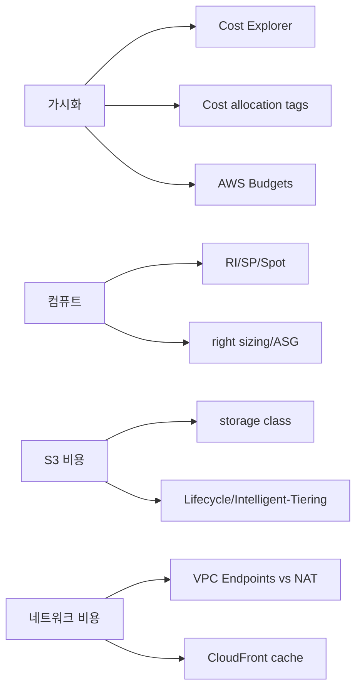

# Day 05 - Special Lecture + Week Summary (Domain 4)

## Quick Links

- [오늘의 이야기](#오늘의-이야기)
- [Timeline](#timeline-오늘-학습-타임라인)
- [Flow](#flow-서비스-연결-흐름)
- [Reading](#reading)
- [Quiz](#quiz)
- [References](../../references/README.md)

## 오늘의 이야기

비용 최적화는 “아끼자”가 아니라 “왜 나왔는지 보이게 하고, 다시 안 나오게 설계하는 것”입니다. 이번 주(Domain 4)는 그 흐름을 Cost Explorer/태그/Budgets로 가시화부터 만들고, 컴퓨트에서는 구매 옵션(RI/SP/Spot)과 right sizing/Auto Scaling으로 ‘지속 가능한 절감’을 만들고, S3는 스토리지 클래스와 Lifecycle/Intelligent-Tiering으로 시간이 지나도 비용이 무너지지 않게 하고, 네트워크는 NAT vs Endpoints, 그리고 CloudFront 캐시로 전송/오리진 비용까지 함께 줄이는 방향으로 정리했습니다.

오늘 pack은 이걸 서비스별로 외우는 대신, 케이스에서 바로 적용할 수 있게 “신호”를 회수하는 데 초점을 맞춥니다. “팀별 비용을 보고 싶다”면 태그, “초과를 막고 싶다”면 Budgets, “예측 가능”이면 RI/SP, “중단 허용”이면 Spot, “예측이 어렵다”면 Intelligent-Tiering, “내부에서 AWS로 나간다”면 Endpoints, “반복 응답”이면 CloudFront. 이 정도가 자동으로 떠오르면 Domain 4는 사실상 끝입니다.

오늘은 케이스를 보면서 “왜 이게 비용 최적화인지”를 한 줄로 말해보는 연습을 합니다. 예를 들어 “NAT 비용이 크다”는 문장은 Endpoints로, “S3 저장이 쌓인다”는 문장은 Lifecycle/클래스로, “예측 가능한 장기 사용”은 RI/SP로, “피크만 높다”는 문장은 Auto Scaling/스케줄 축소로, “전 세계 전송이 많다”는 문장은 CloudFront로 이어집니다. 이렇게 요구 문장을 비용 레버로 번역할 수 있으면, Domain 4는 암기보다 훨씬 빠르게 정리됩니다.

정리하자면 오늘의 마무리는 “가시화 → 선택 → 자동화”입니다. 태그/Cost Explorer/Budgets로 보이게 만들고, 구매 옵션/스토리지 클래스/엔드포인트·캐시로 레버를 고르고, Lifecycle/스케줄링처럼 자동화로 유지하는 것. 이 흐름이 붙으면 비용 문제는 ‘한 번’이 아니라 ‘계속’ 관리되는 형태가 됩니다.

## Timeline (오늘 학습 타임라인)

```mermaid
flowchart LR
  A[0-15m: 워밍업(비용 신호 10개)] --> B[15-195m: Special lecture pack]
  B --> C[195-225m: 케이스 워크스루]
  C --> D[225-240m: Quiz]
```

## Flow (서비스 연결 흐름)



## Reading

- Pack: `aws-saa/special-lectures/domain04-cost-optimized-top-services.md`

## Quiz

- [Day 05 Quiz](03-quiz.md)

## Back

- `../README.md`
