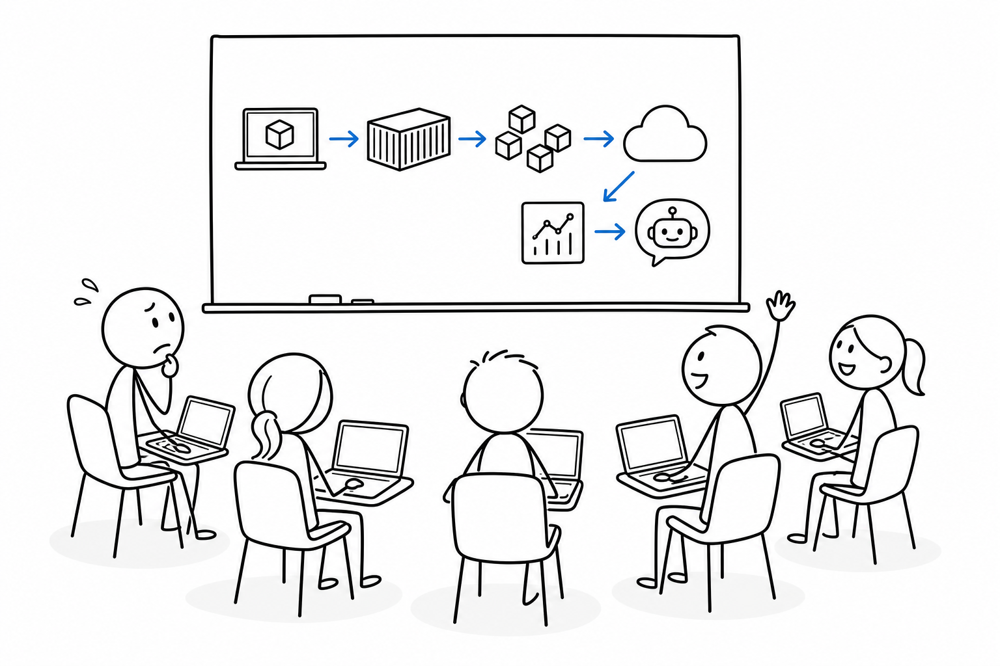
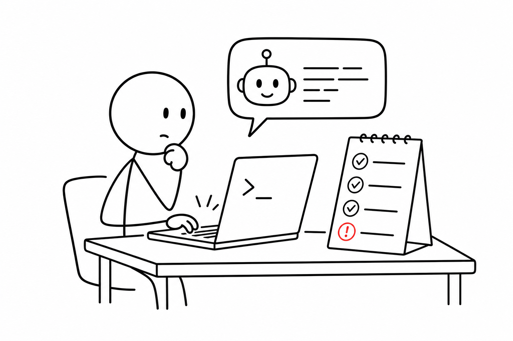
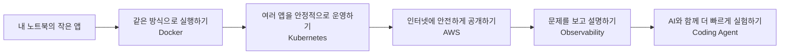
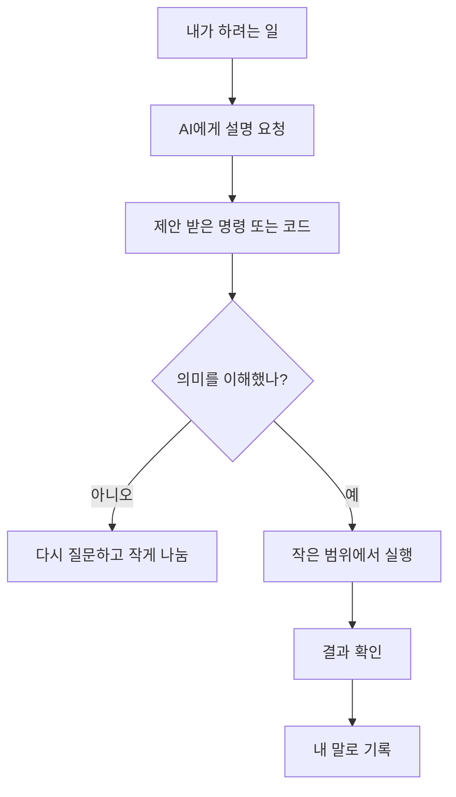

# 1교시 - 아이스 브레이킹: 내가 생각하는 Cloud, 개발, AI

## 목표

첫 50분은 기술을 가르치는 시간이 아니라, 함께 말할 수 있는 분위기를 만드는 시간이다. 서로의 출발점이 다르다는 것을 확인하고, 모르는 상태로 와도 괜찮다는 기준을 공유한다.

이 세션의 끝에서 우리는 다음을 말할 수 있어야 한다.

- 이 과정에서 Docker, Kubernetes, AWS, AI를 왜 함께 다루는지 대략 정리한다.
- 자신이 현재 어떤 도구와 AI를 쓰는지 공유한다.
- 수업 중 모르는 것을 질문해도 되는 분위기라고 느낀다.

## 오늘 한 줄 요약

오늘은 기술을 잘 아는지 평가하는 시간이 아니라, 서로의 출발점과 질문 방식을 맞추는 시간이다.

## 수업 이미지

## 오늘의 흐름

| 시간 | 단계 | 진행 |
|---|---|---|
| 09:00-09:05 | 출발 질문 | 오늘의 질문 3개를 보고 각자의 경험을 떠올린다. |
| 09:05-09:12 | 과정이 생긴 이유 | 이 과정이 Docker, Kubernetes, AWS, AI를 함께 다루는 이유를 확인한다. |
| 09:12-09:22 | 자기소개 | 이름, 관심 분야, 써본 도구, AI 사용 경험을 30초씩 말한다. |
| 09:22-09:32 | 반응형 질문 | 손들기, 스티커, 채팅, 옆 사람 대화로 현재 수준과 기대치를 확인한다. |
| 09:32-09:42 | 큰 그림 보기 | “노트북 앱이 서비스가 되는 길”을 그림으로 이해한다. |
| 09:42-09:50 | 오늘의 약속 | 질문 규칙, AI 사용 규칙, 오후 설치 예고를 정리한다. |

## 시작 화면

아래 질문으로 각자의 출발점을 확인한다.

> 오늘은 정답을 맞히는 날이 아니라, 서로의 출발점을 확인하는 날입니다.

1. 내가 생각하는 “Cloud”는 무엇인가?
2. 개발이나 IT를 배우면서 제일 막막했던 순간은 언제였나?
3. AI 도구를 써본 적이 있다면, 제일 도움이 됐던 순간 또는 제일 이상했던 답변은 무엇이었나?

## 과정의 큰 그림

오늘은 Docker 명령어를 외우는 날이 아니다. Kubernetes 구조를 한 번에 이해하는 날도 아니다. 먼저 서로의 출발점을 확인하고, 앞으로 어떤 질문을 반복해서 다룰지 잡는다.

이 과정은 이미 개발을 해본 사람과 터미널이 낯선 사람이 함께 듣는 수업이다. 중요한 기준은 모르는 것을 숨기지 않는 것이다. Cloud Native는 증상을 보고, 질문하고, 같이 확인하고, 기록하면서 배우는 분야다.

## 그림 1 - 우리 수업의 출발점

이 그림은 6주 동안 반복해서 돌아올 큰 길이다. 지금은 모든 단어를 이해하지 않아도 된다. Docker, Kubernetes, AWS, Observability, Coding Agent가 어떤 순서로 연결되는지만 먼저 본다.

## 활동 1 - 30초 자기소개

말할 내용:

- 이름
- 전공 또는 관심 분야
- 써본 도구 하나: VS Code, Git, Python, Java, Notion, ChatGPT 등 아무거나 가능
- 이번 과정에서 얻고 싶은 것 하나

## 활동 2 - 손들기 진단

아래 질문은 평가가 아니라 현재 출발점을 확인하기 위한 것이다.

손들기 질문:

- 터미널을 열어본 적 있다.
- Git을 써본 적 있다.
- Docker라는 말을 들어본 적 있다.
- AWS, Azure, GCP 중 하나를 들어본 적 있다.
- ChatGPT나 다른 AI에게 코드를 물어본 적 있다.
- AI 답변을 그대로 믿었다가 이상한 결과를 본 적 있다.

손을 들지 않아도 괜찮다. 오늘은 실력 측정이 아니라 수업 지도를 함께 만드는 날이다.

## 활동 3 - AI 경험 공유

둘씩 짝을 지어 3분 동안 이야기한다.

질문:

- AI가 나에게 가장 도움이 됐던 순간은?
- AI가 자신 있게 틀린 답을 했던 순간은?
- AI에게 코드를 맡긴다면 무엇이 걱정되는가?

공유한 내용은 세 칸으로 정리한다.

| 도움 된 점 | 위험한 점 | 수업에서의 약속 |
|---|---|---|
| 설명을 쉽게 해줌 | 틀린 명령을 제안할 수 있음 | 실행 전 의미 확인 |
| 에러 해석이 빠름 | Secret을 붙여넣을 위험 | key, token, password 금지 |
| 예제를 빨리 만듦 | 내 파일을 바꿀 수 있음 | 변경 파일 확인 |

## 그림 2 - AI를 쓰는 좋은 위치

AI는 대신 운전하는 사람이 아니라 옆자리 내비게이션에 가깝다. 내비게이션이 틀릴 수 있으니 표지판을 같이 봐야 한다. 이번 과정에서 중요한 것은 AI를 쓰느냐 안 쓰느냐가 아니라, 결과를 확인할 수 있느냐다.

## 마무리 질문

마지막으로 하나를 적는다.

> 오늘 수업이 끝날 때까지 꼭 해결하고 싶은 설치 또는 도구 관련 걱정은 무엇인가?

이 답변은 오후 설치 세션의 우선순위를 정하는 데 사용한다.

## 다음 교시 연결

다음 시간에는 이 과정이 어떤 방식으로 진행되는지, 질문은 어떻게 하고, 팀 미션은 어떻게 할지 정리한다. 오후에는 실제로 Docker Desktop, VS Code, WSL, AI 도구를 준비한다.
