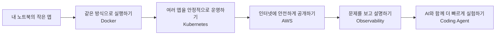
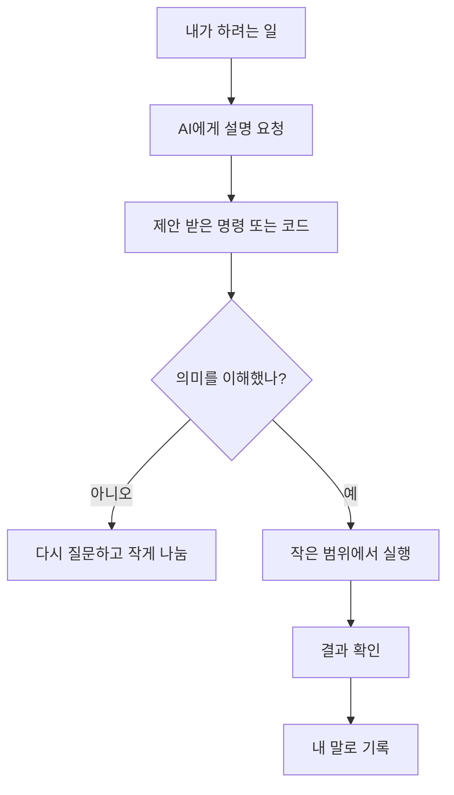

# 1교시 - 아이스 브레이킹: 내가 생각하는 Cloud, 개발, AI

## 목표

첫 50분은 기술을 가르치는 시간이 아니라, 학생들이 말할 수 있는 분위기를 만드는 시간이다. 강사는 학생의 배경을 파악하고, 학생은 “모르는 상태로 와도 괜찮다”는 신호를 받아야 한다.

이 세션의 끝에서 학생들은 다음을 말할 수 있어야 한다.

- 이 과정에서 Docker, Kubernetes, AWS, AI를 왜 함께 다루는지 대략 설명한다.
- 자신이 현재 어떤 도구와 AI를 쓰는지 공유한다.
- 수업 중 모르는 것을 질문해도 되는 분위기라고 느낀다.

## 진행 흐름

| 시간 | 단계 | 진행 |
|---|---|---|
| 09:00-09:05 | 입장 분위기 만들기 | 화면에 오늘의 질문 3개를 띄워두고 학생들이 들어오며 생각하게 한다. |
| 09:05-09:12 | 강사 자기소개 | 강사의 실패담 1개와 이 과정을 만든 이유를 짧게 이야기한다. |
| 09:12-09:22 | 학생 자기소개 | 이름, 관심 분야, 써본 도구, AI 사용 경험을 30초씩 말한다. |
| 09:22-09:32 | 반응형 질문 | 손들기, 스티커, 채팅, 옆 사람 대화로 현재 수준과 기대치를 확인한다. |
| 09:32-09:42 | 큰 그림 보기 | “노트북 앱이 서비스가 되는 길”을 그림으로 보여준다. |
| 09:42-09:50 | 오늘의 약속 | 질문 규칙, AI 사용 규칙, 오후 설치 예고를 정리한다. |

## 시작 화면

수업 시작 전 화면에는 아래 질문을 크게 띄운다.

> 오늘은 정답을 맞히는 날이 아니라, 서로의 출발점을 확인하는 날입니다.

1. 내가 생각하는 “Cloud”는 무엇인가?
2. 개발이나 IT를 배우면서 제일 막막했던 순간은 언제였나?
3. AI 도구를 써본 적이 있다면, 제일 도움이 됐던 순간 또는 제일 이상했던 답변은 무엇이었나?

## 강사 오프닝 스크립트

“오늘은 Docker 명령어를 외우는 날이 아닙니다. Kubernetes 구조를 한 번에 이해하는 날도 아닙니다. 오늘 오전의 목표는 서로의 출발점을 확인하는 것입니다. 이 수업에는 이미 개발을 해본 사람도 있고, 터미널이 낯선 사람도 있을 수 있습니다. 괜찮습니다. 이 과정은 그 차이를 전제로 설계합니다.”

“대신 한 가지는 같이 지켜야 합니다. 모르는 것을 숨기지 않는 겁니다. Cloud Native는 혼자 천재처럼 외워서 되는 분야가 아닙니다. 증상을 보고, 질문하고, 같이 확인하고, 기록하면서 배우는 분야입니다.”

## 그림 1 - 우리 수업의 출발점



강사 멘트:

- “오늘 우리가 보는 길은 이 한 줄입니다.”
- “여기서 제일 낯선 단어가 무엇인지 손들어봅시다.”
- “Docker를 들어본 사람, Kubernetes를 들어본 사람, AWS 계정을 만들어본 사람, AI로 코드를 물어본 사람 순서로 손을 들어봅시다.”

## 활동 1 - 30초 자기소개

학생이 너무 부담을 느끼지 않도록 항목을 고정한다.

말할 내용:

- 이름
- 전공 또는 관심 분야
- 써본 도구 하나: VS Code, Git, Python, Java, Notion, ChatGPT 등 아무거나 가능
- 이번 과정에서 얻고 싶은 것 하나

강사 팁:

- 처음 2-3명은 강사가 밝게 반응해 기준을 만든다.
- “처음입니다”, “아직 잘 모릅니다”라는 답변에 특히 긍정적으로 반응한다.
- 장황한 자기소개가 나오면 “좋습니다. 그 경험은 Docker 주차에서 다시 연결해볼게요.”처럼 자연스럽게 끊는다.

## 활동 2 - 손들기 진단

질문은 평가가 아니라 분위기 파악용이라고 먼저 말한다.

손들기 질문:

- 터미널을 열어본 적 있다.
- Git을 써본 적 있다.
- Docker라는 말을 들어본 적 있다.
- AWS, Azure, GCP 중 하나를 들어본 적 있다.
- ChatGPT나 다른 AI에게 코드를 물어본 적 있다.
- AI 답변을 그대로 믿었다가 이상한 결과를 본 적 있다.

강사 멘트:

“손을 안 들어도 괜찮습니다. 지금 손을 든 사람을 확인하는 이유는 수업 속도를 맞추기 위해서입니다. 오늘은 실력 측정이 아니라 지도 만들기입니다.”

## 활동 3 - AI 경험 공유

둘씩 짝을 지어 3분 동안 이야기하게 한다.

질문:

- AI가 나에게 가장 도움이 됐던 순간은?
- AI가 자신 있게 틀린 답을 했던 순간은?
- AI에게 코드를 맡긴다면 무엇이 걱정되는가?

공유를 받을 때 칠판에 세 칸으로 정리한다.

| 도움 된 점 | 위험한 점 | 수업에서의 약속 |
|---|---|---|
| 설명을 쉽게 해줌 | 틀린 명령을 제안할 수 있음 | 실행 전 의미 확인 |
| 에러 해석이 빠름 | Secret을 붙여넣을 위험 | key, token, password 금지 |
| 예제를 빨리 만듦 | 내 파일을 바꿀 수 있음 | 변경 파일 확인 |

## 그림 2 - AI를 쓰는 좋은 위치



강사 멘트:

- “AI는 대신 운전하는 사람이 아니라 옆자리 내비게이션에 가깝습니다.”
- “내비게이션이 틀릴 수 있으니 표지판을 같이 봐야 합니다.”
- “이번 과정에서 중요한 건 AI를 쓰느냐 안 쓰느냐가 아니라, 결과를 확인할 수 있느냐입니다.”

## 이미지 브리프 - 스틱맨 장면

### 장면 1: 첫날 교실

- 장면: 학생들이 둥글게 앉아 있고, 화이트보드에는 Docker, Kubernetes, AWS, AI가 길처럼 이어져 있다.
- 인물: 긴장한 학생, 이미 써본 도구를 말하는 학생, 웃으며 질문을 받는 강사
- 기술 오브젝트: 노트북, 터미널 창, 작은 웹앱 아이콘, Cloud 아이콘
- 감정: 부담을 낮추고 “같이 시작한다”는 느낌
- 반드시 보여줄 것: 서로 다른 출발점의 학생들이 같은 지도를 보는 장면
- 피할 것: 특정 회사 로고, 복잡한 UI, 작은 글씨
- Prompt:

```text
Simple black-and-white stickman illustration on a clean white background. A classroom of university students sits in a semicircle with laptops, looking at a whiteboard that shows a simple path from a laptop app to Docker, Kubernetes, AWS, and AI. One student looks nervous, one student raises a hand, and the instructor smiles while pointing at the path. Use small blue arrows for the learning journey. Minimal line art, classroom-friendly, no brand logos, no small text.
```

### 장면 2: AI는 내비게이션

- 장면: 학생이 노트북 앞에서 AI가 제안한 명령을 보고 있고, 옆에는 “확인” 체크리스트가 있다.
- 인물: 생각하는 학생, 조심스럽게 안내하는 AI 비서 느낌의 말풍선
- 기술 오브젝트: 터미널, 체크리스트, 작은 경고 표시
- 감정: AI를 무서워하지 않지만 그대로 믿지도 않는 태도
- 반드시 보여줄 것: 실행 전 확인하는 장면
- 피할 것: 실제 API key, password, token처럼 보이는 텍스트
- Prompt:

```text
Simple black-and-white stickman illustration on a clean white background. A student sits at a laptop looking at a terminal command suggested by an AI assistant shown as a simple speech bubble. Next to the laptop is a checklist with check marks and one red warning marker, showing that the student verifies before running commands. Minimal line art, classroom-friendly, no readable secrets, no brand logos, no dense UI.
```

## 마무리 질문

마지막 3분에 학생들에게 하나만 적게 한다.

> 오늘 수업이 끝날 때까지 꼭 해결하고 싶은 설치 또는 도구 관련 걱정은 무엇인가?

강사는 답변을 보며 오후 설치 세션에서 우선순위를 잡는다.

## 다음 교시 연결

“이제 누가 어떤 배경에서 왔는지 대략 알았습니다. 다음 시간에는 이 과정이 어떤 방식으로 진행되는지, 질문은 어떻게 하고, 팀 미션은 어떻게 할지 정리합니다. 오후에는 실제로 Docker Desktop, VS Code, WSL, AI 도구를 준비합니다.”
