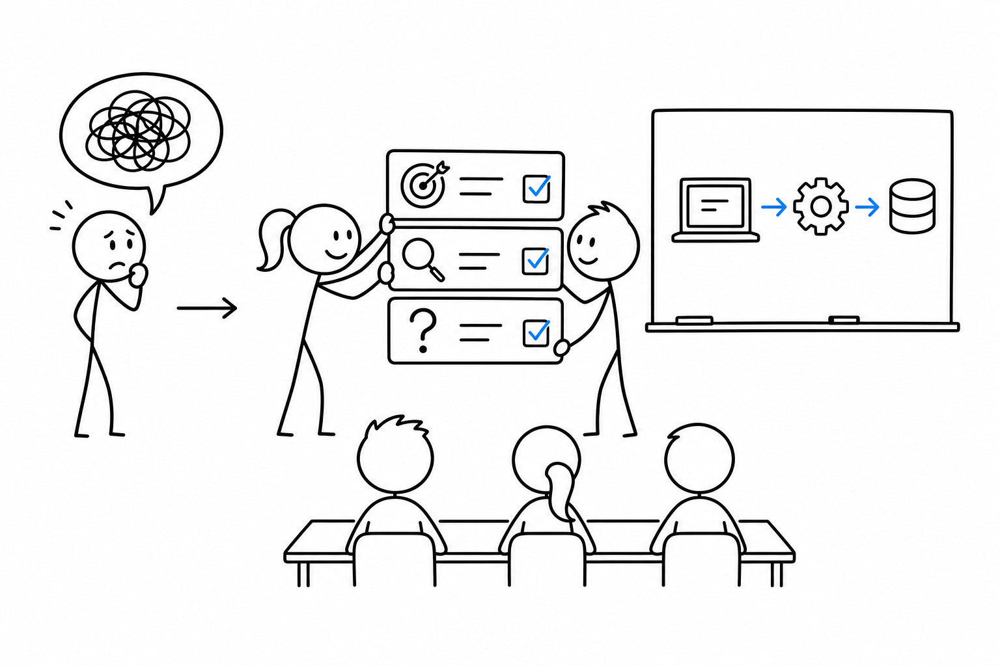
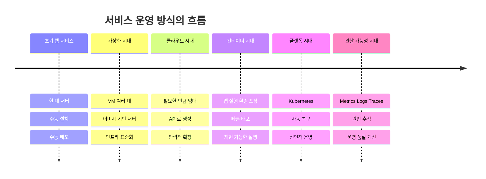

# 2교시 - 과정 OT: 수업 방식, 질문 규칙, 팀 활동, 평가/미션 방식

## 목표

이 시간의 목표는 함께 “이 수업에서 무엇을 어떻게 배우는지”를 예측할 수 있게 만드는 것이다. Cloud Native는 Docker 명령어 몇 개를 외우는 과정이 아니라, 코드가 실제 서비스가 되는 과정을 반복해서 관찰하고 설명하는 과정이다.

이 세션의 끝에서 우리는 다음을 말할 수 있어야 한다.

- 이 과정이 Docker, Kubernetes, AWS, Observability, AI를 한 흐름으로 다루는 이유를 정리한다.
- 수업 중 질문, 실습, 팀 활동이 어떤 방식으로 진행되는지 안다.
- 미션과 평가는 “정답 제출”보다 관찰, 설명, 복구, 기록을 본다는 점을 이해한다.

## 수업 이미지




## 오늘의 흐름

| 시간 | 단계 | 진행 |
|---|---|---|
| 10:00-10:06 | 1교시 연결 | 설치/도구 걱정 중 공통 항목을 2-3개 확인한다. |
| 10:06-10:15 | 과정의 큰 약속 | 이 과정은 “앱을 서비스로 만드는 길”을 반복해서 보는 수업이라고 정리한다. |
| 10:15-10:25 | 왜 이런 과정이 생겼나 | 업계가 서버 구매, 수동 배포, 클라우드, 컨테이너, 플랫폼 운영으로 이동한 흐름을 소개한다. |
| 10:25-10:35 | 수업 운영 방식 | 보기, 설명하기, 해보기, 진단하기, 회고하기 루프를 정리한다. |
| 10:35-10:43 | 질문과 팀 활동 규칙 | 질문 템플릿, 팀 역할, 막혔을 때의 행동 순서를 정한다. |
| 10:43-10:50 | 평가/미션 안내 | 산출물 예시와 채점 기준을 “설명 가능성” 중심으로 정리한다. |

## 시작 질문

> 좋은 개발자는 코드를 잘 쓰는 사람일까요, 아니면 서비스가 왜 멈췄는지 설명할 수 있는 사람일까요?

정답을 바로 고르기보다 두 능력이 어떻게 연결되는지 생각해본다.

## 과정의 큰 그림

이 과정은 Docker를 배웁니다. Kubernetes도 배웁니다. AWS도 배웁니다. 그런데 각각을 따로 외우면 금방 흩어집니다. 그래서 우리는 한 가지 질문으로 계속 돌아옵니다. ‘내 노트북에서 만든 앱은 어떻게 다른 사람이 안정적으로 쓰는 서비스가 되는가?’

서비스가 커지면 문제도 바뀝니다. 처음에는 내 컴퓨터에서만 실행되면 됩니다. 다음에는 팀원 컴퓨터에서도 실행되어야 합니다. 그 다음에는 서버에서 죽지 않고 돌아야 합니다. 더 나중에는 트래픽이 늘어도 버텨야 하고, 문제가 생기면 어디가 아픈지 찾아야 합니다. Docker, Kubernetes, AWS, Observability는 이 문제들이 커지면서 등장한 도구들입니다.

## 왜 이 과정이 필요한가

초기 웹 서비스는 보통 한두 대의 서버에서 시작했다. 개발자는 서버에 직접 접속해 파일을 올리고, 필요한 패키지를 설치하고, 프로세스를 다시 시작했다. 작은 팀에서는 이 방식이 빠르고 단순했다.

문제는 서비스가 커질 때 생겼다. 서버가 여러 대가 되면 “어느 서버에는 되고 어느 서버에는 안 되는” 일이 생긴다. 배포가 사람의 기억과 손작업에 의존하면 야간 장애가 반복된다. 사용자가 늘면 서버를 빠르게 늘려야 하지만, 물리 서버 구매와 설치는 느리다.

클라우드는 서버를 사는 대신 필요한 만큼 빌리는 방식을 대중화했다. Docker는 실행 환경을 이미지로 포장해 “내 컴퓨터에서는 됐는데 서버에서는 안 된다”를 줄였다. Kubernetes는 컨테이너가 많아졌을 때 배포, 재시작, 확장, 네트워크 연결을 일관된 방식으로 다루게 했다. Observability는 시스템이 복잡해진 뒤 “겉으로는 느린데 어디가 문제인지 모르는 상태”를 줄이기 위해 중요해졌다.

정리하면, 이 과정은 유행어를 모아둔 수업이 아니다. 서비스 운영 방식이 바뀌면서 생긴 문제와 그 문제를 해결하려고 등장한 도구들을 순서대로 배우는 수업이다.

## 그림 1 - 서비스 운영 방식의 변천



- 도구 이름보다 중요한 것은 앞 단계의 불편함입니다.
- Docker는 갑자기 멋있어서 나온 것이 아니라 실행 환경이 계속 달라지는 문제에서 나왔습니다.
- Kubernetes는 컨테이너 하나를 실행하는 도구가 아니라 컨테이너가 많아졌을 때 운영하는 도구입니다.

## 수업 루프

이 과정은 매번 같은 순서로 진행한다.

1. 보기: 먼저 시스템의 모양, 흐름, 증상을 본다.
2. 설명하기: 본 것에 이름을 붙인다.
3. 해보기: 작은 명령이나 활동으로 직접 확인한다.
4. 진단하기: 일부러 깨뜨리거나 실패 원인을 찾는다.
5. 회고하기: 운영 판단을 한 문장으로 정리한다.

처음부터 모든 용어를 정확히 외우려고 하면 어렵습니다. 대신 먼저 봅니다. 브라우저에 안 열린다, 로그가 찍힌다, 포트가 충돌한다, 컨테이너가 재시작된다. 그 다음에 이름을 붙입니다. Cloud Native는 현상을 설명하는 힘이 중요합니다.

## 질문 규칙

질문할 때는 아래 템플릿을 사용한다. 완벽하게 말할 필요는 없지만, 가능하면 증상과 시도한 일을 같이 말한다.

```text
제가 하려던 일:
보인 증상:
이미 해본 것:
궁금한 것:
```

좋은 질문 예시:

- Docker Desktop을 켰는데 `docker version`에서 server가 안 보입니다. Docker Desktop 재시작은 해봤습니다. WSL 문제인지 Docker 문제인지 궁금합니다.
- 브라우저에서 localhost가 안 열립니다. 터미널에는 서버가 실행 중이라고 나옵니다. 포트를 잘못 본 것 같습니다.

피해야 할 질문 예시:

- 안 돼요.
- 에러 났어요.
- AI가 하라는 대로 했는데 안 됩니다.

## 팀 활동 규칙

팀 활동은 실력이 비슷한 사람끼리 정답을 빨리 내는 시간이 아니다. 서로 다른 관찰을 합쳐 문제를 설명하는 시간이다.

팀 역할은 상황에 따라 바꾼다.

| 역할 | 하는 일 |
|---|---|
| 드라이버 | 키보드를 잡고 명령을 실행한다. |
| 네비게이터 | 다음 명령의 의미를 확인하고 속도를 조절한다. |
| 기록자 | 증상, 명령, 결과, 결론을 짧게 적는다. |
| 리포터 | 팀의 판단을 1분 안에 공유한다. |

## 평가와 미션 방식

이 과정의 미션은 주로 다음 능력을 본다.

- 실행: 안내된 명령을 순서대로 수행한다.
- 관찰: 성공 출력, 로그, 화면 변화를 확인한다.
- 설명: “왜 이 명령을 썼는지”를 쉬운 말로 정리한다.
- 복구: 실패했을 때 증상을 보고 가능한 원인을 좁힌다.
- 정리: 팀 또는 개인 노트에 재현 가능한 형태로 남긴다.

평가는 빠른 암기보다 설명 가능성을 본다. 실무에서도 “내가 어제 어떤 명령을 쳤는지 기억하는 사람”보다 “현재 상태를 확인하고 다음 행동을 정할 수 있는 사람”이 더 안정적이다.

## 활동 - 좋은 질문 바꾸기

아래 문장을 2분 동안 더 좋은 질문으로 바꿔본다.

```text
Docker가 안 돼요.
```

정리 예시:

```text
제가 하려던 일: Docker 설치 확인
보인 증상: 터미널에서 docker version을 실행했는데 Docker daemon에 연결할 수 없다는 메시지가 나옴
이미 해본 것: Docker Desktop 실행 여부 확인, 터미널 재시작
궁금한 것: Docker Desktop이 완전히 켜지지 않은 문제인지 WSL 연결 문제인지 확인하고 싶음
```

## 마무리 질문

마지막으로 하나를 적는다.

> 이 수업에서 내가 가장 자주 해야 할 행동은 무엇일까? 실행, 관찰, 설명, 복구, 기록 중 하나를 고르고 이유를 적어보자.

## 다음 교시 연결

이제 수업의 운영 방식을 정했습니다. 다음 시간부터는 1-3주차의 기술 흐름을 봅니다. 컴퓨팅 기초에서 Docker, Kubernetes Core까지 이어지는 길을 먼저 큰 그림으로 잡겠습니다.
