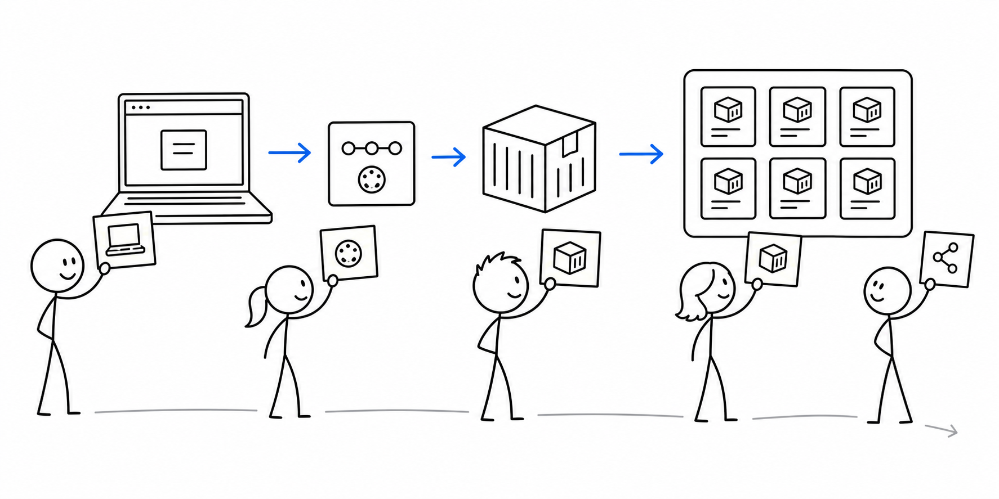
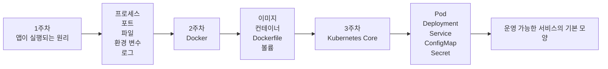

# 3교시 - 1-3주차 오버뷰: 컴퓨팅 기초, Docker, Kubernetes Core

## 목표

이 시간의 목표는 1-3주차를 하나의 이야기로 이해하는 것이다. 아직 Docker와 Kubernetes를 자세히 몰라도, 왜 프로세스와 포트부터 시작하는지, 왜 컨테이너를 배우는지, 왜 Kubernetes까지 가는지 연결할 수 있어야 한다.

이 세션의 끝에서 우리는 다음을 말할 수 있어야 한다.

- 1주차 컴퓨팅 기초가 Docker와 Kubernetes 학습의 바닥 지식임을 정리한다.
- Docker가 해결하려는 핵심 문제가 “실행 환경의 재현성”임을 이해한다.
- Kubernetes Core가 해결하려는 핵심 문제가 “많은 컨테이너의 운영”임을 이해한다.

## 수업 이미지




## 오늘의 흐름

| 시간 | 단계 | 진행 |
|---|---|---|
| 11:00-11:07 | 출발점 확인 | “앱이 실행된다”는 말 안에 무엇이 들어있는지 생각한다. |
| 11:07-11:18 | 1주차 이야기 | 프로세스, 포트, 파일, 환경 변수, 로그가 왜 필요한지 정리한다. |
| 11:18-11:30 | Docker가 생긴 이유 | 실행 환경 차이와 배포 불안을 역사 흐름으로 정리한다. |
| 11:30-11:40 | Kubernetes가 생긴 이유 | 컨테이너가 많아지며 생기는 배치, 재시작, 확장, 연결 문제를 정리한다. |
| 11:40-11:47 | 1-3주차 지도 그리기 | 각 주차의 키워드를 서비스 흐름 위에 붙인다. |
| 11:47-11:50 | 한 문장 정리 | “작은 앱에서 운영 가능한 서비스까지”를 한 문장으로 말한다. |

## 시작 질문

> “앱이 실행된다”는 말은 정확히 무엇이 된다는 뜻일까요?

생각해볼 답:

- 프로그램이 켜진다.
- 브라우저에서 화면이 보인다.
- 서버가 돌아간다.
- 주소로 접속된다.
- 에러가 안 난다.

답을 모아 “프로세스, 포트, 요청, 파일, 환경 변수, 로그”로 연결한다.

## 1주차 - Cloud Native를 위한 컴퓨팅 기초

Cloud Native를 배우기 전에 먼저 앱이 어떻게 살아 움직이는지 봐야 한다. Docker 명령을 외워도 프로세스와 포트를 모르면 문제가 생겼을 때 어디를 봐야 하는지 알기 어렵다.

1주차에서는 다음 질문을 다룬다.

- 프로그램과 프로세스는 어떻게 다른가?
- 브라우저가 `localhost:3000`에 접속한다는 말은 무슨 뜻인가?
- 설정은 왜 코드 밖의 환경 변수로 빠지는가?
- 로그는 왜 운영자의 눈 역할을 하는가?
- 배포는 왜 단순한 파일 복사가 아닌가?

Docker를 배우기 전에 포트를 알아야 합니다. Kubernetes Service를 배우기 전에 localhost와 요청 경로를 알아야 합니다. Observability를 배우기 전에 로그를 보는 습관이 있어야 합니다. 그래서 첫 주는 느려 보여도 나중에 속도를 내기 위한 바닥 공사입니다.

## 2주차 - Docker와 컨테이너

Docker가 널리 쓰이게 된 배경에는 오래된 배포 문제가 있다. 개발자 노트북에서는 잘 되는데 서버에서는 안 되는 일이 반복됐다. 운영체제, 라이브러리 버전, 환경 변수, 실행 명령이 조금씩 달랐기 때문이다.

컨테이너는 애플리케이션과 실행에 필요한 설정을 이미지로 포장해 같은 방식으로 실행하려는 접근이다. VM처럼 완전한 컴퓨터 하나를 매번 만드는 방식보다 가볍고 빠르게 배포할 수 있다. 그래서 개발, 테스트, 운영 환경 사이의 차이를 줄이는 데 큰 도움이 됐다.

2주차에서는 다음 질문을 다룬다.

- 이미지는 무엇이고 컨테이너는 무엇인가?
- Dockerfile은 왜 필요한가?
- 빌드와 실행은 어떻게 다른가?
- 포트 매핑, 볼륨, 환경 변수는 어떤 문제를 해결하는가?
- 좋은 컨테이너 이미지는 어떻게 작고 예측 가능하게 만드는가?

## 3주차 - Kubernetes Core

컨테이너 하나를 실행하는 일은 Docker만으로도 가능하다. 하지만 실제 서비스에는 컨테이너가 여러 개 필요하다. 웹 서버, API 서버, 데이터베이스, 배치 작업, 캐시, 메시지 큐가 함께 움직인다. 트래픽이 늘면 개수를 늘려야 하고, 죽으면 다시 띄워야 하며, 새 버전을 배포할 때는 사용자가 느끼는 중단을 줄여야 한다.

Kubernetes는 이런 운영 문제를 선언적 방식으로 다룬다. “이 컨테이너를 지금 이 명령으로 실행해”보다 “이 서비스는 항상 3개가 떠 있어야 해”에 가깝다. 현재 상태가 원하는 상태와 다르면 Kubernetes가 차이를 줄이려고 움직인다.

3주차에서는 다음 질문을 다룬다.

- Pod, Deployment, Service는 각각 어떤 역할인가?
- 원하는 상태와 현재 상태는 어떻게 비교되는가?
- 컨테이너가 죽었을 때 누가 다시 띄우는가?
- 설정과 비밀값은 어떻게 주입하는가?
- 배포 중 장애를 줄이려면 어떤 구조가 필요한가?

## 그림 1 - 1-3주차 학습 지도



- 1주차는 눈을 만드는 시간입니다.
- 2주차는 실행 환경을 포장하는 시간입니다.
- 3주차는 여러 실행 단위를 운영하는 시간입니다.

## 업계 변천사로 보는 1-3주차

| 시대 | 주된 방식 | 좋아진 점 | 새로 생긴 문제 |
|---|---|---|---|
| 수동 서버 배포 | 서버 접속 후 직접 설치 | 작게 시작하기 쉽다 | 서버마다 상태가 달라진다 |
| VM 이미지 | 서버 이미지를 표준화 | 격리와 복제가 쉬워진다 | 이미지가 무겁고 배포가 느릴 수 있다 |
| 컨테이너 | 앱 실행 환경을 포장 | 빠르고 재현 가능하다 | 컨테이너가 많아지면 관리가 어렵다 |
| Kubernetes | 원하는 상태를 선언 | 자동 복구와 확장이 가능하다 | 개념과 네트워크가 복잡해진다 |

정리하면, 1-3주차는 “앱이 실행된다”에서 시작해 “여러 컨테이너가 운영된다”까지 가는 과정이다.

## 활동 - 키워드 위치 붙이기

칠판에 아래 흐름을 그린다.

```text
내 노트북의 코드 -> 실행 중인 앱 -> 포장된 실행 환경 -> 여러 컨테이너 운영
```

키워드를 알맞은 위치에 붙이게 한다.

- process
- port
- localhost
- environment variable
- log
- image
- container
- Dockerfile
- pod
- deployment
- service

예상 정리:

| 위치 | 키워드 |
|---|---|
| 실행 중인 앱 | process, port, localhost, log |
| 포장된 실행 환경 | image, container, Dockerfile, environment variable |
| 여러 컨테이너 운영 | pod, deployment, service |

## 흔한 오해

- Docker와 Kubernetes를 같은 종류의 도구로 생각한다. Docker는 컨테이너를 만들고 실행하는 경험에 가깝고, Kubernetes는 많은 컨테이너를 운영하는 플랫폼에 가깝다.
- Kubernetes를 배우면 Docker를 몰라도 된다고 생각한다. 실제로는 컨테이너 이미지와 실행 원리를 알아야 Kubernetes 증상을 해석할 수 있다.
- 포트와 로그를 기초라서 가볍게 본다. 운영 문제의 상당수는 포트, 설정, 로그에서 시작한다.

## 마무리 질문

> Docker가 해결하려는 문제와 Kubernetes가 해결하려는 문제를 각각 한 문장으로 써보자.

정리 예시:

- Docker는 앱 실행 환경을 포장해 환경 차이를 줄인다.
- Kubernetes는 여러 컨테이너를 원하는 상태로 운영한다.

## 다음 교시 연결

오전 마지막 시간에는 4-6주차를 미리 봅니다. Kubernetes를 배운 뒤에는 네트워크, 보안, AWS, 관찰 가능성, 캡스톤으로 넘어갑니다. 이때부터는 단순 실행보다 운영 판단이 더 중요해집니다.
