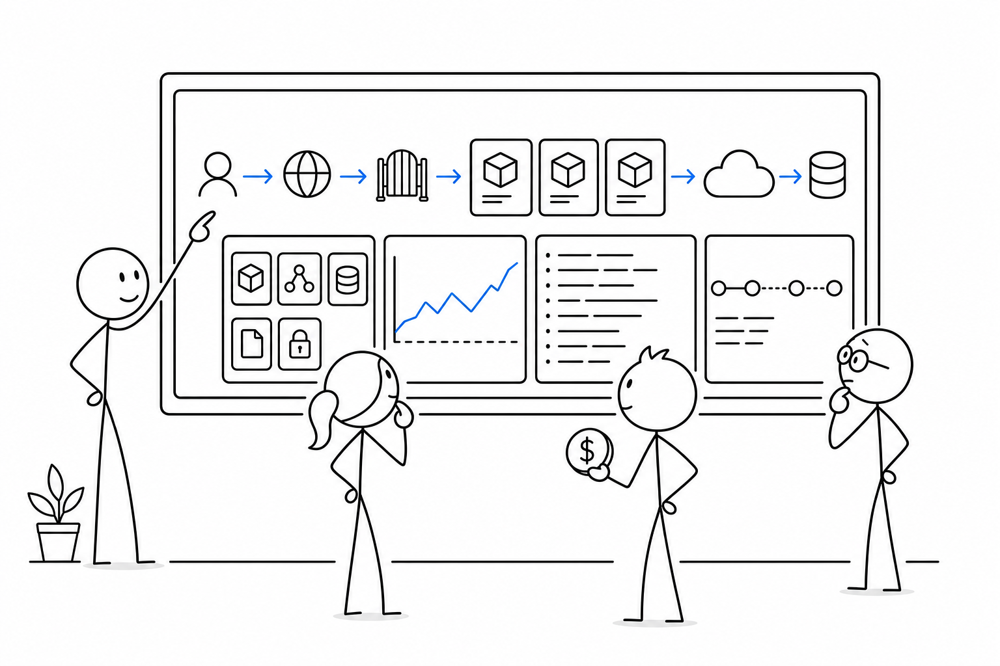
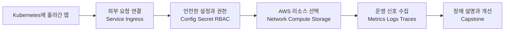

# 4교시 - 4-6주차 오버뷰: Kubernetes 운영, AWS, Observability, Capstone

## 목표

이 시간의 목표는 4-6주차가 왜 “운영” 중심으로 구성되는지 이해하는 것이다. 1-3주차가 앱을 컨테이너로 만들고 Kubernetes에 올리는 길이라면, 4-6주차는 그 서비스를 안전하게 공개하고, 비용과 보안을 고려하고, 문제가 생겼을 때 설명하는 길이다.

이 세션의 끝에서 우리는 다음을 말할 수 있어야 한다.

- Kubernetes 네트워크와 운영 주제가 왜 뒤에 등장하는지 정리한다.
- AWS가 단순 서버 대여가 아니라 관리형 서비스와 운영 선택지의 집합임을 이해한다.
- Observability가 장애 이후에 보는 장식이 아니라 운영의 기본 감각임을 이해한다.

## 오늘 한 줄 요약

4-6주차는 Kubernetes에 올린 서비스를 안전하게 공개하고, 관찰하고, 운영 판단을 내리는 방법을 배운다.

## 수업 이미지

## 시작 질문

> 앱을 Kubernetes에 올리기만 하면 운영이 끝날까요?

생각해볼 답:

- 외부에서 접속되어야 한다.
- HTTPS가 필요하다.
- 트래픽이 늘면 확장해야 한다.
- 로그와 모니터링이 필요하다.
- 비용이 든다.
- 권한과 보안을 챙겨야 한다.

이 답변은 4-6주차 주제와 연결된다.

## 4주차 - Kubernetes 운영과 네트워크

Kubernetes의 기본 리소스를 알게 되면 다음 질문이 생긴다. Pod는 떠 있는데 사용자는 어떻게 접속할까? 서비스가 여러 개일 때 요청은 어디로 갈까? 새 버전을 배포할 때 기존 사용자는 어떻게 보호할까? 설정과 비밀값은 어떻게 관리할까?

4주차에서는 Kubernetes를 “실행하는 곳”에서 “운영하는 곳”으로 확장해서 본다.

- Service와 Ingress로 요청 경로를 이해한다.
- ConfigMap과 Secret으로 설정 주입을 다룬다.
- rollout, rollback, readiness, liveness를 통해 배포와 복구를 본다.
- namespace와 권한의 기본 개념을 소개한다.

Kubernetes에서 가장 많이 헷갈리는 부분은 네트워크입니다. 컨테이너는 떠 있는데 접속이 안 되는 일이 많습니다. 그래서 4주차는 ‘요청이 어디로 지나가는지’ 계속 그리면서 갑니다.

## 5주차 - AWS와 Cloud Native Computing

AWS 같은 클라우드는 서버를 인터넷에서 빌리는 곳으로만 이해하면 반만 맞다. 중요한 변화는 인프라를 API로 만들고 지울 수 있게 되었다는 점이다. 예전에는 서버, 네트워크, 스토리지를 준비하는 데 시간이 오래 걸렸다. 클라우드는 이 과정을 빠르게 만들었고, 점점 더 많은 기능을 관리형 서비스로 제공했다.

서비스 운영자는 이제 모든 것을 직접 설치할지, 관리형 서비스를 쓸지 선택해야 한다. 직접 운영하면 자유도가 높지만 책임도 커진다. 관리형 서비스를 쓰면 운영 부담은 줄지만 비용, 권한, 네트워크, 벤더 종속성을 고려해야 한다.

5주차에서는 다음 질문을 다룬다.

- 클라우드의 핵심은 서버 대여인가, 운영 방식의 변화인가?
- VPC, subnet, security group은 왜 필요한가?
- 컨테이너를 AWS에서 실행하는 대표 선택지는 무엇인가?
- 관리형 데이터베이스와 스토리지는 어떤 운영 부담을 줄이는가?
- 비용이 늘어나는 지점은 어디인가?

## 6주차 - Observability와 Capstone

서비스가 작을 때는 로그 몇 줄로도 문제를 찾을 수 있다. 하지만 여러 서비스가 네트워크로 연결되고, 컨테이너가 자동으로 재시작되고, 클라우드 리소스가 여러 계층으로 나뉘면 로그만으로는 부족하다.

Observability는 시스템 밖에서 보이는 신호로 내부 상태를 추론하는 능력이다. 대표 신호는 metrics, logs, traces다. 이 셋은 각각 다른 질문에 답한다.

| 신호 | 답하는 질문 |
|---|---|
| Metrics | 지금 수치가 평소와 다른가? |
| Logs | 어떤 사건이 어떤 메시지로 남았는가? |
| Traces | 요청 하나가 어떤 서비스들을 지나갔는가? |

6주차의 캡스톤은 완벽한 대규모 시스템을 만드는 것이 아니다. 작은 서비스를 배포하고, 요청 경로를 설명하고, 장애 증상을 관찰하고, 복구와 개선 방향을 말하는 것이다.

## 그림 1 - 4-6주차 운영 지도

- 4주차부터는 실행 성공보다 운영 설명이 중요해집니다.
- AWS는 버튼 누르는 수업이 아니라 선택 기준을 배우는 수업입니다.
- Observability는 장애가 난 뒤에 켜는 화면이 아니라 처음부터 남겨야 하는 신호입니다.

## 업계 변천사로 보는 4-6주차

| 변화 | 왜 일어났나 | 수업에서 연결되는 주제 |
|---|---|---|
| 단일 서버에서 분산 서비스로 | 기능과 트래픽이 늘어 서비스가 쪼개졌다 | Kubernetes networking, Service, Ingress |
| 직접 설치에서 관리형 서비스로 | 운영 부담과 장애 책임을 줄이려 했다 | AWS managed services |
| 수동 점검에서 자동 복구로 | 사람이 24시간 지켜볼 수 없다 | readiness, liveness, rollout |
| 로그 중심에서 세 신호로 | 요청 경로가 길어지고 장애 원인이 분산됐다 | metrics, logs, traces |
| 개인 작업에서 팀 운영으로 | 배포와 장애 대응은 협업이 필요하다 | capstone, runbook, incident note |

## 활동 - 운영 질문 분류하기

아래 질문을 4주차, 5주차, 6주차 중 어디에서 다룰지 분류한다.

- 사용자가 접속할 주소는 어디서 정하나?
- 컨테이너가 죽으면 누가 다시 띄우나?
- 데이터베이스를 직접 설치할까, 관리형 서비스를 쓸까?
- 요청이 느려졌을 때 어느 서비스가 느린지 어떻게 알까?
- 비용이 갑자기 늘면 어디를 먼저 볼까?
- 새 버전 배포 후 문제가 생기면 어떻게 되돌릴까?

예상 분류:

| 질문 | 주차 |
|---|---|
| 사용자가 접속할 주소 | 4주차 |
| 컨테이너 자동 복구 | 4주차 |
| 관리형 데이터베이스 선택 | 5주차 |
| 느린 서비스 찾기 | 6주차 |
| 비용 증가 확인 | 5주차, 6주차 |
| 배포 되돌리기 | 4주차, 6주차 |

## 캡스톤 산출물 예고

최종 산출물은 코드만이 아니다. 운영자가 읽을 수 있는 설명이 함께 있어야 한다.

- 서비스 구조도
- 실행과 배포 절차
- 요청 경로 설명
- 환경 변수와 secret 관리 원칙
- 주요 로그와 메트릭
- 장애 상황 1개와 복구 시나리오
- 비용과 보안에서 조심할 점

## 마무리 질문

> 서비스가 “돌아간다”와 서비스가 “운영된다”는 말은 어떻게 다를까?

정리 예시:

- 돌아간다는 것은 실행 중이라는 뜻에 가깝다.
- 운영된다는 것은 접속, 보안, 확장, 관찰, 복구, 비용까지 관리된다는 뜻이다.

## 다음 교시 연결

오후에는 말로 본 도구들을 실제 노트북에서 준비합니다. VS Code, 터미널, Git, 브라우저, Docker Desktop, WSL은 앞으로 6주 동안 계속 쓰는 작업대입니다.
