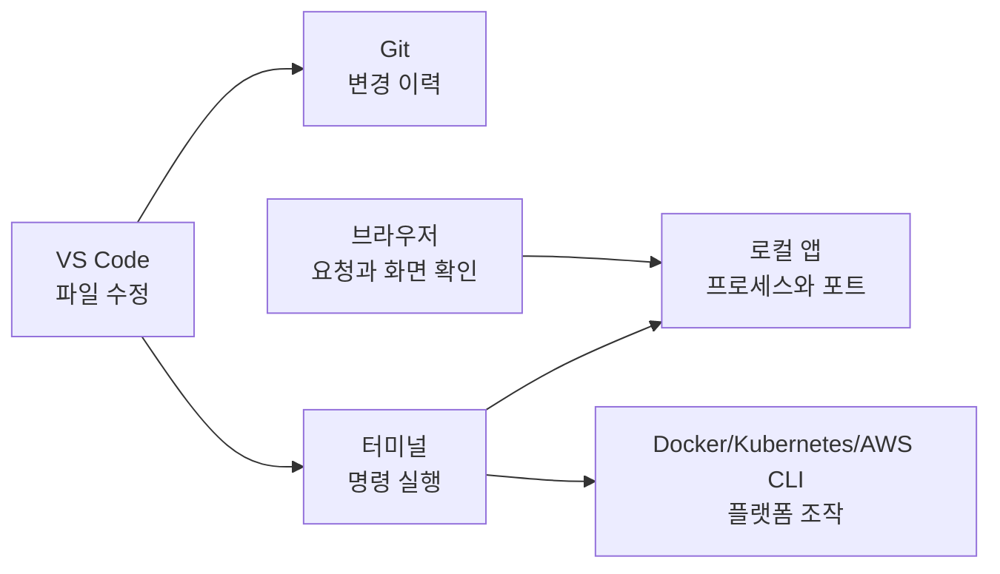

# 5교시 - 개발 도구 점검: VS Code, 터미널, Git, 브라우저, 계정 상태 확인

## 목표

이 시간의 목표는 실습에 필요한 기본 도구가 준비되어 있는지 확인하고, 각 도구가 왜 필요한지 이해하는 것이다. 설치 자체보다 중요한 것은 “어떤 일을 할 때 어떤 도구를 여는지”를 아는 것이다.

이 세션의 끝에서 우리는 다음을 할 수 있어야 한다.

- VS Code, 터미널, Git, 브라우저의 역할을 구분한다.
- 기본 명령으로 설치 상태를 확인한다.
- 문제가 있을 때 증상과 확인 결과를 기록해 도움을 요청한다.

## 오늘 한 줄 요약

VS Code, 터미널, Git, 브라우저는 앞으로 실습에서 계속 사용할 기본 작업대다.

## 수업 이미지


## 시작 화면

> 오후의 목표는 “다 설치했다”가 아니라 “문제가 생겼을 때 어디를 확인할지 안다”입니다.

## 도구가 왜 필요한가

개발 도구는 한 번에 생긴 것이 아니다. 서비스 개발 방식이 바뀌면서 역할이 나뉘었다.

초기에는 서버 안에서 직접 파일을 고치고 실행하는 일이 흔했다. 팀 개발이 커지면서 누가 무엇을 바꿨는지 추적할 필요가 생겼고, Git 같은 버전 관리 도구가 중요해졌다. 웹 서비스가 복잡해지면서 브라우저는 단순히 화면을 보는 도구가 아니라 요청, 응답, 콘솔 에러를 확인하는 진단 도구가 됐다. 클라우드와 컨테이너가 보편화되면서 터미널은 서버와 플랫폼을 다루는 공통 언어가 됐다.

정리하면, 이 도구들은 “개발자가 멋있어 보이려고 쓰는 도구”가 아니다. 코드 작성, 변경 이력, 실행 명령, 요청 관찰을 나누어 맡는 기본 작업대다.

## 도구별 역할

| 도구 | 역할 | 수업에서 하는 일 |
|---|---|---|
| VS Code | 파일과 프로젝트를 읽고 수정한다 | 코드, 설정, README, YAML을 편집한다 |
| 터미널 | 명령을 실행하고 결과를 본다 | 서버 실행, Docker, Kubernetes, Git 명령을 실행한다 |
| Git | 변경 이력을 관리한다 | 실습 코드 변경, 되돌리기, 공유 흐름을 익힌다 |
| 브라우저 | 사용자의 요청을 확인한다 | localhost 접속, 화면, 네트워크, 콘솔을 관찰한다 |
| 계정 | 외부 서비스에 접근한다 | GitHub, Docker Hub, AWS 실습에 사용한다 |

## 명령을 읽는 기본 규칙

터미널이 처음이면 명령어보다 먼저 화면을 읽는 방식이 낯설 수 있다. 수업 자료의 코드 블록은 보통 “터미널에 입력할 내용”을 뜻한다.

```bash
git --version
```

위 줄을 실행하면 터미널은 아래처럼 결과를 보여준다.

```text
git version 2.x.x
```

구분해서 볼 것:

| 구분 | 의미 |
|---|---|
| 명령 | 내가 터미널에 입력하는 문장 |
| 출력 | 명령을 실행한 뒤 터미널이 보여주는 결과 |
| 에러 | 명령을 실행했지만 문제가 있어 나온 메시지 |
| 현재 폴더 | 명령이 실행되는 위치 |

자료에 `$`, `>` 같은 기호가 보이면 터미널 모양을 보여주는 표시일 수 있다. 그런 기호까지 복사하는지 여부는 자료마다 다르므로, 수업에서는 코드 블록 안의 실제 명령 줄을 기준으로 입력한다.

## 공통 점검 명령

학생 운영체제에 따라 명령이 조금 다를 수 있다. 중요한 것은 출력이 나오는지와 에러를 기록하는 것이다.

### 터미널 열기

Windows:

- Windows Terminal 또는 PowerShell을 연다.
- WSL을 쓰는 학생은 Ubuntu 터미널도 열어본다.

macOS:

- Terminal 또는 iTerm을 연다.

Linux:

- 기본 terminal을 연다.

### Git 확인

```bash
git --version
```

예상 출력:

```text
git version 2.x.x
```

사용자 정보 확인:

```bash
git config --global user.name
git config --global user.email
```

비어 있으면 나중에 설정한다. 수업 중 공개 화면에서 개인 이메일 노출이 불편하다면 GitHub noreply 이메일을 사용할 수 있다.

### VS Code 확인

```bash
code --version
```

이 명령이 실패해도 VS Code 앱 자체가 열리면 당장 수업은 진행할 수 있다. 다만 터미널에서 `code .`로 프로젝트를 여는 흐름은 나중에 설정한다.

### 브라우저 확인

Chrome 또는 Edge를 열고 주소창에 아래 주소를 입력한다.

```text
http://localhost
```

아직 서버를 켜지 않았으므로 연결 실패가 정상일 수 있다. 여기서 중요한 것은 localhost라는 주소가 외부 사이트가 아니라 내 컴퓨터를 가리킨다는 감각이다.

## 그림 1 - 개발 도구의 역할 분담



- VS Code에서 파일을 고치고, 터미널에서 실행하고, 브라우저에서 결과를 봅니다.
- Git은 내가 지나온 길을 남깁니다.
- Cloud Native 수업에서는 터미널이 거의 모든 플랫폼의 공통 리모컨처럼 쓰입니다.

## 계정과 민감정보 규칙

앞으로 사용할 수 있는 계정은 다음과 같다.

- GitHub: 코드 저장소와 협업
- Docker Hub: 컨테이너 이미지 저장소
- AWS: 클라우드 리소스 실습
- AI 도구 계정: 설명 요청, 에러 해석, 코드 보조

규칙:

- password, token, API key, private key는 채팅창, AI 도구, 공개 문서에 붙여넣지 않는다.
- 화면 공유 중에는 계정 설정, 결제, access key 화면을 조심한다.
- 실습용 계정과 개인 계정의 경계를 인식한다.
- 문제가 생기면 secret 값을 보여주지 말고 에러 메시지와 상황만 공유한다.

## 설치가 안 되어 있을 때

오늘은 모든 설치 문제를 한 번에 해결하는 날이 아니다. 그래도 무엇이 없는지 확인하고, 공식 설치 페이지를 알면 다음 조치를 정하기 쉽다.

| 도구 | 공식 설치 위치 | 오늘 필요한 수준 |
|---|---|---|
| VS Code | <https://code.visualstudio.com/download> | 앱이 열리면 우선 진행 가능 |
| Git | <https://git-scm.com/downloads> | `git --version` 출력 확인 |
| Docker Desktop | <https://docs.docker.com/desktop/> | 6교시에서 Docker Engine 연결 확인 |
| Windows WSL | <https://learn.microsoft.com/windows/wsl/install> | Windows 학습자는 WSL 2 상태 확인 |

설치 화면에서 선택지가 많으면 혼자 오래 고민하지 않는다. 운영체제, 에러 문구, 현재 화면을 기준으로 도움을 요청한다.

## 활동 - 설치 점검표

아래 표를 개인 노트에 복사해 체크한다.

| 항목 | 상태 | 확인 방법 | 메모 |
|---|---|---|---|
| VS Code 실행 | OK / 문제 있음 | 앱 실행 | |
| 터미널 실행 | OK / 문제 있음 | PowerShell, Terminal, Ubuntu 등 | |
| Git 설치 | OK / 문제 있음 | `git --version` | |
| 브라우저 준비 | OK / 문제 있음 | Chrome 또는 Edge 실행 | |
| GitHub 계정 | OK / 문제 있음 | 로그인 가능 여부 | |
| Docker Hub 계정 | OK / 문제 있음 | 로그인 가능 여부 | |
| AWS 계정 | OK / 나중에 / 문제 있음 | 로그인 가능 여부 | |

문제 있는 항목을 손들기로 빠르게 수집한다.

## 흔한 문제와 대응

| 증상 | 가능한 원인 | 오늘의 대응 |
|---|---|---|
| `git` 명령을 찾을 수 없음 | Git 미설치 또는 PATH 미설정 | 설치 여부 확인, 필요 시 설치 가이드로 이동 |
| `code` 명령을 찾을 수 없음 | VS Code CLI 미설정 | 앱으로 열고, CLI 설정은 보충 시간에 처리 |
| GitHub 로그인이 안 됨 | 비밀번호, 2FA, 브라우저 세션 문제 | 계정 복구 흐름은 쉬는 시간 또는 별도 지원 |
| localhost 접속 실패 | 서버가 실행 중이 아님 | 현재는 정상일 수 있음을 설명 |
| 터미널이 낯섦 | 경험 부족 | 명령을 복사하기 전에 의미를 한 줄로 설명 |

## 마무리 질문

> 내가 지금 가장 자신 없는 도구는 무엇이고, 그 도구는 수업에서 어떤 역할을 맡을까?

## 다음 교시 연결

다음 시간에는 Docker Desktop과 WSL을 확인합니다. 여기서부터는 단순 앱 실행을 넘어 컨테이너 실행 환경을 준비합니다.
