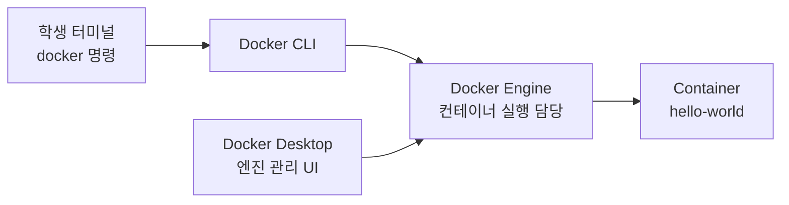
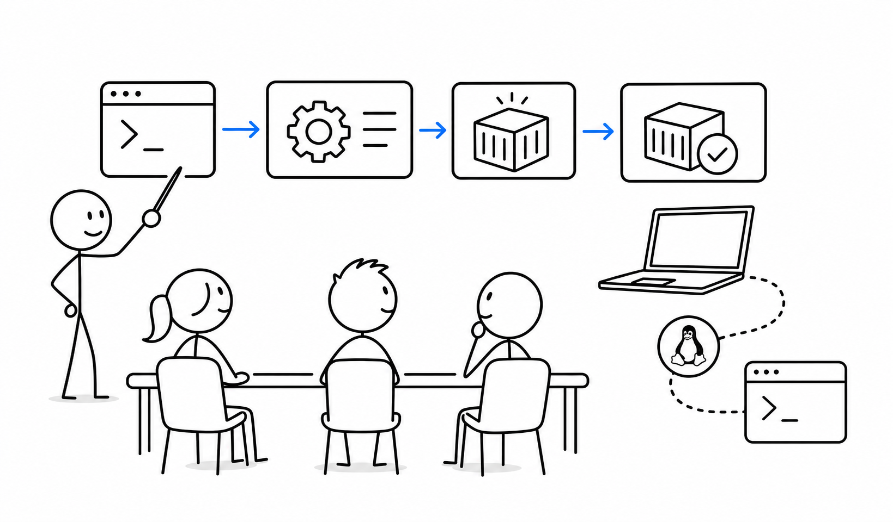

# 6교시 - Docker Desktop 설치와 확인, Windows 학습자는 WSL 상태 점검

## 목표

이 시간의 목표는 Docker Desktop이 설치되어 있고, 터미널에서 Docker 엔진과 통신할 수 있는지 확인하는 것이다. Windows 학습자는 WSL 2와 Docker Desktop의 연결 상태도 함께 본다.

이 세션의 끝에서 우리는 다음을 할 수 있어야 한다.

- Docker Desktop과 Docker CLI의 차이를 정리한다.
- `docker version`과 `docker run hello-world`로 설치 상태를 확인한다.
- Windows에서 WSL 2가 Docker 실습에 왜 중요한지 이해한다.

## 오늘의 흐름

| 시간 | 단계 | 진행 |
|---|---|---|
| 15:00-15:06 | 5교시 연결 | 터미널이 Docker와 대화하는 구조를 소개한다. |
| 15:06-15:16 | Docker가 등장한 배경 | VM, 환경 차이, 컨테이너 대중화 흐름을 정리한다. |
| 15:16-15:28 | Docker Desktop 확인 | 앱 실행, 엔진 상태, 버전 확인을 진행한다. |
| 15:28-15:38 | hello-world 실행 | 첫 컨테이너 실행과 출력 의미를 정리한다. |
| 15:38-15:46 | Windows WSL 점검 | WSL 2 상태와 Docker Desktop integration을 확인한다. |
| 15:46-15:50 | 문제 목록 정리 | 막힌 항목을 유형별로 묶어 다음 조치를 정한다. |

## 시작 질문

> Docker Desktop을 켰다는 것과 Docker 명령이 된다는 것은 같은 말일까요?

정답은 “항상 같지는 않다”이다. Docker Desktop은 로컬에서 Docker 엔진을 실행하고 관리하는 앱이고, `docker` 명령은 그 엔진에 요청을 보내는 CLI다. 앱은 켜져 있어도 엔진이 준비 중일 수 있고, 터미널이 올바른 엔진을 보지 못할 수도 있다.

## Docker가 왜 생겼나

서비스 개발이 커지면서 “실행 환경”이 반복적인 문제가 됐다. 개발자의 노트북, 테스트 서버, 운영 서버의 OS와 라이브러리 버전이 달랐다. 설치 문서는 길어졌고, 배포는 사람의 기억에 의존했다.

VM은 서버 전체를 이미지로 만들 수 있어 큰 진전이었다. 하지만 VM은 상대적으로 무겁고 시작이 느렸다. 컨테이너는 운영체제 전체를 복제하기보다 프로세스 실행 환경을 격리하고 포장하는 방식으로 더 가볍게 같은 문제를 풀었다. Docker는 컨테이너 이미지를 만들고 공유하고 실행하는 경험을 쉽게 만들어 컨테이너 대중화에 큰 역할을 했다.

오늘은 깊은 원리보다 설치 상태와 기본 감각을 확인한다. 자세한 이미지는 2주차에 다시 배운다.

## 그림 1 - Docker Desktop과 Docker CLI



- 터미널에서 치는 `docker`는 요청을 보내는 쪽입니다.
- 실제로 컨테이너를 만드는 쪽은 Docker Engine입니다.
- Docker Desktop은 로컬에서 그 엔진을 쉽게 켜고 관리하게 해주는 앱입니다.

## Docker Desktop 확인

먼저 Docker Desktop 앱을 실행한다. 상태가 running 또는 engine started와 비슷하게 표시될 때까지 기다린다.

터미널에서 확인한다.

```bash
docker version
```

예상 관찰:

- Client 정보가 보인다.
- Server 정보가 보인다.

Client만 보이고 Server 연결 에러가 나오면 Docker CLI는 있지만 Docker Engine과 통신하지 못하는 상태일 수 있다.

추가 확인:

```bash
docker info
```

이 명령은 출력이 길다. 오늘은 전체를 이해하지 않아도 된다. 에러 없이 정보가 나오면 엔진 연결이 된 것이다.

## 첫 컨테이너 실행

```bash
docker run hello-world
```

성공하면 Docker가 이미지를 가져오고 작은 컨테이너를 실행한 뒤 안내 메시지를 출력한다.

관찰할 점:

- 로컬에 이미지가 없으면 먼저 pull을 시도한다.
- 컨테이너가 실행되고 메시지를 출력한 뒤 종료된다.
- 계속 떠 있는 서버 컨테이너가 아니라 “실행 후 끝나는” 예제다.

여기서 중요한 것은 hello-world 문구가 아닙니다. Docker 명령이 엔진에 요청했고, 엔진이 이미지를 찾고, 없으면 받아오고, 컨테이너를 만들고, 실행했다는 흐름입니다.

## Windows 학습자 - WSL 상태 점검

Windows에서 Docker Desktop은 WSL 2 기반으로 동작하는 경우가 많다. WSL은 Windows 안에서 Linux 환경을 사용할 수 있게 해준다. Cloud Native 도구의 많은 예제가 Linux 명령과 파일 시스템 감각을 전제로 하므로 Windows 학습자에게 WSL은 중요하다.

PowerShell에서 확인:

```powershell
wsl --status
wsl --list --verbose
```

확인할 점:

- 기본 버전이 2인지 확인한다.
- Ubuntu 같은 배포판이 설치되어 있는지 본다.
- Docker Desktop 설정에서 WSL integration이 켜져 있는지 확인한다.

Ubuntu 터미널에서도 확인:

```bash
docker version
```

Ubuntu 안에서 `docker` 명령이 동작하면 이후 Linux 기반 실습을 진행하기 좋다.

## 흔한 문제와 대응

| 증상 | 가능한 원인 | 대응 |
|---|---|---|
| `docker` 명령을 찾을 수 없음 | Docker Desktop 미설치 또는 PATH 문제 | 앱 설치 상태와 터미널 재시작 확인 |
| Docker daemon 연결 실패 | Docker Desktop 엔진이 아직 시작되지 않음 | 앱 실행 후 상태가 준비될 때까지 대기 |
| WSL 2 관련 에러 | Windows 기능 또는 가상화 설정 문제 | WSL 상태 확인, 필요 시 별도 설치 지원 |
| `hello-world` pull 실패 | 네트워크, 프록시, Docker Hub 접근 문제 | 인터넷 연결과 Docker Desktop 로그인/설정 확인 |
| 권한 에러 | Linux 사용자 권한 또는 Docker socket 문제 | 수업 환경별로 수업에서 함께 확인 |

## 활동 - 증상 분류하기

함께 자기 상태를 아래 중 하나로 분류한다.

| 코드 | 상태 |
|---|---|
| A | Docker Desktop 실행, `docker run hello-world` 성공 |
| B | Docker Desktop 실행, `docker version` server 연결 실패 |
| C | `docker` 명령을 찾을 수 없음 |
| D | Windows WSL 상태가 불명확함 |
| E | 네트워크 또는 계정 문제로 이미지 다운로드 실패 |

A 상태는 준비 완료로 보고, B-E 유형은 원인별로 나누어 해결한다.

## 수업 이미지



## 마무리 질문

> `docker version`에서 Client와 Server를 나누어 보는 이유는 무엇일까?

정리 예시:

- Client는 명령을 보내는 쪽이고 Server는 컨테이너를 실제로 관리하는 엔진이다.
- Client만 있어도 엔진 연결이 안 되면 컨테이너를 실행할 수 없다.

## 다음 교시 연결

Docker까지 확인했으니, 다음 시간에는 AI 도구 사용 현황을 조사하고 CLI 기반 coding agent를 소개합니다. AI도 Docker처럼 도구 자체보다 어디에 놓고 어떻게 검증할지가 중요합니다.
