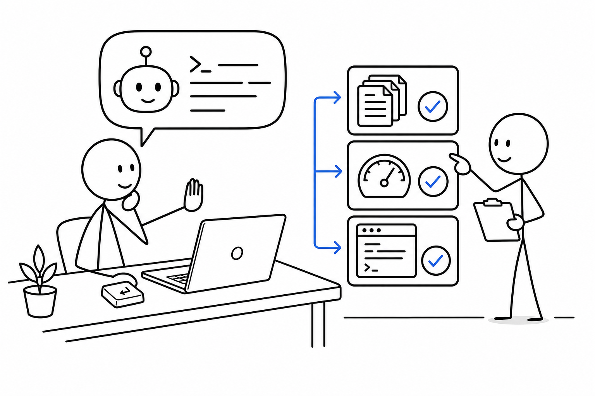
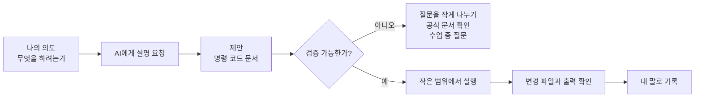

# 7교시 - AI 도구 사용 현황 조사와 CLI 기반 Coding Agent 소개

## 목표

이 시간의 목표는 함께 AI 도구를 수업에서 안전하고 생산적으로 쓰는 기준을 세우는 것이다. ChatGPT 같은 대화형 도구와 CLI 기반 coding agent의 차이를 이해하고, AI가 제안한 내용을 검증하는 습관을 만든다.

이 세션의 끝에서 우리는 다음을 말할 수 있어야 한다.

- AI 도구가 개발 학습에서 도움이 되는 지점과 위험한 지점을 구분한다.
- 대화형 AI와 coding agent의 차이를 정리한다.
- secret, 명령 실행, 파일 변경과 관련된 안전 규칙을 말할 수 있다.

## 수업 이미지




## 오늘의 흐름

| 시간 | 단계 | 진행 |
|---|---|---|
| 16:00-16:07 | 사용 현황 조사 | 써본 AI 도구와 용도를 손들기/스티커로 공유한다. |
| 16:07-16:18 | AI 도구 변천사 | 자동완성, 챗봇, IDE assistant, coding agent로 이어진 흐름을 정리한다. |
| 16:18-16:30 | 도움이 되는 일과 위험한 일 | 에러 해석, 설명, 예제 생성, 명령 실행 위험을 분리한다. |
| 16:30-16:40 | CLI coding agent 소개 | 작업 디렉터리, 파일 변경, 명령 실행, 검증 흐름을 정리한다. |
| 16:40-16:47 | 안전 규칙 만들기 | 팀별로 AI 사용 규칙 3개를 작성한다. |
| 16:47-16:50 | 다음 예시 예고 | 8교시에 작은 coding agent 예시를 본다. |

## 시작 질문

> AI에게 코드를 물어봤을 때 가장 좋았던 순간과 가장 불안했던 순간은 무엇인가요?

칠판을 두 칸으로 나눈다.

| 도움이 된 순간 | 불안했던 순간 |
|---|---|
| 에러 메시지를 쉽게 설명 | 틀린 명령을 자신 있게 제안 |
| 예제 코드를 빠르게 생성 | 내 코드 전체를 이해한 것처럼 말함 |
| 개념을 비유로 설명 | 보안 정보 입력을 유도할 수 있음 |
| 반복 작업을 줄임 | 바뀐 파일을 내가 놓칠 수 있음 |

## AI 개발 도구의 변천사

개발자를 돕는 자동화는 갑자기 등장하지 않았다.

초기에는 문서 검색과 코드 자동완성이 중심이었다. 개발자는 검색 엔진에서 에러 메시지를 찾고, Stack Overflow 같은 Q&A를 참고하고, IDE 자동완성으로 함수 이름을 빠르게 입력했다. 이후 대화형 AI가 등장하면서 질문을 자연어로 던지고 설명을 받을 수 있게 됐다.

그 다음 변화는 AI가 코드 편집기와 터미널에 가까워진 것이다. IDE assistant는 현재 파일과 프로젝트 맥락을 보고 제안한다. CLI 기반 coding agent는 작업 디렉터리 안에서 파일을 읽고, 수정하고, 테스트 명령을 실행하고, 결과를 바탕으로 다시 고칠 수 있다.

이 변화는 강력하지만 위험도 함께 커진다. AI가 실제 파일을 바꿀 수 있다면, 사용자는 변경 범위와 검증 결과를 확인해야 한다. 그래서 이 수업에서는 AI를 “대신 제출하는 도구”가 아니라 “설명, 실험, 검증을 빠르게 돕는 도구”로 다룬다.

## 대화형 AI와 Coding Agent 비교

| 구분 | 대화형 AI | CLI 기반 Coding Agent |
|---|---|---|
| 주된 위치 | 브라우저 또는 앱 | 터미널과 프로젝트 폴더 |
| 잘하는 일 | 설명, 요약, 예시, 개념 비교 | 파일 탐색, 코드 수정, 명령 실행, 테스트 반복 |
| 위험 | 틀린 설명, 출처 없는 주장, secret 입력 | 원치 않는 파일 변경, 위험한 명령 실행, 검증 누락 |
| 사용자의 역할 | 질문을 작게 나누고 답을 확인 | 작업 범위, 변경 파일, 실행 명령, 테스트 결과를 확인 |

## AI가 잘 돕는 일

- 에러 메시지를 쉬운 말로 풀어준다.
- 긴 문서를 요약해 학습 순서를 잡아준다.
- 간단한 예제 코드를 만든다.
- 명령어의 의미를 정리한다.
- README 초안을 만들거나 실습 기록을 정리한다.
- 실패 원인을 가설로 나누어준다.

## AI에게 조심해야 할 일

- 운영 계정의 secret, token, password를 붙여넣지 않는다.
- 이해하지 못한 명령을 바로 실행하지 않는다.
- 삭제, 초기화, 권한 변경, 비용이 발생하는 명령은 특히 확인한다.
- AI가 만든 코드가 실행되는지 테스트한다.
- AI가 바꾼 파일 목록을 본다.
- 공식 문서나 실제 실행 결과로 확인할 수 없는 주장은 보류한다.

## 그림 1 - AI 도구의 위치



- AI 사용의 핵심은 믿음이 아니라 검증입니다.
- 모르면 쓰지 말자는 뜻이 아닙니다. 모르면 더 작게 묻고, 더 작게 실행합니다.
- 이번 과정에서 좋은 AI 사용자는 질문을 잘하고 결과를 확인하는 사람입니다.

## CLI Coding Agent의 기본 흐름

CLI 기반 coding agent를 사용할 때는 다음 흐름을 기준으로 본다.

1. 작업 디렉터리를 확인한다.
2. 요청을 작고 구체적으로 말한다.
3. agent가 어떤 파일을 읽는지 본다.
4. 수정 전 범위와 의도를 확인한다.
5. 수정 후 변경 파일 목록을 확인한다.
6. 테스트 또는 실행 결과를 확인한다.
7. 최종 설명이 실제 변경과 맞는지 본다.

coding agent는 프로젝트 안에서 움직이는 동료에 가깝습니다. 동료가 코드를 바꾸면 우리는 코드 리뷰를 합니다. AI가 바꿔도 마찬가지입니다.

## 활동 - 우리 반 AI 사용 규칙 3개

팀별로 아래 문장을 완성한다.

```text
우리는 AI를 사용할 때 반드시 _____ 한다.
우리는 AI에게 절대 _____ 를 입력하지 않는다.
우리는 AI가 만든 결과를 _____ 로 확인한다.
```

정리 예시:

- 우리는 AI를 사용할 때 반드시 실행 전 명령의 의미를 확인한다.
- 우리는 AI에게 절대 password, token, private key를 입력하지 않는다.
- 우리는 AI가 만든 결과를 테스트 실행과 변경 파일 확인으로 확인한다.

## 마무리 질문

> AI가 만든 답을 신뢰하기 전에 확인해야 할 증거는 무엇인가?

정리 예시:

- 실제 실행 결과
- 테스트 통과 여부
- 변경 파일 목록
- 공식 문서 또는 수업 자료와의 일치
- 내가 이해한 설명

## 다음 교시 연결

다음 시간에는 coding agent 예시를 짧게 본다. 작은 파일을 만들고, 명령을 실행하고, 바뀐 파일을 확인하는 흐름에 집중한다.
