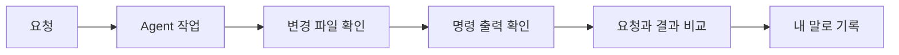
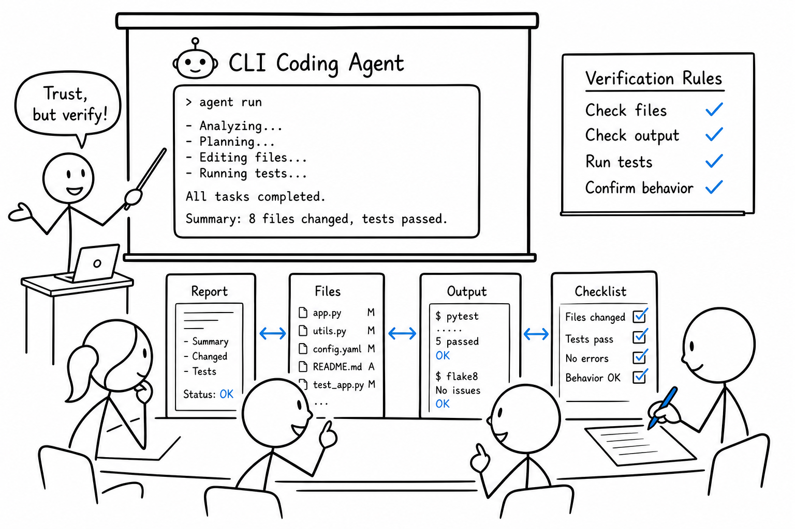

# 8교시 - Coding Agent 예시, 설치 상태 체크, 2일차 준비

## 목표

이 시간의 목표는 하루를 정리하고 다음 수업에 필요한 준비 상태를 확인하는 것이다. CLI 기반 coding agent가 작은 작업을 수행할 때 무엇을 확인해야 하는지 보고, 설치 상태와 질문을 정리한다.

이 세션의 끝에서 우리는 다음을 할 수 있어야 한다.

- coding agent가 파일을 읽고 수정하고 검증하는 흐름을 관찰한다.
- 오늘 설치 상태를 A/B/C로 분류하고 다음 조치를 안다.
- 2일차에 배울 프로세스, 포트, 로그의 의미를 미리 연결한다.

## 오늘의 흐름

| 시간 | 단계 | 진행 |
|---|---|---|
| 17:00-17:07 | 하루 리캡 | 오전 큰 그림과 오후 도구 점검을 한 줄씩 정리한다. |
| 17:07-17:25 | Coding agent 예시 | 작은 README 또는 체크리스트 파일을 만들고 검증하는 과정을 본다. |
| 17:25-17:35 | 변경 확인 | 바뀐 파일, 명령 출력, agent의 최종 보고를 비교한다. |
| 17:35-17:43 | 설치 상태 체크 | VS Code, Git, Docker, WSL, 계정 상태를 최종 분류한다. |
| 17:43-17:48 | 2일차 예고 | 작은 웹앱, 프로세스, 포트, 로그를 예고한다. |
| 17:48-17:50 | 퇴실 티켓 | 내일 시작 전에 해결해야 할 것 1개를 적는다. |

## 시작 질문

> AI가 “완료했습니다”라고 말하면 우리는 무엇을 확인해야 할까요?

생각해볼 답:

- 실제 파일이 바뀌었는지
- 명령이 성공했는지
- 테스트를 했는지
- 내가 요청한 것과 맞는지
- 불필요한 변경이 없는지

## 하루 정리

오늘 오전에는 우리가 왜 Docker, Kubernetes, AWS, Observability, AI를 함께 배우는지 봤습니다. 핵심은 하나입니다. 앱이 실제 서비스가 되는 과정에서 문제가 계속 바뀌고, 그 문제를 해결하려고 도구와 운영 방식이 발전했습니다.

오후에는 그 여정을 시작하기 위한 작업대를 확인했습니다. VS Code는 파일을 보는 곳, 터미널은 명령을 실행하는 곳, Git은 변경 이력을 남기는 곳, Docker Desktop은 컨테이너 실행 환경을 준비하는 곳입니다. AI 도구는 이 흐름을 도울 수 있지만, 실행 결과와 변경 파일을 확인해야 합니다.

## Coding Agent 예시 시나리오

실제 프로젝트 폴더 또는 빈 연습 폴더에서 매우 작은 작업을 기준으로 본다. 목적은 AI의 능력을 과시하는 것이 아니라 검증 습관을 만드는 것이다.

예시 요청:

```text
현재 폴더에 tomorrow-checklist.md 파일을 만들고,
2일차 수업 전에 확인할 항목 5개를 한국어로 작성해 주세요.
마지막에는 "확인 명령" 섹션을 넣어 주세요.
```

확인할 포인트:

1. 지금 작업 디렉터리가 어디인지 먼저 봅니다.
2. 요청을 작게 말합니다.
3. 어떤 파일을 만들거나 바꾸는지 봅니다.
4. 명령을 실행한다면 왜 실행하는지 확인합니다.
5. 끝나면 파일 내용과 변경 목록을 직접 확인합니다.

## 예시 산출물

~~~markdown
# 2일차 준비 체크리스트

- VS Code가 열린다.
- 터미널에서 `git --version`이 출력된다.
- Docker Desktop이 실행된다.
- `docker run hello-world`를 한 번 성공했다.
- 브라우저에서 localhost 주소를 입력해본 적이 있다.

## 확인 명령

```bash
git --version
docker version
docker run hello-world
```
~~~

예시 산출물을 그대로 복사하지 않아도 된다. 중요한 것은 작은 요청, 파일 확인, 명령 확인의 흐름이다.

## 변경 확인 루프

작업 후 아래 질문으로 결과를 확인한다.

- agent는 어떤 파일을 만들었나?
- 기존 파일을 바꿨나?
- 명령을 실행했나?
- 명령 출력은 성공이었나?
- 최종 보고가 실제 파일 내용과 맞나?

그림으로 보면 다음과 같다.



## 설치 상태 최종 분류

우리는 아래 중 하나로 자신의 상태를 고른다.

| 상태 | 의미 | 다음 조치 |
|---|---|---|
| A | VS Code, Git, Docker, 브라우저가 모두 준비됨 | 2일차 실습 바로 참여 |
| B | 대부분 준비됐지만 Docker 또는 WSL에 작은 문제가 있음 | 내일 시작 전 또는 쉬는 시간에 지원 |
| C | 핵심 도구가 아직 설치되지 않음 | 수업에서 별도 설치 지원 필요 |

세부 체크:

| 항목 | OK | 문제 있음 | 메모 |
|---|---|---|---|
| VS Code | | | |
| 터미널 | | | |
| Git | | | |
| Docker Desktop | | | |
| `docker run hello-world` | | | |
| Windows WSL 2 | | | Windows 학습자만 |
| GitHub 계정 | | | |
| Docker Hub 계정 | | | |

## 2일차 예고

2일차에는 작은 웹 애플리케이션을 실행하며 다음 질문을 다룬다.

- 프로그램과 프로세스는 어떻게 다른가?
- 서버가 “포트에서 기다린다”는 말은 무슨 뜻인가?
- 브라우저 요청은 내 컴퓨터 안에서 어디로 가는가?
- 로그는 왜 문제 해결의 첫 번째 단서인가?

내일은 Docker를 깊게 들어가기 전에 앱이 실행되는 장면을 더 자세히 봅니다. 컨테이너 안에서도 결국 프로세스가 뜨고, 포트를 열고, 로그를 남깁니다. 그래서 이 기초가 중요합니다.

## 퇴실 티켓

마지막 2분에는 아래 문장을 작성한다.

```text
오늘 준비된 것:
아직 막힌 것:
내일 시작 전에 확인할 것:
```

C 상태와 공통 에러는 다음 날 시작 전 지원 대상으로 분류한다.

## 수업 이미지



## 마무리

오늘은 본격적인 기술 실습보다 출발점과 작업대를 맞추는 날이었습니다. 내일부터는 작은 웹앱을 실제로 실행하고 관찰합니다. 실행이 안 되는 순간도 수업의 일부입니다. 중요한 것은 증상을 보고, 확인하고, 기록하는 것입니다.
