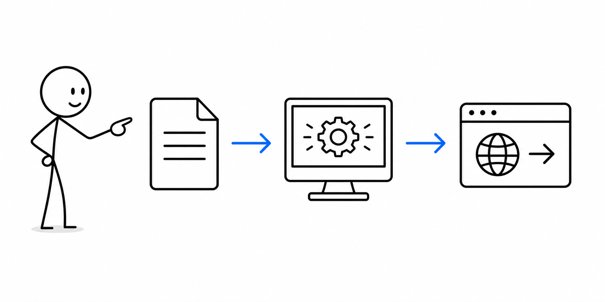
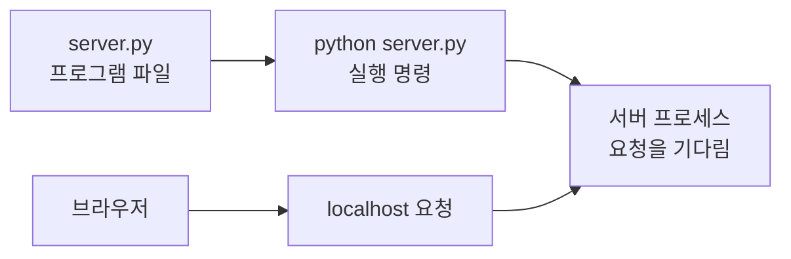

# 1교시 - 전날 복습과 프로그램/프로세스 개념

## 목표

이 시간의 목표는 “앱이 실행된다”는 말을 더 정확하게 이해하는 것이다. 프로그램은 파일로 존재하는 코드이고, 프로세스는 그 프로그램이 메모리 위에서 실제로 실행 중인 상태다.

이 세션의 끝에서 우리는 다음을 말할 수 있어야 한다.

- 프로그램과 프로세스의 차이를 설명한다.
- 웹 애플리케이션도 결국 실행 중인 프로세스라는 점을 이해한다.
- Docker와 Kubernetes가 왜 프로세스를 직접 다루는 대신 컨테이너와 Pod라는 단위로 감싸는지 감을 잡는다.

## 오늘 한 줄 요약

프로그램은 “실행할 수 있는 것”이고, 프로세스는 “지금 실행 중인 것”이다.

## 왜 클라우드 과정에서 웹앱을 보나

Cloud Native 수업에서 웹앱을 보는 이유는 웹 페이지를 예쁘게 만들기 위해서가 아니다. 클라우드에 올리는 많은 서비스는 결국 요청을 받고 응답하는 서버 프로세스다. Docker는 그 실행 환경을 포장하고, Kubernetes는 그 프로세스가 담긴 컨테이너를 계속 운영하며, AWS는 그 서비스를 네트워크와 인프라 위에 올린다.

그래서 웹앱의 코드를 조금이라도 읽을 수 있어야 한다. 코드 전체를 개발자처럼 다 이해하지 않아도 된다. 하지만 어느 파일이 서버를 시작하는지, 어떤 포트에서 기다리는지, 어떤 경로가 응답하는지, 로그가 어디서 찍히는지는 알아야 나중에 컨테이너와 Kubernetes 문제를 설명할 수 있다.

## 수업 이미지



## 시작 질문

> `app.py` 파일이 있으면 앱은 실행 중일까?

정답은 “아니다”이다. 파일은 실행 가능한 재료일 뿐이다. 터미널에서 실행 명령을 내려 운영체제가 메모리와 CPU 시간을 배정하면 그때 프로세스가 된다.

## 프로그램과 프로세스

프로그램은 디스크에 저장된 파일이다. 예를 들어 `server.py`, `node`, `python`, `chrome.exe` 같은 파일은 실행될 수 있는 프로그램이다.

프로세스는 실행 중인 프로그램이다. 같은 프로그램을 두 번 실행하면 프로세스도 두 개가 될 수 있다. 각각은 자기만의 process id, 메모리, 열린 파일, 네트워크 연결을 가진다.

| 구분 | 의미 | 예시 |
|---|---|---|
| 프로그램 | 실행 가능한 파일 또는 코드 | `server.py`, `python`, `node` |
| 프로세스 | 지금 실행 중인 프로그램 | 터미널에서 실행한 웹 서버 |
| Process ID | 실행 중인 프로세스의 번호 | Windows 작업 관리자, Linux `ps`에서 보이는 번호 |

## 웹 서버도 프로세스다

브라우저에서 웹 페이지가 열린다는 것은 어딘가에서 서버 프로세스가 요청을 받고 있다는 뜻이다. 로컬 실습에서는 그 서버 프로세스가 내 노트북에서 실행된다.



파일만 있으면 아무 일도 일어나지 않는다. 프로세스가 실행되어야 요청을 받을 수 있다.

## 왜 이런 개념이 생겼나

초기 컴퓨터는 한 번에 하나의 작업을 처리하는 방식에 가까웠다. 시간이 지나면서 여러 사람이 같은 컴퓨터를 쓰고, 여러 프로그램이 동시에 돌아가야 했다. 운영체제는 실행 중인 작업을 프로세스라는 단위로 관리하기 시작했다.

웹 서비스 시대가 되면서 프로세스 관리는 더 중요해졌다. 웹 서버 프로세스가 죽으면 사용자는 페이지를 볼 수 없다. 서버가 여러 개가 되면 어떤 프로세스가 어디서 실행 중인지, 죽었는지, 다시 띄워야 하는지 계속 확인해야 한다.

컨테이너와 Kubernetes는 이 문제를 더 큰 단위로 다룬다. Docker는 프로세스 실행 환경을 컨테이너로 감싼다. Kubernetes는 컨테이너를 Pod로 묶고, 원하는 개수만큼 계속 살아 있도록 관리한다.

## Docker와 Kubernetes로 이어지는 감각

오늘은 아직 Docker를 깊게 쓰지 않는다. 하지만 기억할 기준은 단순하다.

- 컨테이너 안에서도 결국 프로세스가 실행된다.
- 프로세스가 종료되면 컨테이너도 보통 종료된다.
- Kubernetes는 프로세스를 직접 관리하기보다 컨테이너와 Pod 상태를 보고 다시 실행한다.

즉, 프로세스를 모르면 컨테이너가 왜 종료됐는지 이해하기 어렵다.

## 활동 - 문장 바꾸기

아래 문장을 더 정확한 문장으로 바꿔본다.

```text
앱 파일이 있으니까 앱이 실행 중이다.
```

정리 예시:

```text
앱 파일은 실행 가능한 코드이고, 앱이 실행 중이려면 그 파일을 실행한 프로세스가 떠 있어야 한다.
```

## 마무리 질문

> 서버 프로세스가 꺼지면 브라우저에서는 어떤 일이 생길까?

## 다음 교시 연결

다음 시간에는 프로세스가 요청을 받는 입구인 포트와, 내 컴퓨터를 가리키는 `localhost`를 배운다.
