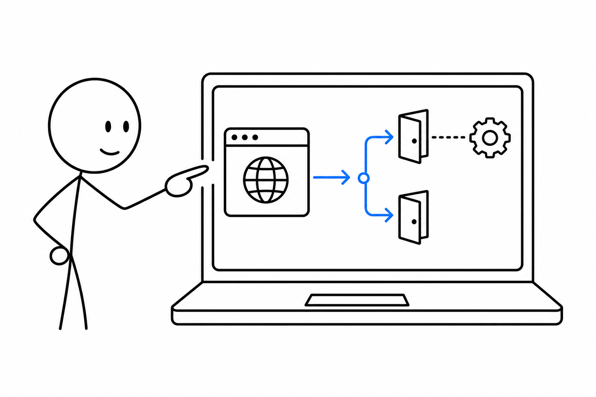
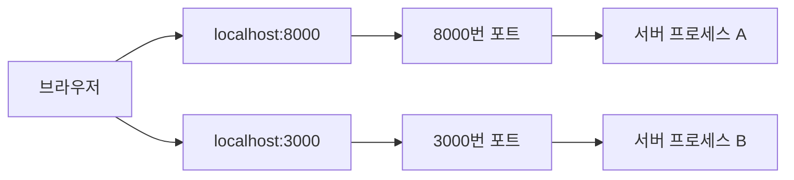

# 2교시 - 포트, localhost, 브라우저 요청

## 목표

이 시간의 목표는 브라우저가 `localhost:8000`에 접속할 때 실제로 무슨 일이 일어나는지 이해하는 것이다. 포트는 한 컴퓨터 안에서 어떤 프로세스가 요청을 받을지 구분하는 번호다.

이 세션의 끝에서 우리는 다음을 말할 수 있어야 한다.

- `localhost`가 내 컴퓨터를 가리킨다는 점을 설명한다.
- 포트가 한 컴퓨터 안의 여러 서버 프로세스를 구분하는 번호임을 이해한다.
- 브라우저 요청이 서버 프로세스로 이동하는 흐름을 그릴 수 있다.

## 오늘 한 줄 요약

`localhost:8000`은 “내 컴퓨터의 8000번 입구에서 기다리는 서버 프로세스에게 요청한다”는 뜻이다.

## 수업 이미지



## 오늘의 흐름

| 시간 | 단계 | 진행 |
|---|---|---|
| 10:00-10:08 | 1교시 연결 | 프로세스가 요청을 받으려면 입구가 필요하다는 점을 확인한다. |
| 10:08-10:20 | localhost | 내 컴퓨터를 가리키는 주소를 이해한다. |
| 10:20-10:32 | 포트 | 한 컴퓨터 안에서 여러 서버를 구분하는 번호를 이해한다. |
| 10:32-10:42 | 요청 경로 | 브라우저에서 서버 프로세스까지의 경로를 그린다. |
| 10:42-10:50 | 흔한 오류 | 포트 착각, 서버 미실행, 주소 오타를 구분한다. |

## 시작 질문

> 내 컴퓨터에서 웹 서버 두 개를 동시에 실행하면 브라우저는 어느 서버로 가야 할까?

주소만으로는 부족하다. 같은 컴퓨터 안에서도 여러 프로세스가 요청을 기다릴 수 있기 때문에 포트 번호가 필요하다.

## 웹 요청 기초 용어

오늘부터 브라우저와 서버가 대화하는 장면을 자주 본다. 아래 용어는 지금 완벽히 외울 필요는 없지만, 어떤 역할인지 알고 있으면 뒤의 실습이 훨씬 덜 낯설다.

| 용어 | 쉬운 뜻 | 오늘 어디서 보나 |
|---|---|---|
| HTTP | 브라우저와 서버가 요청과 응답을 주고받는 방식 | `http://localhost:8000` |
| HTML | 브라우저 화면을 만드는 문서 형식 | `/` 경로의 화면 |
| JSON | 서버가 데이터를 주고받을 때 자주 쓰는 형식 | `/health`, `/api/time` |
| API | 화면이 아니라 데이터를 주고받기 위한 약속된 경로 | `/api/time` |
| 404 | 서버는 살아 있지만 요청한 경로가 없다는 응답 | `/missing` |

정리하면, 브라우저는 HTTP로 서버에 요청하고, 서버는 HTML이나 JSON 같은 형태로 응답한다. 404는 “서버가 죽었다”가 아니라 “그 경로를 찾지 못했다”는 신호다.

## localhost

`localhost`는 내 컴퓨터 자신을 가리키는 이름이다. 인터넷 어딘가의 서버가 아니라, 지금 내가 쓰는 노트북 안으로 요청을 보내는 주소다.

대표적으로 아래 두 주소는 로컬 실습에서 자주 만난다.

| 표현 | 의미 |
|---|---|
| `localhost` | 내 컴퓨터 |
| `127.0.0.1` | 내 컴퓨터를 가리키는 IP 주소 |

실무에서도 로컬 개발은 보통 `localhost`에서 시작한다. 배포 전에는 먼저 내 컴퓨터에서 앱이 잘 실행되는지 본다.

## 포트

포트는 한 컴퓨터 안에서 요청을 받을 프로세스를 구분하는 번호다. 예를 들어 서버 A는 8000번 포트에서 기다리고, 서버 B는 3000번 포트에서 기다릴 수 있다.



같은 포트는 보통 한 번에 하나의 프로세스만 사용할 수 있다. 이미 8000번 포트를 쓰는 서버가 있는데 다른 서버가 8000번을 쓰려고 하면 충돌이 난다.

## 왜 포트가 필요해졌나

네트워크가 단순했을 때는 한 컴퓨터가 하나의 역할만 하는 경우가 많았다. 시간이 지나면서 한 서버에서 웹 서버, 데이터베이스, SSH, 모니터링, 개발용 앱처럼 여러 서비스가 동시에 실행되었다.

주소는 컴퓨터를 찾는 데 필요하고, 포트는 그 컴퓨터 안의 어떤 서비스로 갈지 정하는 데 필요하다. 그래서 웹은 보통 80번과 443번을 사용하고, 개발용 서버는 3000, 5000, 8000, 8080 같은 포트를 자주 사용한다.

## 브라우저 요청 흐름

브라우저 주소창에 아래 주소를 입력한다고 생각해보자.

```text
http://localhost:8000/health
```

이 주소는 네 부분으로 나눌 수 있다.

| 부분 | 의미 |
|---|---|
| `http://` | HTTP 방식으로 요청한다 |
| `localhost` | 내 컴퓨터로 보낸다 |
| `:8000` | 8000번 포트에서 기다리는 프로세스로 보낸다 |
| `/health` | 서버 안의 health 경로를 요청한다 |

## 흔한 오류

| 증상 | 가능한 원인 |
|---|---|
| 브라우저가 연결할 수 없다고 나온다 | 서버 프로세스가 실행 중이 아닐 수 있다 |
| 다른 화면이 열린다 | 다른 프로세스가 그 포트를 쓰고 있을 수 있다 |
| 404가 나온다 | 서버는 살아 있지만 요청 경로가 없을 수 있다 |
| 터미널에는 로그가 없다 | 브라우저가 다른 포트로 요청했을 수 있다 |

## 활동 - 주소 해석하기

아래 주소를 해석해본다.

```text
http://localhost:3000/api/todos
```

정리 예시:

```text
내 컴퓨터의 3000번 포트에서 기다리는 서버 프로세스에게 /api/todos 경로를 HTTP로 요청한다.
```

## 마무리 질문

> `localhost:8000`과 `localhost:3000`은 같은 컴퓨터일까, 다른 컴퓨터일까?

## 다음 교시 연결

다음 시간에는 서버 프로세스가 읽는 파일, 설정을 담는 환경 변수, 실행 중 남기는 로그를 배운다.
