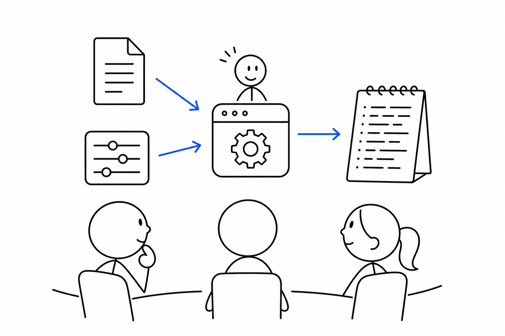
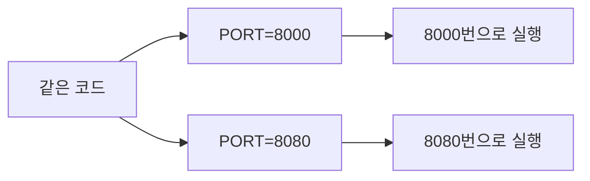

# 3교시 - 파일, 환경 변수, 로그

## 목표

이 시간의 목표는 실행 중인 앱이 파일, 환경 변수, 로그와 어떤 관계를 가지는지 이해하는 것이다. 컨테이너와 Kubernetes에서도 설정과 로그를 계속 다루기 때문에 오늘의 개념은 뒤에서 반복해서 등장한다.

이 세션의 끝에서 우리는 다음을 말할 수 있어야 한다.

- 파일은 코드와 데이터의 출발점임을 이해한다.
- 환경 변수는 실행할 때 바뀔 수 있는 설정값임을 설명한다.
- 로그는 실행 중인 앱이 남기는 관찰 기록임을 이해한다.

## 오늘 한 줄 요약

파일은 앱의 재료, 환경 변수는 실행 설정, 로그는 실행 중 남기는 흔적이다.

## 수업 이미지

## 오늘의 흐름

| 시간 | 단계 | 진행 |
|---|---|---|
| 11:00-11:08 | 앞 시간 연결 | 프로세스가 실행될 때 무엇을 읽고 무엇을 남기는지 생각한다. |
| 11:08-11:20 | 파일 | 코드 파일과 설정 파일의 역할을 구분한다. |
| 11:20-11:32 | 환경 변수 | 실행 환경에 따라 바뀌는 값을 코드 밖으로 빼는 이유를 이해한다. |
| 11:32-11:42 | 로그 | 앱이 실행 중 남기는 기록이 왜 문제 해결의 시작점인지 본다. |
| 11:42-11:50 | 정리 활동 | 파일, 환경 변수, 로그를 한 문장씩 정리한다. |

## 시작 질문

> 서버 주소, 포트 번호, 비밀번호 같은 값도 코드 파일 안에 그대로 적어두면 될까?

작은 연습에서는 가능해 보일 수 있다. 하지만 환경이 바뀌고 팀이 커지고 운영 서비스가 되면 문제가 생긴다. 개발 환경과 운영 환경은 값이 다르고, 비밀번호 같은 값은 코드 저장소에 들어가면 위험하다.

## 파일

파일은 앱의 출발점이다. 코드 파일, 이미지 파일, 설정 파일, 문서 파일처럼 여러 종류가 있다.

웹 앱을 실행할 때는 보통 코드 파일을 읽고, 필요하면 정적 파일이나 설정 파일도 읽는다. Docker를 배우면 이 파일들을 이미지 안에 어떻게 넣을지 고민하게 된다.

| 파일 종류 | 예시 | 역할 |
|---|---|---|
| 코드 파일 | `server.py`, `app.js` | 앱의 동작을 정의한다 |
| 설정 파일 | `.env`, `config.yaml` | 실행 설정을 담는다 |
| 문서 파일 | `README.md` | 실행 방법과 구조를 설명한다 |
| 정적 파일 | `index.html`, 이미지 | 브라우저에 보여줄 자료가 된다 |

## 환경 변수

환경 변수는 프로세스를 실행할 때 외부에서 넣어주는 설정값이다. 같은 코드라도 환경 변수에 따라 포트, 모드, 연결 대상이 달라질 수 있다.

예를 들어 개발할 때는 8000번 포트를 쓰고, 다른 실습에서는 8080번 포트를 쓸 수 있다. 코드를 매번 고치기보다 실행할 때 포트 값을 바꾸는 편이 안전하다.

Cloud Native에서 환경 변수는 매우 중요하다. 컨테이너 이미지는 같게 유지하고, 실행 환경에 따라 설정만 바꾸는 방식이 자주 쓰인다.

## 로그

로그는 실행 중인 앱이 남기는 기록이다. 앱이 시작됐는지, 어떤 요청이 들어왔는지, 어떤 오류가 났는지 확인할 수 있다.

브라우저에 화면이 안 열릴 때 첫 번째 단서는 보통 로그다. 서버가 아예 시작하지 못했는지, 요청은 받았지만 경로를 못 찾았는지, 내부 오류가 났는지 로그에서 힌트를 얻는다.

| 로그에서 보는 것 | 알 수 있는 것 |
|---|---|
| 서버 시작 메시지 | 프로세스가 실행됐는지 |
| 요청 기록 | 브라우저 요청이 서버까지 왔는지 |
| 오류 메시지 | 어떤 단계에서 실패했는지 |
| 종료 메시지 | 프로세스가 왜 멈췄는지 |

## 왜 로그가 중요해졌나

서버가 한 대이고 사람이 직접 접속하던 시절에는 화면을 보거나 직접 명령을 실행하며 상태를 확인할 수 있었다. 하지만 서비스가 커지면 서버와 프로세스가 많아지고, 컨테이너는 계속 생성되고 사라진다.

이때 로그는 시스템이 남기는 가장 기본적인 증거다. Kubernetes에서도 문제가 생기면 `kubectl logs`로 컨테이너 로그를 먼저 본다. Observability에서 logs가 중요한 이유도 여기에 있다.

## 활동 - 셋을 구분하기

아래 항목을 파일, 환경 변수, 로그 중 하나로 분류한다.

| 항목 | 분류 |
|---|---|
| `server.py` | 파일 |
| `PORT=8000` | 환경 변수 |
| `GET /health 200` | 로그 |
| `README.md` | 파일 |
| `APP_MODE=dev` | 환경 변수 |
| `server started` | 로그 |

## 마무리 질문

> 같은 코드를 다른 포트로 실행하고 싶을 때, 코드를 고치는 것과 환경 변수를 바꾸는 것 중 어느 쪽이 더 안전할까?

## 다음 교시 연결

다음 시간에는 작은 웹앱의 파일 구조를 보고, 오후에 직접 실행할 준비를 한다.
