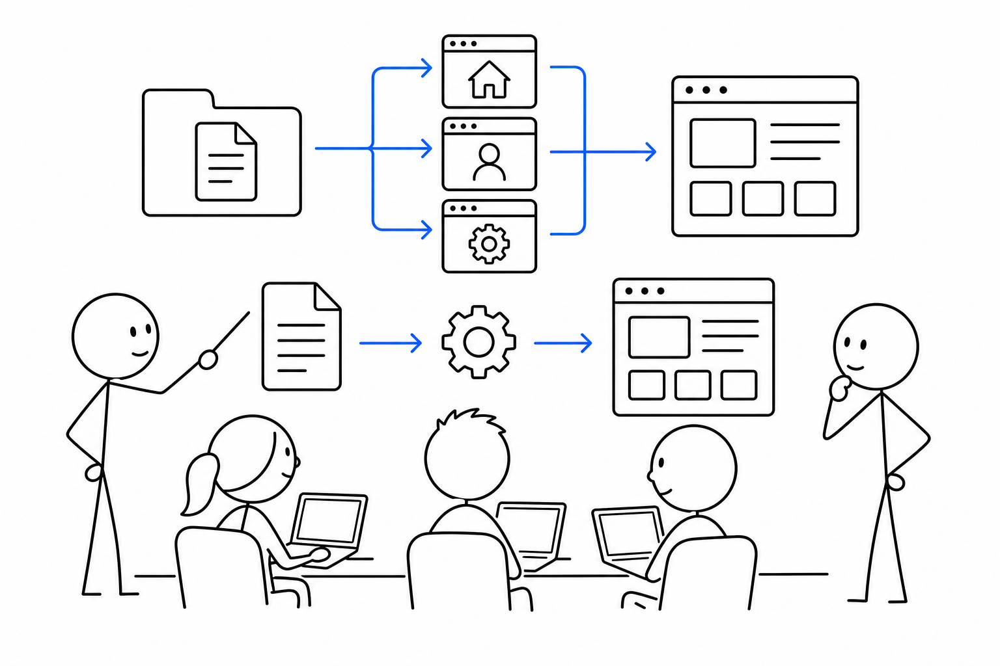
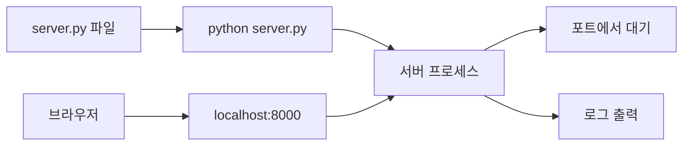

# 4교시 - 작은 웹앱 구조 보기

## 목표

이 시간의 목표는 오후에 실행할 작은 웹앱의 구조를 먼저 눈으로 익히는 것이다. 코드를 모두 이해하지 않아도 파일, 환경 변수, 포트, 요청 경로, 로그가 어디에 연결되는지 알면 실습이 훨씬 쉬워진다.

이 세션의 끝에서 우리는 다음을 할 수 있어야 한다.

- 작은 웹앱 폴더에서 주요 파일의 역할을 구분한다.
- `/`, `/health`, `/api/time` 같은 요청 경로가 서버 코드와 연결된다는 점을 이해한다.
- 오후 실습에서 무엇을 관찰해야 하는지 미리 안다.

## 오늘 한 줄 요약

작은 웹앱도 파일, 프로세스, 포트, 요청 경로, 로그가 함께 움직이는 하나의 시스템이다.

## 왜 작은 웹앱을 읽어야 하나

Cloud Native는 애플리케이션을 운영하는 기술이다. 운영하려는 앱이 어떤 요청을 받고, 어떤 설정을 읽고, 어떤 로그를 남기는지 전혀 모르면 Dockerfile, Kubernetes Service, Ingress, health check도 껍데기처럼 느껴진다.

오늘 보는 작은 웹앱은 앞으로 배울 운영 개념의 축소판이다.

| 웹앱에서 보는 것 | 나중에 연결되는 것 |
|---|---|
| 서버 시작 명령 | Docker image의 실행 명령 |
| 포트 | Docker port mapping, Kubernetes Service |
| `/health` 경로 | readiness/liveness check |
| 환경 변수 | container env, ConfigMap, Secret |
| 로그 | `docker logs`, `kubectl logs`, Observability |

## 수업 이미지



## 오늘의 흐름

| 시간 | 단계 | 진행 |
|---|---|---|
| 12:00-12:08 | 앞 시간 연결 | 파일, 환경 변수, 로그가 실제 앱 구조에서 어디에 있는지 확인한다. |
| 12:08-12:20 | 폴더 구조 보기 | 실습 앱의 파일 구성을 살펴본다. |
| 12:20-12:32 | 요청 경로 보기 | 브라우저가 요청할 URL과 서버 코드의 연결을 본다. |
| 12:32-12:42 | 관찰 포인트 정리 | 오후 실습에서 볼 프로세스, 포트, 로그를 미리 정한다. |
| 12:42-12:50 | 점검표 | 오후 실습 전 필요한 도구 상태를 확인한다. |

## 실습 앱 폴더

Day2 실습 앱은 아래 위치에 있다.

```text
cloud-native/week01/day02/app/
```

구조는 단순하다.

```text
app/
└── server.py
```

`server.py`는 Python 표준 라이브러리만 사용한다. 별도 패키지 설치 없이 실행할 수 있도록 만든 작은 HTTP 서버다.

## 앱이 제공하는 경로

| 경로 | 역할 |
|---|---|
| `/` | 간단한 HTML 페이지를 보여준다 |
| `/health` | 앱이 살아 있는지 확인하는 JSON을 보여준다 |
| `/api/time` | 서버가 응답한 현재 시간을 JSON으로 보여준다 |
| 그 외 경로 | 404 응답을 보여준다 |

이 구조는 실제 서비스의 축소판이다. `/health`는 나중에 Kubernetes readiness/liveness와 연결되고, `/api/time`은 API 요청과 응답을 관찰하는 연습에 사용된다.

## 코드를 어디까지 읽으면 되나

오늘은 웹앱을 개발자처럼 전부 이해하는 시간이 아니다. 운영 관점에서 필요한 부분만 읽으면 된다.

| 볼 부분 | 왜 중요한가 |
|---|---|
| 서버가 시작되는 부분 | 어떤 명령을 실행해야 프로세스가 뜨는지 알 수 있다 |
| 포트 값을 정하는 부분 | 브라우저가 어느 주소로 가야 하는지 알 수 있다 |
| `/`, `/health`, `/api/time` 경로 | 어떤 요청에 어떤 응답이 나오는지 알 수 있다 |
| 로그를 출력하는 부분 | 요청이 서버까지 도착했는지 확인할 수 있다 |

반대로 HTML 스타일이나 시간 표시 코드의 모든 세부사항을 지금 이해할 필요는 없다. Cloud Native 실습에서는 “이 앱을 어떻게 실행하고 관찰할 것인가”가 먼저다.

## 전체 흐름



오후에는 이 그림을 실제 터미널과 브라우저에서 확인한다.

## 왜 바로 Docker부터 하지 않나

Docker나 Kubernetes부터 바로 시작하면 문제가 생겼을 때 원인을 좁히기 어렵다. 컨테이너가 문제인지, 포트가 문제인지, 앱 자체가 문제인지 한꺼번에 섞이기 때문이다.

그래서 먼저 로컬에서 작은 앱을 실행한다. 로컬 앱의 프로세스, 포트, 요청, 로그를 이해하면 나중에 컨테이너와 Kubernetes에서도 같은 질문을 적용할 수 있다.

## 오후 실습 관찰 포인트

실습에서 성공 여부는 “브라우저가 열린다” 하나만으로 판단하지 않는다. 아래를 함께 본다.

- 터미널에 서버 시작 로그가 보이는가?
- 브라우저에서 `/`, `/health`, `/api/time`이 열리는가?
- 요청할 때마다 터미널 로그가 추가되는가?
- 잘못된 경로로 요청하면 404가 나는가?
- 서버를 끄면 브라우저 연결이 실패하는가?

## 실습 전 점검

아래 항목을 확인한다.

| 항목 | 확인 |
|---|---|
| 터미널을 열 수 있다 | OK / 문제 있음 |
| Python 3를 실행할 수 있다 | OK / 문제 있음 |
| 브라우저를 열 수 있다 | OK / 문제 있음 |
| 이 저장소 폴더 위치를 찾을 수 있다 | OK / 문제 있음 |

Python이 아직 설치되어 있지 않다면 먼저 [Python 설치와 확인](00-python-setup.md)을 진행한다.

Python 확인 명령:

```bash
python3 --version
```

Windows에서 `python3`가 안 되면 아래도 시도한다.

```powershell
python --version
py --version
```

## 마무리 질문

> 오후 실습에서 브라우저 화면보다 먼저 확인해야 할 터미널 증거는 무엇일까?

## 다음 교시 연결

점심 이후에는 작은 웹앱을 직접 실행하고, 프로세스와 포트가 살아 있는지 확인한다.
