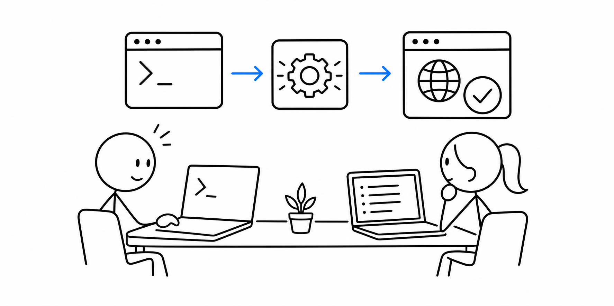

# 5교시 - 실습 준비: 작은 웹앱 실행

## 목표

이 시간의 목표는 작은 웹앱을 직접 실행하고, 브라우저에서 로컬 서버에 접속하는 것이다. 명령을 많이 외우는 것보다 “서버 프로세스가 떠 있고 포트에서 기다린다”는 감각을 잡는 것이 중요하다.

이 세션의 끝에서 우리는 다음을 할 수 있어야 한다.

- 터미널에서 실습 앱 폴더로 이동한다.
- Python으로 작은 웹 서버를 실행한다.
- 브라우저에서 `localhost:8000`에 접속한다.
- 서버를 안전하게 종료한다.

## 오늘 한 줄 요약

서버를 실행한다는 것은 터미널에서 프로세스를 띄우고, 브라우저가 그 프로세스의 포트로 요청하게 만드는 것이다.

## 실습의 목적

이번 실습의 목적은 웹앱을 잘 만드는 것이 아니다. Cloud Native에서 운영할 대상이 어떤 최소 조건을 가져야 하는지 직접 보는 것이다.

오늘 실행하는 작은 앱은 앞으로 Docker 이미지로 포장되고, Kubernetes Pod로 실행되고, Service나 Ingress를 통해 외부 요청을 받게 될 대상의 작은 버전이다. 그래서 실행 명령, 포트, 요청 경로, 로그를 정확히 보는 연습이 필요하다.

## 수업 이미지



## 오늘의 흐름

| 시간 | 단계 | 진행 |
|---|---|---|
| 14:00-14:08 | 폴더 이동 | 실습 앱 폴더 위치를 확인한다. |
| 14:08-14:18 | Python 확인 | Python 실행 명령을 확인한다. |
| 14:18-14:32 | 서버 실행 | 작은 웹앱을 실행하고 시작 로그를 본다. |
| 14:32-14:42 | 브라우저 접속 | `localhost:8000`과 `/health`를 확인한다. |
| 14:42-14:50 | 종료와 정리 | `Ctrl+C`로 서버를 종료하고 상태를 확인한다. |

## 환경

이 실습은 아래 환경을 기준으로 한다.

- OS: Windows, macOS, Linux 모두 가능
- 필요 도구: 터미널, 브라우저, Python 3
- 외부 패키지 설치: 없음
- 클라우드 비용: 없음

Python 3가 설치되어 있지 않다면 먼저 [Python 설치와 확인](00-python-setup.md)을 진행한다.

## 1단계 - 폴더 이동

먼저 저장소 루트에 있는지 확인한다. 저장소 루트는 이 수업 자료 전체가 들어 있는 가장 위쪽 폴더다. 보통 이 위치에는 `README.md`, `cloud-native/`, `scripts/` 같은 항목이 보인다.

현재 위치를 확인한다.

```bash
pwd
```

현재 폴더의 파일 목록을 본다.

```bash
ls
```

Windows PowerShell에서는 아래 명령도 사용할 수 있다.

```powershell
dir
```

`cloud-native` 폴더가 보이면 저장소 루트일 가능성이 높다. 그 위치에서 아래 명령을 실행한다.

```bash
cd cloud-native/week01/day02/app
```

이동 후 현재 위치를 다시 확인한다.

```bash
pwd
```

파일이 보이는지 확인한다.

```bash
ls
```

Windows PowerShell에서 `ls`가 동작하지 않으면 아래를 사용한다.

```powershell
dir
```

`server.py`가 보여야 한다.

## 2단계 - Python 확인

macOS, Linux, WSL에서는 보통 아래 명령을 사용한다.

```bash
python3 --version
```

Windows PowerShell에서는 아래 중 하나가 동작할 수 있다.

```powershell
python --version
py --version
```

Python 3 버전이 나오면 진행할 수 있다.

## 3단계 - 서버 실행

macOS, Linux, WSL:

```bash
python3 server.py
```

Windows PowerShell에서 `python3`가 안 되면:

```powershell
python server.py
```

또는:

```powershell
py server.py
```

예상 출력:

```text
starting day2 demo server
listening on http://localhost:8000
```

이 터미널은 서버 프로세스가 실행 중인 창이다. 실습이 끝날 때까지 닫지 않는다.

## 4단계 - 브라우저 접속

브라우저에서 아래 주소를 연다.

```text
http://localhost:8000
```

확인할 것:

- Day2 Demo App 화면이 보인다.
- 터미널에 요청 로그가 찍힌다.

다음 주소도 열어본다.

```text
http://localhost:8000/health
```

예상 응답:

```json
{"status": "ok", "service": "day2-demo"}
```

## 5단계 - 서버 종료

서버를 실행한 터미널에서 아래 키를 누른다.

```text
Ctrl+C
```

예상 출력:

```text
server stopped
```

브라우저에서 다시 `http://localhost:8000`을 새로고침하면 연결 실패가 날 수 있다. 서버 프로세스가 종료됐기 때문이다.

## 검증 체크리스트

| 확인 항목 | 상태 |
|---|---|
| `server.py`가 있는 폴더로 이동했다 | OK / 문제 있음 |
| Python 버전을 확인했다 | OK / 문제 있음 |
| 서버 시작 로그를 봤다 | OK / 문제 있음 |
| 브라우저에서 `/`를 열었다 | OK / 문제 있음 |
| 브라우저에서 `/health`를 열었다 | OK / 문제 있음 |
| `Ctrl+C`로 서버를 종료했다 | OK / 문제 있음 |

## 문제 해결

| 증상 | 가능한 원인 | 확인 |
|---|---|---|
| `server.py`를 찾을 수 없음 | 폴더 위치가 다름 | `pwd`, `ls` 또는 `dir` 확인 |
| Python 명령을 찾을 수 없음 | Python 미설치 또는 PATH 문제 | `python --version`, `py --version` 확인 |
| 브라우저 연결 실패 | 서버가 실행 중이 아님 | 터미널에 시작 로그가 있는지 확인 |
| 포트 사용 중 오류 | 8000번 포트를 다른 프로세스가 사용 중 | 7교시에서 포트 변경으로 진단 |

## 정리

오늘 만든 리소스는 로컬 프로세스뿐이다. 종료는 `Ctrl+C`로 충분하다.

## 다음 교시 연결

다음 시간에는 요청을 보낼 때마다 터미널 로그가 어떻게 바뀌는지 보고, 포트와 요청 경로를 더 자세히 관찰한다.
