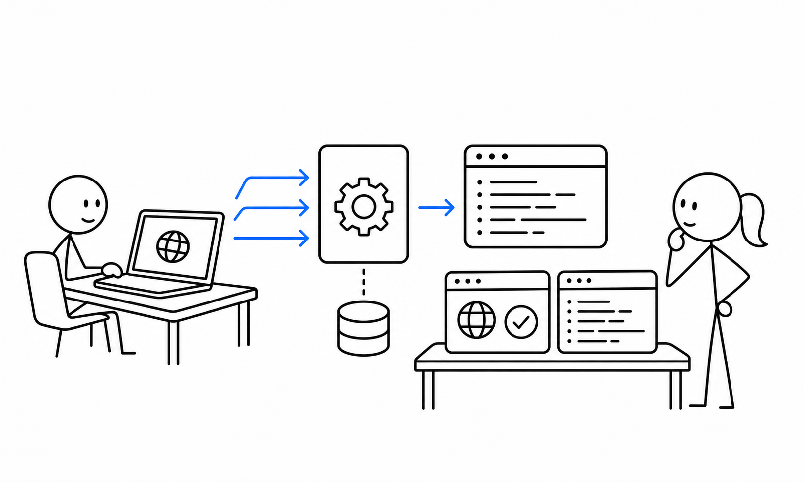

# 6교시 - 실습: 포트, 요청, 로그 확인

## 목표

이 시간의 목표는 서버를 실행한 뒤 브라우저 요청과 터미널 로그가 어떻게 연결되는지 직접 확인하는 것이다. 화면이 보이는지만 보지 않고, 요청이 서버까지 도착했다는 증거를 로그에서 찾는다.

이 세션의 끝에서 우리는 다음을 할 수 있어야 한다.

- 서버가 어떤 포트에서 실행 중인지 확인한다.
- `/`, `/health`, `/api/time`, 없는 경로를 요청하고 차이를 관찰한다.
- 요청 로그를 보고 브라우저 요청이 서버에 도착했는지 판단한다.

## 오늘 한 줄 요약

브라우저 화면은 결과이고, 터미널 로그는 요청이 서버까지 도착했다는 증거다.

## 수업 이미지



## 1단계 - 서버 실행

실습 앱 폴더로 이동한다.

```bash
cd cloud-native/week01/day02/app
```

서버를 실행한다.

```bash
python3 server.py
```

Windows에서 필요하면 `python server.py` 또는 `py server.py`를 사용한다.

## 2단계 - 정상 경로 요청

브라우저에서 아래 주소를 하나씩 연다.

```text
http://localhost:8000/
http://localhost:8000/health
http://localhost:8000/api/time
```

각 요청 후 터미널 로그를 확인한다.

예상 로그 예시:

```text
GET / -> 200
GET /health -> 200
GET /api/time -> 200
```

## 3단계 - 없는 경로 요청

브라우저에서 아래 주소를 연다.

```text
http://localhost:8000/missing
```

예상 결과:

- 브라우저에는 404 응답이 보인다.
- 터미널에는 `/missing` 요청 로그가 남는다.

중요한 점은 404가 “서버가 죽었다”는 뜻은 아니라는 것이다. 서버는 살아 있고, 요청한 경로가 없다는 뜻이다.

## 4단계 - 포트 변경

서버를 `Ctrl+C`로 종료한다.

다른 포트로 실행한다.

macOS, Linux, WSL:

```bash
PORT=8080 python3 server.py
```

Windows PowerShell:

```powershell
$env:PORT=8080
python server.py
```

브라우저에서 확인한다.

```text
http://localhost:8080
```

기존 주소도 확인한다.

```text
http://localhost:8000
```

8000번은 더 이상 열리지 않아야 한다. 같은 앱이라도 어느 포트에서 기다리는지에 따라 접속 주소가 달라진다.

Windows PowerShell에서 환경 변수를 되돌리고 싶으면 아래를 실행한다.

```powershell
Remove-Item Env:PORT
```

## 관찰 표

| 요청 | 브라우저 결과 | 터미널 로그 | 의미 |
|---|---|---|---|
| `/` | HTML 화면 | `GET / -> 200` | 기본 화면 요청 성공 |
| `/health` | JSON | `GET /health -> 200` | 서버 상태 확인 성공 |
| `/api/time` | JSON | `GET /api/time -> 200` | API 응답 성공 |
| `/missing` | 404 | `GET /missing -> 404` | 서버는 살아 있지만 경로가 없음 |
| 잘못된 포트 | 연결 실패 | 로그 없음 | 요청이 서버까지 도착하지 않음 |

## 왜 이 관찰이 중요한가

컨테이너와 Kubernetes에서도 같은 질문을 한다.

- 프로세스가 실행 중인가?
- 어느 포트에서 기다리는가?
- 요청이 서버까지 도착했는가?
- 서버는 응답했는가?
- 로그에는 어떤 증거가 남았는가?

오늘은 로컬 앱으로 보지만, 나중에는 같은 질문을 컨테이너 로그와 Kubernetes 리소스에 적용한다.

## 마무리 질문

> 브라우저에는 연결 실패가 보이고 터미널에는 로그가 없다면, 요청은 서버까지 도착했을까?

## 다음 교시 연결

다음 시간에는 앱이 열리지 않는 상황을 일부러 만들고, 증상에서 원인을 좁히는 연습을 한다.
