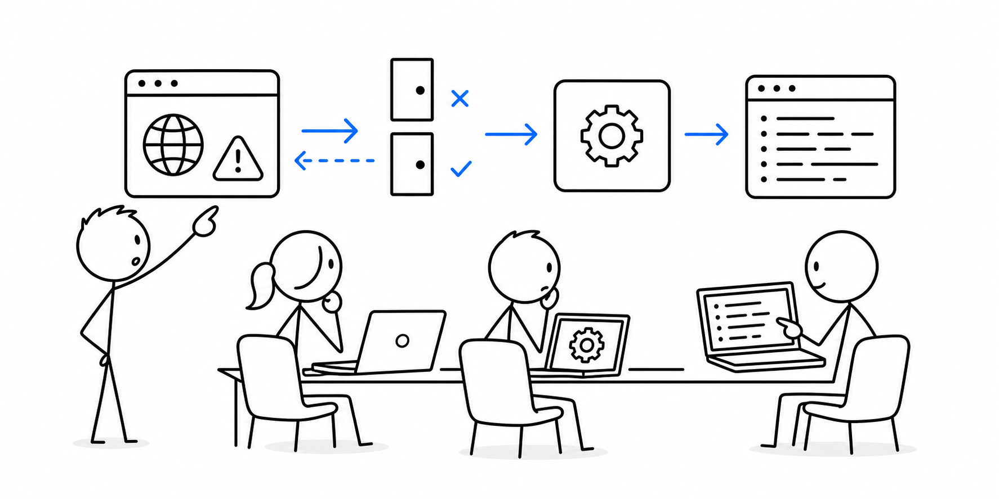

# 7교시 - 진단: 앱이 열리지 않는 이유 찾기

## 목표

이 시간의 목표는 “안 열려요”라는 문제를 증상별로 나누어 원인을 좁히는 것이다. 실제 실무에서도 장애 대응은 정답을 바로 맞히는 일이 아니라, 증거를 보고 가능성을 줄여가는 일에 가깝다.

이 세션의 끝에서 우리는 다음을 할 수 있어야 한다.

- 서버 미실행, 포트 착각, 경로 오류, 포트 충돌을 구분한다.
- 브라우저 화면과 터미널 로그를 함께 보고 원인을 추론한다.
- 문제를 질문 템플릿으로 정리한다.

## 오늘 한 줄 요약

“안 열림”은 하나의 원인이 아니라 서버, 포트, 경로, 로그를 나누어 봐야 하는 증상이다.

## 수업 이미지



## 진단의 기본 순서

문제가 생겼을 때는 아래 순서로 확인한다.

1. 서버 프로세스가 실행 중인가?
2. 서버가 어떤 포트에서 기다리는가?
3. 브라우저가 같은 포트로 요청하는가?
4. 요청 경로가 서버에 존재하는가?
5. 터미널 로그에 요청이 남는가?

이 순서를 따르면 막연한 “안 돼요”가 구체적인 증상으로 바뀐다.

## 상황 1 - 서버가 실행 중이 아님

서버를 종료한 상태에서 아래 주소를 연다.

```text
http://localhost:8000
```

예상 증상:

- 브라우저는 연결할 수 없다고 표시한다.
- 터미널에는 새 요청 로그가 없다.

판단:

```text
요청을 받을 서버 프로세스가 실행 중이 아닐 가능성이 크다.
```

## 상황 2 - 포트를 잘못 봄

서버를 8080번으로 실행한다.

```bash
PORT=8080 python3 server.py
```

Windows PowerShell:

```powershell
$env:PORT=8080
python server.py
```

브라우저에서 일부러 잘못된 포트로 접속한다.

```text
http://localhost:8000
```

예상 증상:

- 서버 터미널에는 8080번으로 실행 중이라고 나온다.
- 브라우저는 8000번으로 요청한다.
- 터미널에는 요청 로그가 없다.

판단:

```text
서버는 살아 있지만 브라우저가 다른 포트로 요청하고 있다.
```

## 상황 3 - 없는 경로를 요청함

서버가 실행 중인 포트로 없는 경로를 요청한다.

```text
http://localhost:8080/not-here
```

예상 증상:

- 브라우저에는 404가 보인다.
- 터미널에는 `/not-here -> 404` 로그가 남는다.

판단:

```text
요청은 서버까지 도착했다. 서버가 해당 경로를 제공하지 않을 뿐이다.
```

## 상황 4 - 포트가 이미 사용 중임

서버를 실행한 터미널을 그대로 둔 상태에서 새 터미널을 열고 같은 포트로 다시 실행한다.

```bash
python3 server.py
```

예상 증상:

```text
Address already in use
```

판단:

```text
이미 다른 프로세스가 같은 포트를 사용하고 있다.
```

해결 방법:

- 기존 서버 터미널에서 `Ctrl+C`로 종료한다.
- 또는 다른 포트로 실행한다.

## 질문 템플릿

문제를 공유할 때는 아래처럼 정리한다.

```text
제가 하려던 일:
입력한 주소:
서버 실행 명령:
터미널에 보인 로그:
브라우저에 보인 증상:
이미 해본 것:
궁금한 것:
```

예시:

```text
제가 하려던 일: 로컬 웹앱 접속
입력한 주소: http://localhost:8000
서버 실행 명령: PORT=8080 python3 server.py
터미널에 보인 로그: listening on http://localhost:8080
브라우저에 보인 증상: localhost:8000 연결 실패
이미 해본 것: 새로고침
궁금한 것: 서버는 실행 중인데 왜 8000번은 안 열리는지 알고 싶음
```

## 마무리 질문

> 404가 보인다는 것은 서버가 죽었다는 뜻일까, 살아 있다는 뜻일까?

## 다음 교시 연결

마지막 시간에는 오늘 배운 프로세스, 포트, 요청, 로그가 Docker의 이미지와 컨테이너 개념으로 어떻게 이어지는지 본다.
