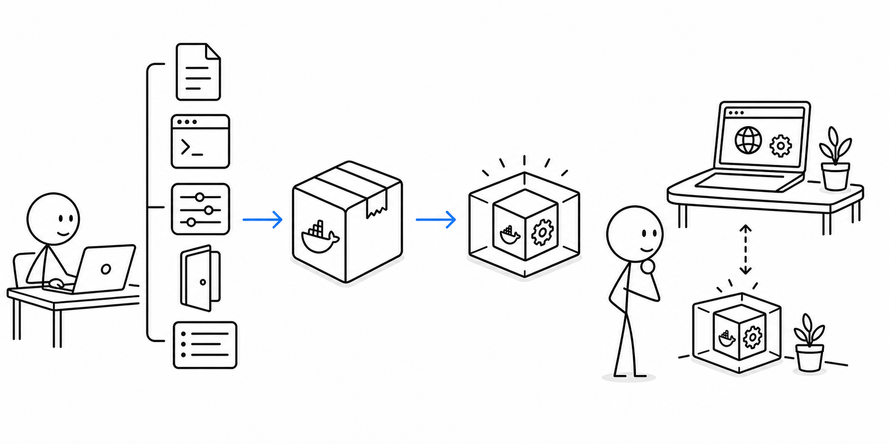
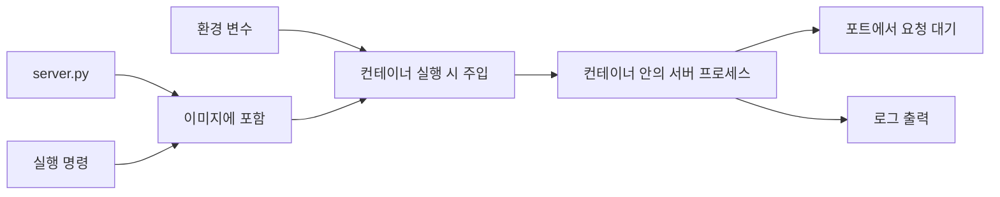
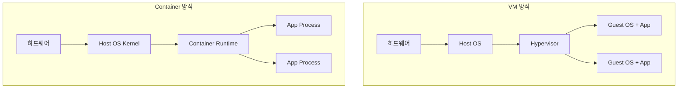

# 8교시 - Docker 개념 미리보기: 실행 환경을 포장한다는 것

## 목표

이 시간의 목표는 Day2에서 배운 프로세스, 포트, 파일, 환경 변수, 로그가 Docker로 어떻게 이어지는지 이해하는 것이다. Docker는 “서버를 하나 더 만드는 도구”가 아니라, 앱 실행에 필요한 조건을 이미지로 포장하고 컨테이너라는 실행 단위로 반복하는 도구다.

이 세션의 끝에서 우리는 다음을 말할 수 있어야 한다.

- Docker가 해결하려는 문제가 실행 환경 차이라는 점을 설명한다.
- 컨테이너가 VM보다 가볍게 실행될 수 있는 이유를 큰 그림으로 이해한다.
- 컨테이너 안에서도 결국 프로세스가 실행되고, 포트를 열고, 로그를 남긴다는 점을 연결한다.

## 오늘 한 줄 요약

Docker는 앱 실행에 필요한 파일, 실행 명령, 설정을 이미지로 포장해 어디서든 비슷한 방식으로 실행하려는 도구다.

## 수업 이미지



## 오늘의 흐름

| 시간 | 단계 | 진행 |
|---|---|---|
| 17:00-17:08 | Day2 연결 | 오늘 실행한 로컬 앱에 어떤 조건이 필요했는지 정리한다. |
| 17:08-17:20 | Docker가 필요한 이유 | 사람마다 다른 실행 환경이 왜 문제가 되는지 본다. |
| 17:20-17:32 | 이미지와 컨테이너 | 이미지는 포장된 실행 재료, 컨테이너는 실행 중인 단위로 이해한다. |
| 17:32-17:42 | VM과 컨테이너 | OS 관리 구조와 효율성 차이를 큰 그림으로 비교한다. |
| 17:42-17:50 | 다음 수업 준비 | Docker를 배울 때 계속 확인할 질문을 정리한다. |

## 시작 질문

> 오늘 만든 작은 웹앱을 친구 컴퓨터에서도 똑같이 실행하려면 무엇이 같아야 할까?

필요한 조건은 생각보다 많다.

- Python이 설치되어 있어야 한다.
- 실행 명령을 알아야 한다.
- `server.py` 파일이 있어야 한다.
- 포트를 알아야 한다.
- 필요한 환경 변수를 맞춰야 한다.
- 실행 후 로그를 볼 수 있어야 한다.

작은 앱도 이 정도 조건이 필요하다. 실제 서비스는 언어 버전, 패키지, OS 라이브러리, 설정 파일, 인증서, 실행 사용자까지 더 많은 조건이 붙는다.

## Docker가 생긴 이유

개발자 노트북에서는 잘 되는데 다른 사람 컴퓨터나 서버에서는 안 되는 일이 오래전부터 반복됐다. 이유는 코드만 같고 실행 환경은 다르기 때문이다.

예를 들어 내 컴퓨터에는 Python 3.12가 있고, 다른 컴퓨터에는 Python 3.9가 있을 수 있다. 어떤 서버에는 필요한 라이브러리가 설치되어 있고, 어떤 서버에는 없을 수 있다. 배포 문서가 길어질수록 사람의 손작업이 늘어나고, 손작업이 늘어날수록 실수가 생긴다.

Docker는 이 문제를 줄이기 위해 앱 실행에 필요한 조건을 이미지로 포장한다. 이미지를 기반으로 컨테이너를 실행하면, 같은 이미지를 쓰는 한 실행 방식이 훨씬 예측 가능해진다.

## 이미지와 컨테이너

Docker를 처음 배울 때 가장 중요한 구분은 이미지와 컨테이너다.

| 개념 | 비유 | 의미 |
|---|---|---|
| 이미지 | 실행 재료가 들어 있는 밀봉 박스 | 코드, 실행 명령, 기본 파일 시스템 등이 들어 있는 실행 템플릿 |
| 컨테이너 | 박스를 열어 실제로 실행한 상태 | 이미지에서 만들어진 실행 중인 격리 환경 |

프로그램과 프로세스의 관계와 비슷하게 생각할 수 있다.

| 일반 실행 | Docker 실행 |
|---|---|
| 프로그램 파일 | 이미지 |
| 실행 중인 프로세스 | 컨테이너 |

완전히 같은 개념은 아니지만, 초반에는 “이미지는 실행 전 재료, 컨테이너는 실행 중인 상태”라고 잡으면 된다.

## 컨테이너 안에서도 결국 프로세스가 돈다

컨테이너는 마법의 서버가 아니다. 컨테이너 안에서도 결국 하나 이상의 프로세스가 실행된다.

오늘 실행한 로컬 앱을 Docker 관점으로 보면 이렇게 연결된다.



즉, Docker를 배워도 Day2 개념은 사라지지 않는다. 오히려 더 자주 확인하게 된다.

- 컨테이너가 실행 중인가?
- 컨테이너 안의 프로세스가 살아 있는가?
- 어떤 포트에서 기다리는가?
- 환경 변수는 제대로 들어갔는가?
- 로그에는 어떤 증거가 남았는가?

## VM과 컨테이너의 차이

Docker의 효율성을 이해하려면 VM과 컨테이너를 비교해야 한다.

VM은 가상의 컴퓨터를 만든다. 각 VM은 자기 운영체제를 따로 가진다. 격리는 강하지만, OS를 여러 개 띄우는 만큼 무겁고 시작 시간이 길 수 있다.

컨테이너는 보통 호스트 OS의 커널을 공유한다. 대신 프로세스가 보는 파일 시스템, 네트워크, 환경을 격리해서 마치 독립된 실행 환경처럼 보이게 한다. 그래서 VM보다 가볍게 시작할 수 있고, 같은 서버에서 더 많은 앱을 실행하기 쉽다.

| 구분 | VM | 컨테이너 |
|---|---|---|
| 격리 단위 | 가상 머신 전체 | 프로세스 실행 환경 |
| OS 구조 | 각 VM이 게스트 OS를 가짐 | 호스트 OS 커널을 공유 |
| 시작 속도 | 상대적으로 느림 | 상대적으로 빠름 |
| 자원 사용 | 상대적으로 큼 | 상대적으로 작음 |
| 주 사용 목적 | 강한 격리, 서로 다른 OS 실행 | 앱 배포, 실행 환경 표준화, 빠른 확장 |

주의할 점은 컨테이너가 VM보다 항상 더 안전하거나 항상 더 좋다는 뜻은 아니라는 것이다. 컨테이너는 가볍고 배포에 유리하지만, 커널을 공유하기 때문에 보안 설정과 권한 관리가 중요하다.

## OS 관리 구조를 아주 크게 보면

아래 그림처럼 이해하면 된다.



정확한 내부 구조는 더 복잡하지만, 초반에는 이것만 기억하면 충분하다.

- VM은 운영체제까지 묶어 가상 컴퓨터를 만든다.
- 컨테이너는 호스트 커널을 공유하면서 앱 실행 환경을 격리한다.
- 그래서 컨테이너는 앱을 빠르게 반복 실행하고 배포하기에 유리하다.

## Docker를 배울 때 계속 물어볼 질문

다음 수업부터 Docker 명령을 배울 때 아래 질문을 계속 붙인다.

| 질문 | Day2와 연결되는 개념 |
|---|---|
| 이미지 안에 어떤 파일이 들어갔는가? | 파일 |
| 컨테이너가 어떤 명령으로 시작되는가? | 프로세스 |
| 어떤 포트를 열고 있는가? | 포트 |
| 실행할 때 어떤 값을 바꿀 수 있는가? | 환경 변수 |
| 문제가 생기면 무엇을 봐야 하는가? | 로그 |

## 짧은 확인 문제

### 1. Docker 이미지와 컨테이너 중 실행 중인 상태에 가까운 것은?

정답: 컨테이너

### 2. 컨테이너 안에서도 프로세스가 실행될까?

정답: 실행된다.

### 3. 컨테이너가 VM보다 가볍게 시작될 수 있는 큰 이유는?

정답: 보통 호스트 OS 커널을 공유하고, 앱 실행 환경 중심으로 격리하기 때문이다.

## 퇴실 티켓

아래 문장을 작성한다.

```text
오늘 가장 이해된 개념:
오늘 가장 헷갈린 개념:
Docker가 해결하려는 문제를 한 문장으로 쓰면:
다음 Docker 수업에서 꼭 확인하고 싶은 것:
```

## 다음 수업 준비

다음 Docker 수업 전에 아래를 확인한다.

- Docker Desktop이 실행된다.
- `docker version`에서 Client와 Server가 모두 보인다.
- `docker run hello-world`를 실행해본 적이 있다.
- 오늘 배운 프로세스, 포트, 환경 변수, 로그 개념을 다시 읽어본다.

## 마무리

Docker는 Day2에서 배운 기초를 대체하지 않는다. Docker는 그 기초를 더 예측 가능한 실행 단위로 포장하는 도구다.
