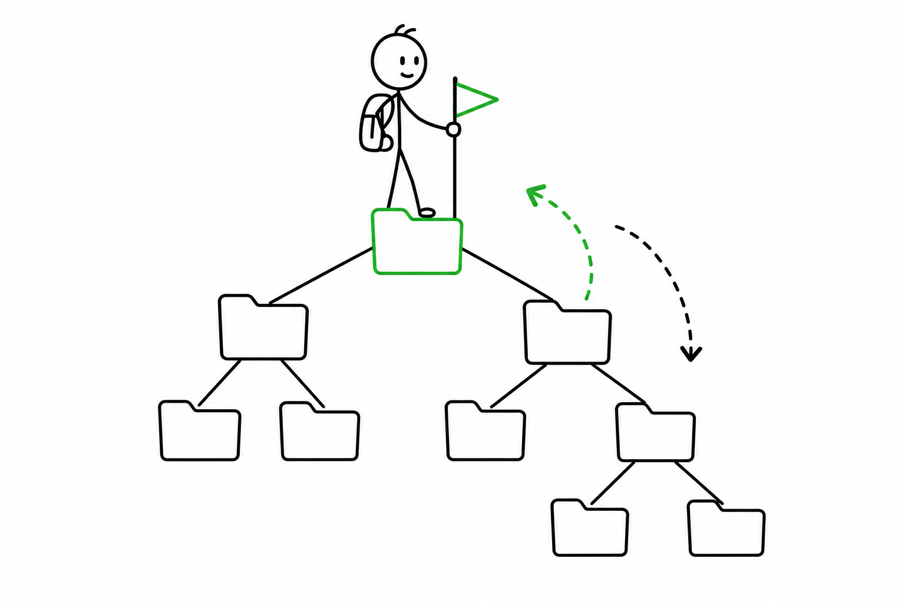

# 2교시 - 경로, 파일, 폴더, 현재 위치

## 목표

이 시간의 목표는 현재 작업 디렉터리와 경로를 읽고 이동하는 것이다. 로컬 앱 실행, Docker build, Kubernetes YAML 적용은 모두 “어느 폴더에서 어떤 파일을 대상으로 실행했는지”에 영향을 받는다.

이 세션의 끝에서 우리는 다음을 할 수 있어야 한다.

- 절대 경로와 상대 경로의 차이를 설명한다.
- `pwd`, `ls`, `cd`로 현재 위치를 확인하고 이동한다.
- 실습 폴더 안에서 필요한 파일을 찾는다.

## 오늘 한 줄 요약

터미널에서 길을 잃으면 새 명령을 치기 전에 `pwd`와 `ls`로 현재 위치부터 확인한다.

## 수업 이미지



## 오늘의 흐름

| 시간 | 단계 | 진행 |
|---|---|---|
| 10:00-10:08 | 1교시 연결 | 명령은 현재 위치의 영향을 받는다는 점을 확인한다. |
| 10:08-10:20 | 경로 개념 | 절대 경로, 상대 경로, `.`과 `..`를 이해한다. |
| 10:20-10:35 | 실습 폴더 탐색 | Day3 `playground` 구조를 탐색한다. |
| 10:35-10:45 | 파일 찾기 미션 | 설정 파일과 로그 파일 위치를 찾는다. |
| 10:45-10:50 | 정리 | 길을 잃었을 때 복구 순서를 정리한다. |

## 경로를 읽는 법

파일 시스템은 폴더 안에 폴더와 파일이 들어있는 구조다.

| 표현 | 뜻 |
|---|---|
| `/` | Linux/macOS에서 최상위 위치 |
| `.` | 현재 폴더 |
| `..` | 한 단계 위 폴더 |
| `cloud-native/week01/day03` | 현재 위치를 기준으로 찾아가는 상대 경로 |
| `/mnt/d/github/...` | 루트부터 시작하는 절대 경로 예시 |

Windows PowerShell에서는 경로 모양이 `C:\Users\...`처럼 다를 수 있다. 하지만 “현재 위치를 기준으로 찾아간다”는 생각은 같다.

## 실습 폴더로 이동

저장소 루트에서 시작한다고 가정한다.

```bash
pwd
```

```bash
ls
```

Day3 실습 폴더로 이동한다.

```bash
cd cloud-native/week01/day03/playground
```

현재 위치를 확인한다.

```bash
pwd
```

구조를 본다.

```bash
ls
```

자세히 본다.

```bash
ls -la
```

## 실습 폴더 구조

```text
playground/
  apps/
    api/
    web/
  config/
  logs/
  notes/
```

각 폴더의 역할:

| 폴더 | 역할 |
|---|---|
| `apps/api` | API 서비스 예시 파일 |
| `apps/web` | 웹 서비스 예시 파일 |
| `config` | 설정 파일 |
| `logs` | 실행 로그와 에러 로그 |
| `notes` | 실습 기록 |

## 이동 연습

현재 위치가 `playground`일 때 실행한다.

```bash
cd logs
```

```bash
pwd
```

```bash
ls
```

한 단계 위로 돌아간다.

```bash
cd ..
```

```bash
pwd
```

`config` 폴더로 이동한다.

```bash
cd config
```

```bash
ls
```

다시 `playground`로 돌아간다.

```bash
cd ..
```

## 파일 찾기 미션

아래 파일들이 어디에 있는지 찾는다.

| 찾을 것 | 힌트 |
|---|---|
| `app.env` | 설정 파일 |
| `access.log` | 정상 요청 로그 |
| `error.log` | 에러 로그 |
| `README.txt` | 실습 안내 |

사용할 명령:

```bash
ls config
ls logs
ls notes
```

조금 어렵게 찾고 싶다면 `find`를 사용한다.

```bash
find . -name "app.env"
```

```bash
find . -name "*.log"
```

`find`가 익숙하지 않아도 괜찮다. 오늘의 기본기는 `pwd`, `ls`, `cd`다.

## 길을 잃었을 때

아래 순서대로 복구한다.

1. `pwd`로 현재 위치를 본다.
2. `ls`로 주변 파일을 본다.
3. 한 단계 위가 필요하면 `cd ..`를 쓴다.
4. 저장소 루트로 돌아가야 하면 자료의 `cd ...` 명령을 다시 실행한다.
5. 그래도 모르겠으면 현재 `pwd` 출력과 하려던 일을 같이 질문한다.

## 마무리 질문

> `../logs/error.log`는 현재 폴더 기준으로 어디를 가리키는가?

## 다음 교시 연결

다음 시간에는 명령 옵션과 `--help`를 읽는다. 외우지 않아도 도움말을 읽을 수 있으면 낯선 도구를 만났을 때 버틸 수 있다.
