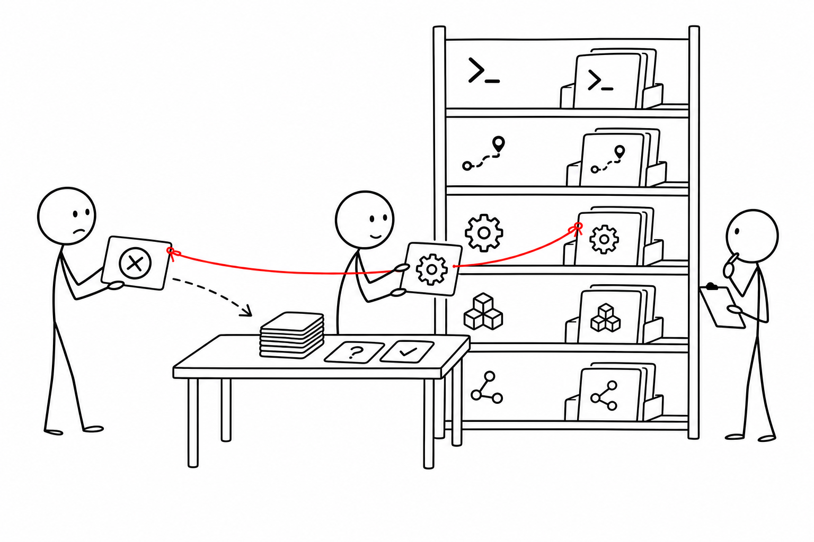

# 7교시 - 에러 메시지가 말하는 것 팀별 해석

## 목표

이 시간의 목표는 에러 메시지를 시스템 상황으로 번역하는 것이다. Cloud Native 운영에서는 에러를 보는 것에서 끝나지 않고, “어느 계층의 문제인가”를 좁혀야 한다.

이 세션의 끝에서 우리는 다음을 할 수 있어야 한다.

- 에러를 명령 문제, 경로 문제, 설정 문제, 애플리케이션 문제로 분류한다.
- 로그와 설정 파일을 근거로 원인 가설을 세운다.
- 팀의 판단을 짧은 incident note 형태로 정리한다.

## 오늘 한 줄 요약

좋은 엔지니어는 에러를 외우는 사람이 아니라, 에러가 가리키는 계층을 좁히는 사람이다.

## 수업 이미지



## 오늘의 흐름

| 시간 | 단계 | 진행 |
|---|---|---|
| 16:00-16:08 | 에러 계층 | 명령, 경로, 설정, 앱, 네트워크를 구분한다. |
| 16:08-16:25 | 팀 분석 | 제공된 증상 카드 4개를 분류한다. |
| 16:25-16:38 | incident note | 증상, 영향, 근거, 다음 확인을 적는다. |
| 16:38-16:47 | 공유 | 팀별로 한 사례를 1분 발표한다. |
| 16:47-16:50 | 정리 | Day4 웹앱 구조와 연결한다. |

## 에러 계층

| 계층 | 질문 | 예시 |
|---|---|---|
| 명령 | 명령 이름이나 옵션이 틀렸는가? | `command not found` |
| 경로 | 파일이나 폴더 위치가 틀렸는가? | `No such file or directory` |
| 설정 | 필요한 환경 변수나 설정이 없는가? | `missing DATABASE_URL` |
| 앱 | 코드가 요청을 처리하다 실패했는가? | `status=500` |
| 네트워크 | 주소, 포트, 연결이 틀렸는가? | `connection refused` |

처음부터 정답을 맞히지 않아도 된다. 중요한 것은 원인 후보를 줄이는 것이다.

## 증상 카드

### 카드 A

```text
cat: logs/access: No such file or directory
```

질문:

- 이 문제는 앱 문제인가, 경로/파일명 문제인가?
- 먼저 실행할 확인 명령은 무엇인가?

### 카드 B

```text
2026-03-02T10:20:04Z ERROR config missing required key DATABASE_URL
```

질문:

- 이 문제는 설정 문제인가, 네트워크 문제인가?
- 어느 파일을 확인해야 하는가?

### 카드 C

```text
GET /api/orders status=500 duration_ms=31
```

질문:

- 사용자 입장에서는 어떤 증상으로 보일 수 있는가?
- 추가로 어떤 로그를 봐야 하는가?

### 카드 D

```text
curl: (7) Failed to connect to localhost port 8000
```

질문:

- 포트가 틀렸는가, 서버 프로세스가 꺼져 있는가?
- Day2에서 배운 확인 순서는 무엇인가?

## Incident note 작성

incident note는 장애나 실패 상황을 짧게 정리한 운영 기록이다. 한국어로는 “장애 메모” 또는 “상황 기록” 정도로 이해하면 된다. 운영자는 긴 감상문보다 짧고 재현 가능한 기록을 원한다. 아래 형식을 사용한다.

```text
제목:
증상:
영향:
확인한 증거:
가능한 원인:
다음 확인:
```

예시:

```text
제목: 주문 API 500 응답
증상: access.log에서 /api/orders status=500 확인
영향: 주문 조회 또는 생성 기능이 실패할 수 있음
확인한 증거: error.log에 DATABASE_URL missing 기록
가능한 원인: 데이터베이스 연결 설정 누락
다음 확인: config/app.env와 배포 환경 변수 주입 방식 확인
```

## 팀 발표 기준

1분 안에 아래만 말한다.

- 어떤 증상인가?
- 어느 계층 문제로 보았는가?
- 근거는 무엇인가?
- 다음 확인은 무엇인가?

## 난이도 확장

빠른 팀은 아래 질문까지 답한다.

> `status=500`과 `DATABASE_URL missing`이 같은 시간대에 보이면 어떤 관계를 의심할 수 있는가?

가능한 답:

- 주문 API가 데이터베이스 설정을 필요로 하는데, 설정이 없어 요청 처리 중 실패했을 수 있다.
- 단, 시간대가 비슷하다는 것만으로 100% 같은 원인이라고 단정하면 안 된다. 같은 요청 ID나 더 자세한 로그가 있으면 좋다.

## 다음 교시 연결

마지막 시간에는 오늘 배운 터미널 생존법을 Day4 웹앱 구조 학습으로 연결한다. 내일부터는 파일과 로그를 보는 수준을 넘어, 웹앱 구성요소가 어떻게 나뉘는지 본다.
