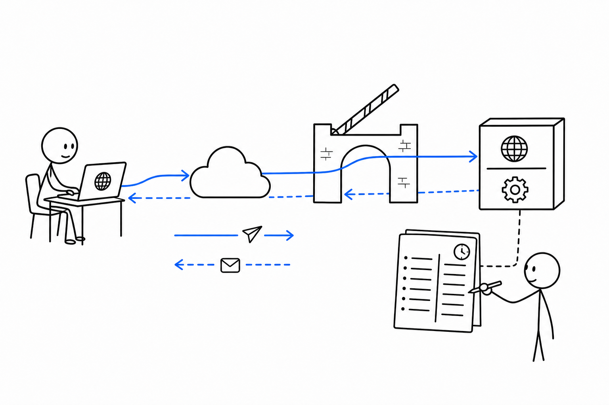
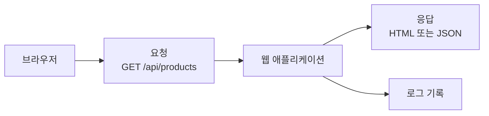

# 1교시 - 브라우저에서 앱까지 요청 경로 복습

## 목표

이 시간의 목표는 Day2의 localhost, Day3의 로그 읽기를 웹 애플리케이션 구조로 연결하는 것이다. 브라우저에서 주소를 입력했을 때 요청이 어디로 가고, 서버는 어떤 기록을 남기는지 다시 본다.

이 세션의 끝에서 우리는 다음을 할 수 있어야 한다.

- 브라우저, 주소, 포트, 요청, 응답을 한 문장으로 설명한다.
- `localhost:포트/경로`를 나누어 읽는다.
- 웹앱 구조를 배우는 이유가 Cloud Native 운영과 연결됨을 이해한다.

## 오늘 한 줄 요약

웹앱은 화면 하나가 아니라, 요청을 받고 응답하고 기록을 남기는 작은 시스템이다.

## 수업 이미지



## 오늘의 흐름

| 시간 | 단계 | 진행 |
|---|---|---|
| 09:00-09:08 | Day2/Day3 연결 | localhost, 포트, 로그를 다시 연결한다. |
| 09:08-09:20 | 주소 읽기 | `http://localhost:8000/api/products`를 나누어 본다. |
| 09:20-09:35 | 요청과 응답 | 브라우저 요청, 서버 처리, 응답, 로그 기록을 본다. |
| 09:35-09:45 | 웹앱 구조 예고 | client, API, data, config, health check를 소개한다. |
| 09:45-09:50 | 정리 | 오늘 하루의 관찰 질문을 정한다. |

## 주소를 나누어 읽기

예시 주소:

```text
http://localhost:8000/api/products
```

| 부분 | 뜻 |
|---|---|
| `http://` | 브라우저와 서버가 대화하는 방식 |
| `localhost` | 내 컴퓨터 자신 |
| `8000` | 서버가 기다리는 문 번호 |
| `/api/products` | 서버 안에서 요청한 경로 |

처음에는 주소 전체를 외우지 않는다. “어느 컴퓨터의 어느 포트에, 어떤 경로를 요청하는가?”로 나누어 읽는다.

## 요청과 응답

브라우저에서 주소를 입력하면 아래 흐름이 생긴다.



Day3에서 봤던 access log는 이 요청과 응답의 흔적이다.

```text
method=GET path=/api/products status=200 duration_ms=18
```

이 한 줄은 “브라우저 또는 클라이언트가 `/api/products`를 요청했고, 서버가 정상 응답했다”는 증거다.

## 화면 요청과 데이터 요청

브라우저에서 보는 웹앱에는 보통 두 종류의 요청이 섞여 있다.

| 요청 | 쉬운 설명 | 오늘의 예 |
|---|---|---|
| 화면 요청 | 사람이 볼 화면을 달라는 요청 | `/` |
| 데이터 요청 | 화면이나 프로그램이 쓸 데이터를 달라는 요청 | `/api/products` |

`/`는 상품 목록 화면을 보여준다. `/api/products`는 화면 없이 데이터만 보여준다. 처음 JSON 화면을 보면 이상해 보일 수 있지만, 프로그램 입장에서는 이런 데이터 형식이 읽기 쉽다.

## 웹앱을 배우는 이유

Cloud Native 과정에서 웹앱을 배우는 이유는 웹 개발자가 되기 위해서만은 아니다. Docker, Kubernetes, AWS가 실제로 운영하는 대상이 대부분 이런 앱 구조를 가지고 있기 때문이다.

| 웹앱에서 보는 것 | 나중에 연결되는 것 |
|---|---|
| 포트 | 컨테이너 포트, Service 포트 |
| 설정 | 환경 변수, ConfigMap, Secret |
| 로그 | 컨테이너 로그, observability |
| health check | liveness/readiness probe |
| API 경로 | Ingress, 라우팅, 마이크로서비스 |

## 오늘의 관찰 질문

오늘은 새 용어를 많이 외우기보다 아래 질문을 계속 반복한다.

1. 요청은 어디로 들어가는가?
2. 어떤 부품이 응답을 만드는가?
3. 실패하면 어떤 증상이 보이는가?
4. 로그와 health check는 무엇을 알려주는가?

## 마무리 질문

> `http://localhost:3000/health`에서 포트와 경로는 각각 무엇인가?

## 다음 교시 연결

다음 시간에는 웹 애플리케이션을 클라이언트, API, 데이터, 정적 파일로 나누어 본다. 화면 뒤에 어떤 부품들이 있는지 이름을 붙이는 시간이다.
