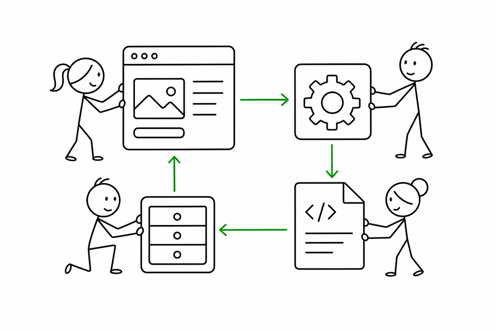

# 2교시 - 클라이언트, API, 데이터베이스, 정적 파일

## 목표

이 시간의 목표는 웹 애플리케이션을 하나의 덩어리가 아니라 여러 역할의 조합으로 이해하는 것이다. 비전공자에게 웹앱은 “브라우저에 뜨는 화면”처럼 보이지만, 운영자는 그 뒤의 부품을 나누어 봐야 한다.

이 세션의 끝에서 우리는 다음을 할 수 있어야 한다.

- 클라이언트, API, 데이터 저장소, 정적 파일의 역할을 구분한다.
- HTML과 JSON의 차이를 쉬운 말로 설명한다.
- 웹앱 부품 하나가 실패하면 어떤 증상이 생길지 추정한다.

## 오늘 한 줄 요약

웹앱은 화면, 요청 처리, 데이터, 파일이 함께 움직이는 시스템이다.

## 수업 이미지



## 웹앱 구성요소

| 구성요소 | 쉬운 설명 | 예시 |
|---|---|---|
| 클라이언트 | 사용자가 보는 쪽 | 브라우저 화면, HTML |
| API | 요청을 받아 규칙대로 응답하는 쪽 | `/api/products` |
| 데이터 저장소 | 앱이 기억해야 할 정보를 보관하는 곳 | JSON 파일, 데이터베이스 |
| 정적 파일 | 그대로 전달되는 파일 | CSS, 이미지, JavaScript |
| 설정 | 실행 환경마다 달라지는 값 | 포트, 앱 이름, 데이터 경로 |

오늘 시연 앱은 진짜 대형 서비스가 아니다. 하지만 작은 앱 안에 이 부품들이 축소판으로 들어 있다.

## HTML과 JSON

브라우저 화면:

```html
<h1>상품 목록</h1>
```

프로그램이 읽기 쉬운 데이터:

```json
[
  {"id": 1, "name": "Notebook"},
  {"id": 2, "name": "Tumbler"}
]
```

| 구분 | HTML | JSON |
|---|---|---|
| 주로 보는 대상 | 사람 | 프로그램 |
| 쓰임 | 화면 구조 | 데이터 전달 |
| Day4 예시 | `/` | `/api/products` |

JSON은 “자바스크립트만 쓰는 파일”이 아니라, 여러 프로그램이 데이터를 주고받을 때 자주 쓰는 형식이다.

## API를 식당 주문으로 비유하면

처음 API가 낯설다면 식당 주문처럼 생각할 수 있다.

| 식당 | 웹앱 |
|---|---|
| 손님 | 브라우저 또는 다른 프로그램 |
| 주문서 | 요청 |
| 주방 | API |
| 재료 창고 | 데이터 저장소 |
| 완성된 음식 | 응답 |

손님이 주방 안의 모든 과정을 알 필요는 없다. 대신 정해진 메뉴 이름으로 주문한다. 웹앱에서도 클라이언트는 `/api/products` 같은 정해진 경로로 요청하고, API는 약속된 모양의 데이터를 돌려준다.

## 데이터베이스를 아직 쓰지 않는 이유

오늘은 진짜 데이터베이스 서버를 띄우지 않고 JSON 파일을 데이터처럼 사용한다. 이유는 간단하다.

- 웹앱 구조를 먼저 보는 날이다.
- 데이터베이스 설치 문제로 수업 흐름이 끊기지 않게 한다.
- “데이터가 없으면 앱이 실패한다”는 구조를 작게 관찰할 수 있다.

나중에 데이터베이스를 쓰더라도 핵심 질문은 비슷하다. 앱은 데이터를 어디서 읽는가? 연결 설정은 어디에 있는가? 데이터 쪽이 실패하면 어떤 로그가 남는가?

## 부품별 실패 예측

| 실패한 부품 | 보일 수 있는 증상 |
|---|---|
| 클라이언트 HTML | 화면이 비어 있거나 깨져 보임 |
| API | 특정 경로가 `500`을 냄 |
| 데이터 파일 | 상품 목록을 불러오지 못함 |
| 설정 | 포트, 앱 이름, 데이터 경로가 잘못됨 |
| health check | 앱 상태가 unhealthy로 보임 |

## 활동 - 경로 분류하기

아래 경로를 사람이 보는 화면인지, 프로그램이 읽는 데이터인지 분류한다.

| 경로 | 분류 |
|---|---|
| `/` | |
| `/api/products` | |
| `/health` | |
| `/static/style.css` | |

예상 정리:

- `/`: 사람이 보는 HTML 화면
- `/api/products`: 프로그램이 읽는 JSON 데이터
- `/health`: 시스템 상태 확인
- `/static/style.css`: 화면 모양을 정하는 정적 파일

## 다음 교시 연결

다음 시간에는 설정과 health check를 본다. Cloud Native에서는 “앱이 켜졌다”만으로 충분하지 않고, 실행 환경과 상태 확인 방법이 중요하다.
