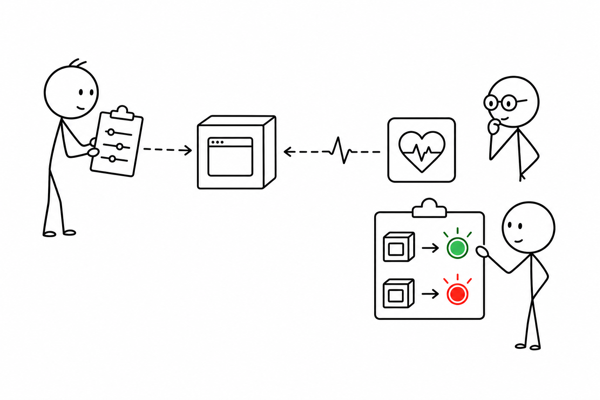
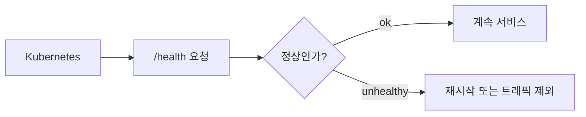

# 3교시 - 설정과 Health Check

## 목표

이 시간의 목표는 설정과 health check가 왜 필요한지 이해하는 것이다. 로컬에서는 그냥 실행되던 앱도 Docker, Kubernetes, AWS로 가면 포트, 데이터 경로, secret, 상태 확인 방식이 명확해야 한다.

이 세션의 끝에서 우리는 다음을 할 수 있어야 한다.

- 설정을 코드와 분리하는 이유를 설명한다.
- `/health`가 무엇을 확인하는 경로인지 말한다.
- healthy와 unhealthy 상태를 구분한다.

## 오늘 한 줄 요약

운영 가능한 앱은 실행 방법뿐 아니라 설정과 상태 확인 방법도 설명할 수 있어야 한다.

## 수업 이미지



## 오늘의 흐름

| 시간 | 단계 | 진행 |
|---|---|---|
| 11:00-11:08 | 2교시 연결 | 부품이 늘어나면 설정도 늘어난다는 점을 확인한다. |
| 11:08-11:22 | 설정 | 포트, 앱 이름, 데이터 경로를 코드 밖으로 빼는 이유를 본다. |
| 11:22-11:35 | health check | `/health`가 무엇을 알려주는지 본다. |
| 11:35-11:45 | 실패 상태 | 설정 누락과 데이터 누락이 health에 미치는 영향을 본다. |
| 11:45-11:50 | 정리 | 오후 시연 앱 실행 전 체크리스트를 만든다. |

## 설정이란 무엇인가

설정은 앱이 실행될 때 바뀔 수 있는 값이다.

| 설정 | 예시 | 왜 바뀌는가 |
|---|---|---|
| 포트 | `8000`, `3000` | 환경마다 열 수 있는 포트가 다름 |
| 앱 이름 | `demo-shop` | 로그나 화면에서 구분해야 함 |
| 데이터 경로 | `data/products.json` | 실행 위치나 배포 방식에 따라 달라짐 |
| secret | password, token | 코드에 넣으면 위험함 |

설정을 코드에 박아두면 내 컴퓨터에서는 편할 수 있다. 하지만 다른 환경으로 옮길 때 매번 코드를 고쳐야 한다. 그래서 Cloud Native에서는 환경 변수, 설정 파일, Secret 같은 방식으로 설정을 분리한다.

## 오늘 시연 앱의 설정

오늘 앱은 아래 값을 사용한다.

| 이름 | 기본값 | 뜻 |
|---|---|---|
| `PORT` | `8000` | 앱이 기다리는 포트 |
| `APP_NAME` | `day4-shop` | 앱 이름 |
| `DATA_FILE` | `data/products.json` | 상품 데이터 파일 |
| `REQUIRE_DATA` | `true` | 데이터 파일이 없으면 unhealthy로 볼지 여부 |

처음에는 기본값으로 실행한다. 오후에는 일부 설정을 바꾸어 실패 증상을 본다.

## Health Check란 무엇인가

health check는 앱이 살아 있는지 확인하는 약속된 경로다.

```text
GET /health
```

가능한 응답:

```json
{"status": "ok"}
```

또는:

```json
{"status": "unhealthy", "reason": "data file missing"}
```

브라우저 화면이 떠도 health check가 실패할 수 있다. 예를 들어 메인 HTML은 보이지만 API가 데이터 파일을 읽지 못하면 사용자는 상품 목록을 못 볼 수 있다.

## 왜 Kubernetes와 연결되는가

Kubernetes는 나중에 앱 상태를 자동으로 확인해야 한다.



오늘은 Kubernetes를 쓰지 않는다. 하지만 `/health`의 의미를 미리 알아야 나중에 liveness, readiness를 이해할 수 있다.

## 흔한 오해

- 브라우저 첫 화면이 보이면 모든 것이 정상이라고 생각한다.
- 설정값을 코드 안에 직접 넣어도 된다고 생각한다.
- health check는 대형 서비스에만 필요하다고 생각한다.

작은 앱에서도 상태 확인 습관을 만들면, 나중에 컨테이너와 Kubernetes에서 문제를 훨씬 빨리 좁힐 수 있다.

## 마무리 질문

> 메인 화면 `/`은 보이는데 `/health`가 unhealthy라면 어떤 가능성이 있을까?

## 다음 교시 연결

다음 시간에는 Day4 시연 앱의 파일 구조와 실행 방법을 본다. 오후에는 일부러 실패 상태를 만들고 증상을 진단한다.
