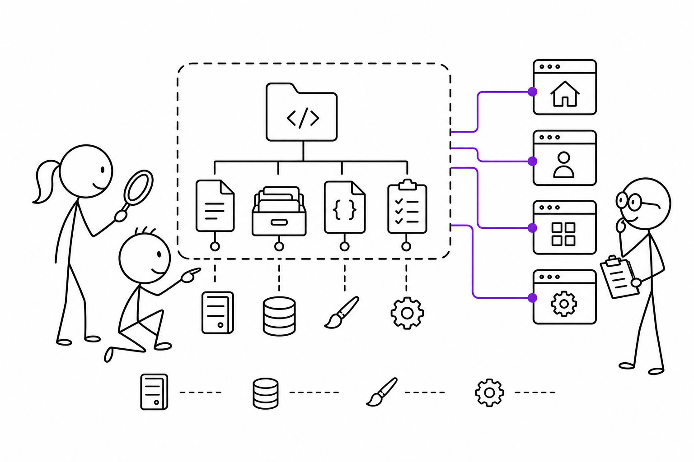

# 4교시 - 시연 앱 소개

## 목표

이 시간의 목표는 오후에 사용할 시연 앱의 구조와 실행 방법을 이해하는 것이다. 이 앱은 멋진 서비스를 만들기 위한 프로젝트가 아니라, 웹앱의 부품과 실패 증상을 관찰하기 위한 학습 도구다.

이 세션의 끝에서 우리는 다음을 할 수 있어야 한다.

- 시연 앱 파일 구조를 읽는다.
- `/`, `/api/products`, `/health`의 역할을 구분한다.
- 앱 실행 전 현재 폴더와 Python 상태를 확인한다.

## 오늘 한 줄 요약

시연 앱은 웹앱 구조를 눈으로 보기 위한 작은 모형이다.

## 수업 이미지



## 파일 구조

```text
demo_app/
  server.py
  data/
    products.json
  static/
    style.css
  config/
    example.env
```

역할:

| 파일/폴더 | 역할 |
|---|---|
| `server.py` | 요청을 받고 응답하는 Python 서버 |
| `data/products.json` | 상품 데이터 |
| `static/style.css` | 화면 스타일 |
| `config/example.env` | 설정 예시 |

## 주요 경로

| 경로 | 응답 | 의미 |
|---|---|---|
| `/` | HTML | 사람이 보는 메인 화면 |
| `/api/products` | JSON | 상품 목록 데이터 |
| `/health` | JSON | 앱 상태 확인 |
| `/static/style.css` | CSS | 화면 스타일 파일 |
| 없는 경로 | JSON 404 | 요청한 경로가 없음 |

## 실행 준비

저장소 루트에서 시작한다.

```bash
pwd
ls
```

`cloud-native` 폴더가 보이면 아래로 이동한다.

```bash
cd cloud-native/week01/day04/demo_app
```

Python 확인:

```bash
python3 --version
```

Windows에서 `python3`가 안 되면 아래도 확인한다.

```bash
python --version
py --version
```

## 실행 명령

Linux/macOS/WSL:

```bash
python3 server.py
```

Windows:

```powershell
py server.py
```

성공하면 아래와 비슷한 문구가 나온다.

```text
day4-shop listening on http://localhost:8000
```

브라우저에서 아래 주소를 연다.

```text
http://localhost:8000
```

## 실행 중인 터미널

서버를 실행한 터미널은 계속 켜둔다. 그 터미널은 서버 프로세스가 사용 중이므로, 새 명령을 입력하려면 새 터미널을 하나 더 열거나 서버를 중지해야 한다.

중지:

```text
Ctrl+C
```

처음 실습할 때 가장 많이 헷갈리는 부분:

| 상황 | 의미 | 다음 행동 |
|---|---|---|
| 터미널에 커서가 안 돌아옴 | 서버가 실행 중이라 그 터미널을 사용 중 | 브라우저로 접속하거나 새 터미널을 연다 |
| 로그가 계속 찍힘 | 브라우저 요청을 서버가 받고 있음 | 정상적인 관찰 대상 |
| 새 명령을 입력하고 싶음 | 서버 터미널에서는 입력하기 어려움 | 새 터미널을 열거나 `Ctrl+C`로 서버 중지 |
| 브라우저가 안 열림 | 주소/포트/서버 실행 상태 문제 가능 | `http://localhost:8000`과 서버 터미널 확인 |

서버 실행 터미널은 “앱이 살아 있는 화면”이라고 생각한다. 닫거나 `Ctrl+C`를 누르면 서버 프로세스가 종료된다.

## 오후 실습에서 볼 실패

| 실패 | 관찰할 증상 |
|---|---|
| 포트 충돌 | 이미 사용 중인 포트라 서버가 시작하지 못함 |
| 데이터 파일 누락 | `/api/products`와 `/health`가 실패 |
| 없는 경로 요청 | `404` 응답 |
| 설정 변경 | 앱 이름, 포트, 데이터 경로가 바뀜 |

## 다음 교시 연결

점심 이후에는 이 앱을 실제로 실행하고, 일부러 실패를 만든다. 중요한 것은 실패 자체가 아니라 어떤 증거를 보고 원인을 좁히는지다.
